# Indonesia Macroeconomic Nowcasting Report

**Generated:** 2025-09-23 18:39:08
**Output Directory:** `advanced_models_indonesia_macro-20250923-111855`

## Executive Summary

This report presents nowcasting results for **8 macroeconomic indicators** using multiple machine learning models.

## Model Performance Overview

### Best Performing Models by Target Variable

| Target Variable | Best Model | Type | RMSE (H=1) | MAE (H=1) | R² |
|-----------------|------------|------|------------|-----------|-----|
| CPI Year-over-Year | Lasso-1599-v15-113112 | Lasso | 0.5799 | 0.4446 | 0.8186 |
| 12-Month Deposit Rate | ElasticNetGrid-871-v07-174403 | ElasticNetGrid | 0.1808 | 0.1238 | 0.9609 |
| 1-Month Deposit Rate | DFM2-591-v15-142147 | DFM2 | 0.2157 | 0.1815 | 0.9295 |
| 3-Month Deposit Rate | StandardizedLinear-2177-v17-154751 | StandardizedLinear | 0.1265 | 0.1033 | 0.9833 |
| 6-Month Deposit Rate | ARp-161-v17-163917 | ARp | 0.1392 | 0.1121 | 0.9807 |
| GDP Year-over-Year | DFM2-598-v22-121519 | DFM2 | 2.0592 | 0.9019 | 0.6039 |
| Policy Rate (7DRR) | AR1-016-v16-140234 | AR1 | 0.2835 | 0.2179 | 0.9314 |
| USD/IDR Exchange Rate | StandardizedRidge-2324-v20-132123 | StandardizedRidge | 413.8608 | 293.8453 | 0.6907 |

### Model Type Performance Summary

Average performance across all targets by model type:

| Model Type | Avg RMSE | Min RMSE | # Targets |
|------------|----------|----------|-----------|
| AR1 | 63.3471 | 0.2835 | 8 |
| ARp | 53.2472 | 0.1265 | 8 |
| BVAR | 53.2467 | 0.1279 | 8 |
| DFM | 128.0970 | 0.3120 | 8 |
| DFM2 | 63.3844 | 0.1999 | 8 |
| ElasticNet | 62.7430 | 0.2272 | 8 |
| ElasticNetGrid | 61.6684 | 0.1808 | 8 |
| ExtraTrees | 138.5470 | 0.7627 | 8 |
| GARCH | 23292.8902 | 1.4273 | 8 |
| GradientBoosting | 119.4222 | 0.5825 | 8 |
| LSTM | 200.3343 | 0.6454 | 8 |
| Lasso | 62.7112 | 0.2295 | 8 |
| Linear | 53.2472 | 0.1265 | 8 |
| RandomForest | 136.1106 | 0.7473 | 8 |
| Ridge | 53.1112 | 0.1544 | 8 |
| StandardizedLinear | 53.2472 | 0.1265 | 8 |
| StandardizedRidge | 52.3024 | 0.1764 | 8 |
| StochasticGB | 129.3954 | 0.7996 | 8 |
| Tree | 137.4064 | 0.9835 | 8 |
| XGBoost | 95.7908 | 0.6176 | 8 |

## 1. CPI Year-over-Year

### Top 5 Models (Diverse Selection)

**1. Lasso Model 🏆**
- ID: `Lasso-1599-v15-113112`
- RMSE (H=1): 0.5799
- MAE (H=1): 0.4446
- R² (H=1): 0.8186
- MAPE: 44.4%
- RMSE (H=3): 0.9082
- RMSE (H=6): 1.4469
- Degradation: H3=+56.6%, H6=+149.5%
- Features: 16 variables
- Normalization: None
- Feature Pack: None

**2. ElasticNet Model**
- ID: `ElasticNet-735-v15-112120`
- RMSE (H=1): 0.5809
- MAE (H=1): 0.4472
- R² (H=1): 0.8179
- MAPE: 44.6%
- RMSE (H=3): 0.9120
- RMSE (H=6): 1.4510
- Degradation: H3=+57.0%, H6=+149.8%
- Features: 16 variables
- Normalization: None
- Feature Pack: None

**3. ElasticNetGrid Model**
- ID: `ElasticNetGrid-879-v15-112302`
- RMSE (H=1): 0.6114
- MAE (H=1): 0.4533
- R² (H=1): 0.7983
- MAPE: 45.4%
- RMSE (H=3): 1.1191
- RMSE (H=6): 2.3274
- Degradation: H3=+83.0%, H6=+280.6%
- Features: 16 variables
- Normalization: None
- Feature Pack: None

**4. AR1 Model**
- ID: `AR1-016-v16-111856`
- RMSE (H=1): 0.7050
- MAE (H=1): 0.5767
- R² (H=1): 0.7319
- MAPE: 61.5%
- RMSE (H=3): 1.1570
- RMSE (H=6): 1.6633
- Degradation: H3=+64.1%, H6=+135.9%
- Features: 16 variables
- Normalization: None
- Feature Pack: None

**5. DFM2 Model**
- ID: `DFM2-583-v07-112047`
- RMSE (H=1): 0.7463
- MAE (H=1): 0.6333
- R² (H=1): 0.6996
- MAPE: 60.0%
- RMSE (H=3): 1.2159
- RMSE (H=6): 1.6350
- Degradation: H3=+62.9%, H6=+119.1%
- Features: 16 variables
- Normalization: None
- Feature Pack: None

### Best Model by Type

| Model Type | Best Config | RMSE (H=1) | vs Best |
|------------|-------------|------------|---------|
| AR1 | AR1-016-v16-111856 | 0.7050 | +21.6% |
| ARp | ARp-153-v09-111924 | 0.8554 | +47.5% |
| BVAR | BVAR-305-v17-111953 | 0.8609 | +48.5% |
| DFM | DFM-438-v06-112019 | 1.4971 | +158.2% |
| DFM2 | DFM2-583-v07-112047 | 0.7463 | +28.7% |
| ElasticNet | ElasticNet-735-v15-112120 | 0.5809 | +0.2% |
| ElasticNetGrid | ElasticNetGrid-879-v15-112302 | 0.6114 | +5.4% |
| ExtraTrees | ExtraTrees-1022-v14-112437 | 1.3417 | +131.4% |
| GARCH | GARCH-1168-v16-112529 | 1.4273 | +146.1% |
| GradientBoosting | GradientBoosting-1302-v06-112615 | 1.1872 | +104.7% |
| LSTM | LSTM-1448-v08-112817 | 1.5995 | +175.8% |
| Lasso | Lasso-1599-v15-113112 | 0.5799 | 0.0% |
| Linear | Linear-1745-v17-113144 | 0.8554 | +47.5% |
| RandomForest | RandomForest-1895-v23-113221 | 1.3023 | +124.6% |
| Ridge | Ridge-2033-v17-113250 | 0.9007 | +55.3% |
| StandardizedLinear | StandardizedLinear-2177-v17-113319 | 0.8554 | +47.5% |
| StandardizedRidge | StandardizedRidge-2328-v24-113349 | 0.9043 | +56.0% |
| StochasticGB | StochasticGB-2455-v07-113418 | 1.2408 | +114.0% |
| Tree | Tree-2614-v22-113454 | 1.3833 | +138.5% |
| XGBoost | XGBoost-2742-v06-114449 | 1.3193 | +127.5% |

### Forecast Visualizations

#### 1. Lasso Model Forecast
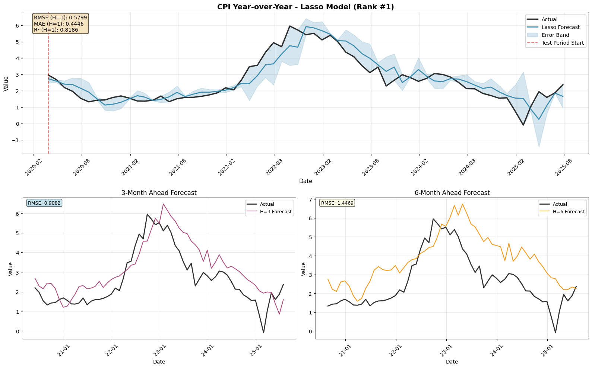

#### 2. ElasticNet Model Forecast
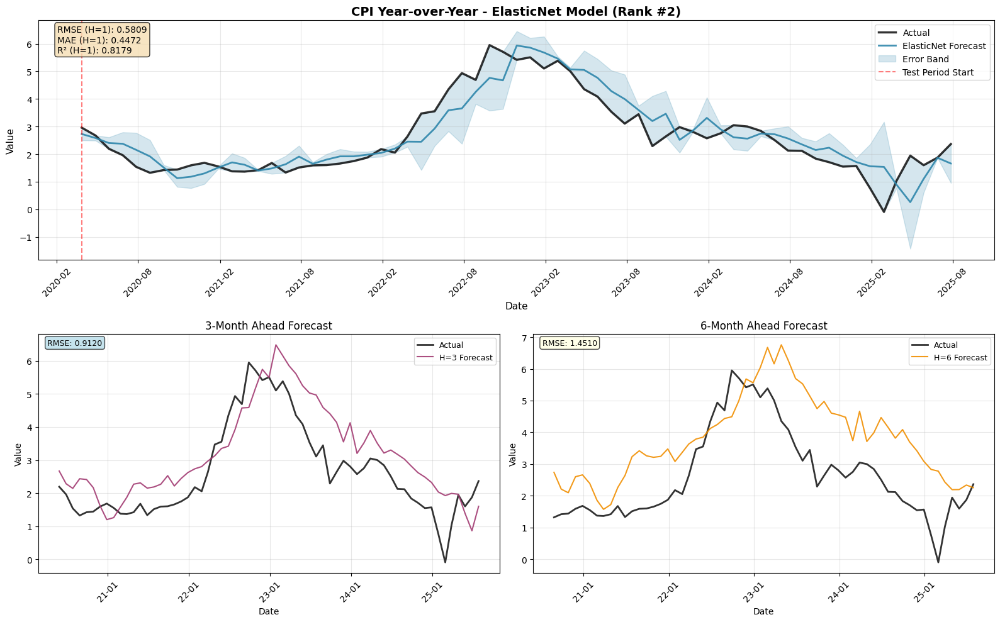

#### 3. ElasticNetGrid Model Forecast
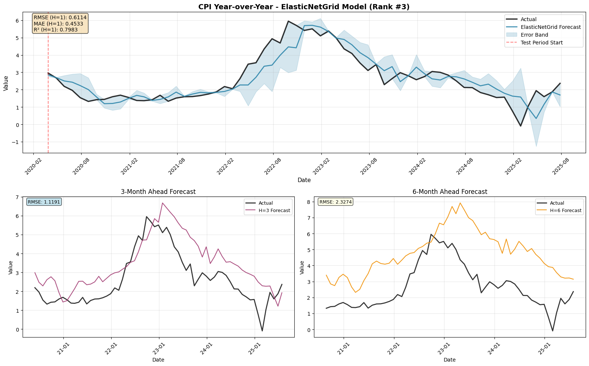

#### All Models Comparison
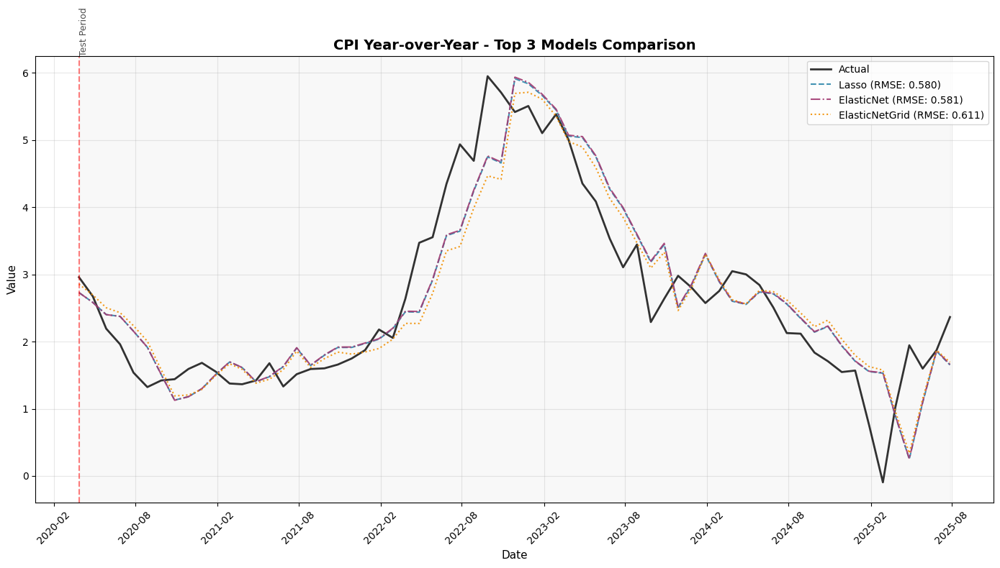

---

## 2. 12-Month Deposit Rate

### Top 5 Models (Diverse Selection)

**1. ElasticNetGrid Model 🏆**
- ID: `ElasticNetGrid-871-v07-174403`
- RMSE (H=1): 0.1808
- MAE (H=1): 0.1238
- R² (H=1): 0.9609
- MAPE: 2.7%
- RMSE (H=3): 0.3360
- RMSE (H=6): 0.9645
- Degradation: H3=+85.8%, H6=+433.4%
- Features: 16 variables
- Normalization: None
- Feature Pack: None

**2. DFM2 Model**
- ID: `DFM2-579-v03-174130`
- RMSE (H=1): 0.1999
- MAE (H=1): 0.1446
- R² (H=1): 0.9522
- MAPE: 3.1%
- RMSE (H=3): 0.3422
- RMSE (H=6): 0.6118
- Degradation: H3=+71.2%, H6=+206.0%
- Features: 16 variables
- Normalization: None
- Feature Pack: None

**3. BVAR Model**
- ID: `BVAR-312-v24-173943`
- RMSE (H=1): 0.2012
- MAE (H=1): 0.1444
- R² (H=1): 0.9516
- MAPE: 3.1%
- RMSE (H=3): 0.3627
- RMSE (H=6): 0.6482
- Degradation: H3=+80.3%, H6=+222.2%
- Features: 16 variables
- Normalization: None
- Feature Pack: None

**4. StandardizedLinear Model**
- ID: `StandardizedLinear-2184-v24-175904`
- RMSE (H=1): 0.2016
- MAE (H=1): 0.1444
- R² (H=1): 0.9514
- MAPE: 3.1%
- RMSE (H=3): 0.3666
- RMSE (H=6): 0.6579
- Degradation: H3=+81.8%, H6=+226.3%
- Features: 16 variables
- Normalization: None
- Feature Pack: None

**5. ARp Model**
- ID: `ARp-168-v24-173846`
- RMSE (H=1): 0.2016
- MAE (H=1): 0.1444
- R² (H=1): 0.9514
- MAPE: 3.1%
- RMSE (H=3): 0.3666
- RMSE (H=6): 0.6579
- Degradation: H3=+81.8%, H6=+226.3%
- Features: 16 variables
- Normalization: None
- Feature Pack: None

### Best Model by Type

| Model Type | Best Config | RMSE (H=1) | vs Best |
|------------|-------------|------------|---------|
| AR1 | AR1-024-v24-173750 | 0.3151 | +74.3% |
| ARp | ARp-168-v24-173846 | 0.2016 | +11.5% |
| BVAR | BVAR-312-v24-173943 | 0.2012 | +11.3% |
| DFM | DFM-446-v14-174037 | 0.3120 | +72.6% |
| DFM2 | DFM2-579-v03-174130 | 0.1999 | +10.6% |
| ElasticNet | ElasticNet-743-v23-174238 | 0.2272 | +25.7% |
| ElasticNetGrid | ElasticNetGrid-871-v07-174403 | 0.1808 | 0.0% |
| ExtraTrees | ExtraTrees-1017-v09-174632 | 1.3791 | +662.8% |
| GARCH | GARCH-1175-v23-174800 | 3.1191 | +1625.1% |
| GradientBoosting | GradientBoosting-1305-v09-174904 | 1.3013 | +619.7% |
| LSTM | LSTM-1454-v14-175227 | 1.1511 | +536.6% |
| Lasso | Lasso-1599-v15-175455 | 0.2295 | +27.0% |
| Linear | Linear-1736-v08-175553 | 0.2016 | +11.5% |
| RandomForest | RandomForest-1881-v09-175656 | 1.3586 | +651.4% |
| Ridge | Ridge-2024-v08-175759 | 0.2372 | +31.2% |
| StandardizedLinear | StandardizedLinear-2184-v24-175904 | 0.2016 | +11.5% |
| StandardizedRidge | StandardizedRidge-2320-v16-180000 | 0.2525 | +39.6% |
| StochasticGB | StochasticGB-2463-v15-180104 | 1.3772 | +661.7% |
| Tree | Tree-2600-v08-180203 | 1.3063 | +622.5% |
| XGBoost | XGBoost-2739-v03-180814 | 1.3524 | +648.0% |

### Forecast Visualizations

#### 1. ElasticNetGrid Model Forecast
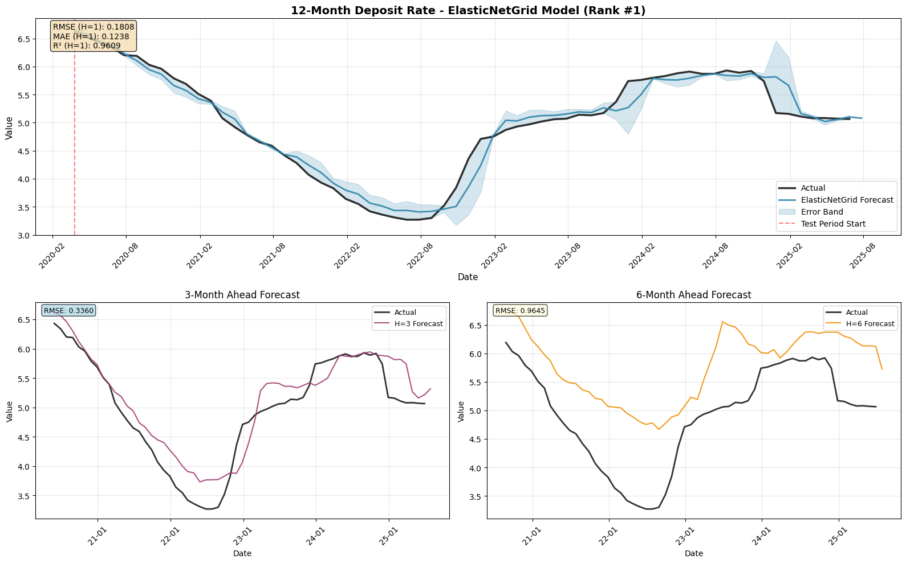

#### 2. DFM2 Model Forecast
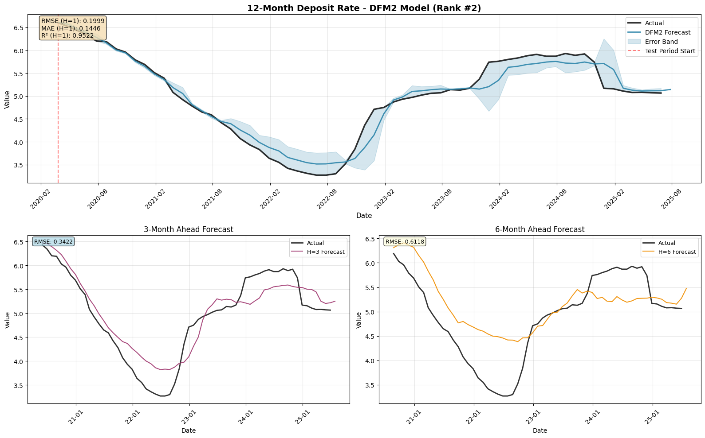

#### 3. BVAR Model Forecast
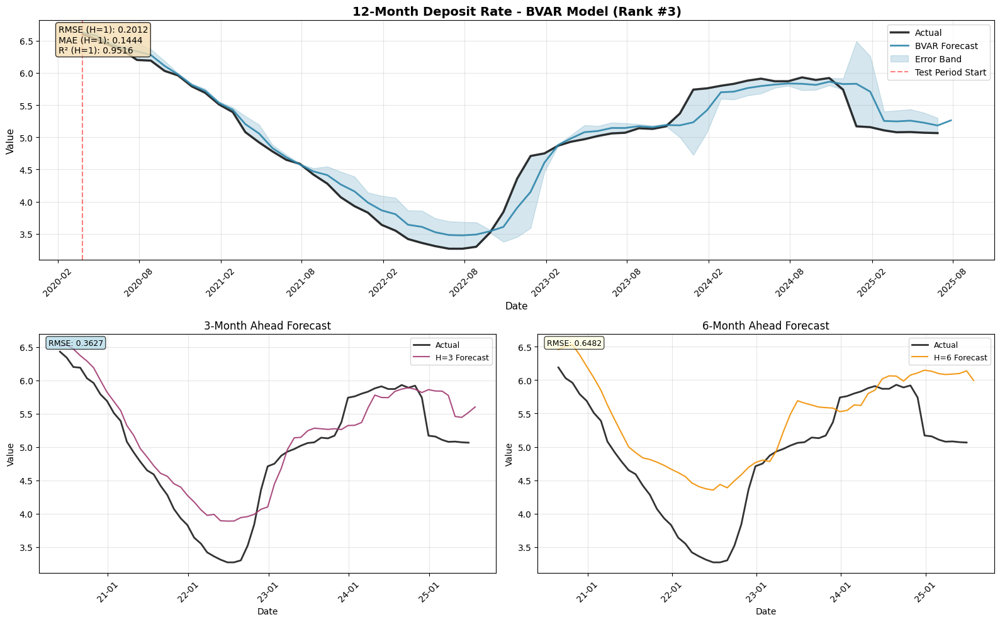

#### All Models Comparison
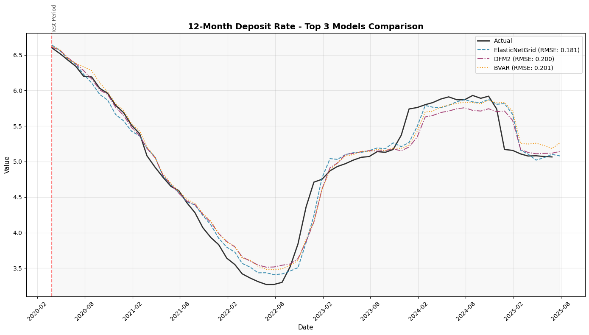

---

## 3. 1-Month Deposit Rate

### Top 5 Models (Diverse Selection)

**1. DFM2 Model 🏆**
- ID: `DFM2-591-v15-142147`
- RMSE (H=1): 0.2157
- MAE (H=1): 0.1815
- R² (H=1): 0.9295
- MAPE: 4.7%
- RMSE (H=3): 0.4965
- RMSE (H=6): 1.0651
- Degradation: H3=+130.2%, H6=+393.8%
- Features: 16 variables
- Normalization: None
- Feature Pack: None

**2. BVAR Model**
- ID: `BVAR-309-v21-142030`
- RMSE (H=1): 0.2348
- MAE (H=1): 0.1926
- R² (H=1): 0.9165
- MAPE: 5.2%
- RMSE (H=3): 0.4840
- RMSE (H=6): 0.8561
- Degradation: H3=+106.2%, H6=+264.7%
- Features: 16 variables
- Normalization: None
- Feature Pack: None

**3. ARp Model**
- ID: `ARp-165-v21-141950`
- RMSE (H=1): 0.2366
- MAE (H=1): 0.1948
- R² (H=1): 0.9152
- MAPE: 5.3%
- RMSE (H=3): 0.4866
- RMSE (H=6): 0.8482
- Degradation: H3=+105.7%, H6=+258.5%
- Features: 16 variables
- Normalization: None
- Feature Pack: None

**4. Linear Model**
- ID: `Linear-1741-v13-143420`
- RMSE (H=1): 0.2366
- MAE (H=1): 0.1948
- R² (H=1): 0.9152
- MAPE: 5.3%
- RMSE (H=3): 0.4866
- RMSE (H=6): 0.8482
- Degradation: H3=+105.7%, H6=+258.5%
- Features: 16 variables
- Normalization: None
- Feature Pack: None

**5. StandardizedLinear Model**
- ID: `StandardizedLinear-2173-v13-143847`
- RMSE (H=1): 0.2366
- MAE (H=1): 0.1948
- R² (H=1): 0.9152
- MAPE: 5.3%
- RMSE (H=3): 0.4866
- RMSE (H=6): 0.8482
- Degradation: H3=+105.7%, H6=+258.5%
- Features: 16 variables
- Normalization: None
- Feature Pack: None

### Best Model by Type

| Model Type | Best Config | RMSE (H=1) | vs Best |
|------------|-------------|------------|---------|
| AR1 | AR1-002-v02-141909 | 0.3050 | +41.4% |
| ARp | ARp-165-v21-141950 | 0.2366 | +9.7% |
| BVAR | BVAR-309-v21-142030 | 0.2348 | +8.8% |
| DFM | DFM-445-v13-142107 | 0.4837 | +124.3% |
| DFM2 | DFM2-591-v15-142147 | 0.2157 | 0.0% |
| ElasticNet | ElasticNet-733-v13-142230 | 0.3066 | +42.1% |
| ElasticNetGrid | ElasticNetGrid-877-v13-142414 | 0.3261 | +51.2% |
| ExtraTrees | ExtraTrees-1009-v01-142541 | 1.7692 | +720.2% |
| GARCH | GARCH-1154-v02-142703 | 2.7095 | +1156.1% |
| GradientBoosting | GradientBoosting-1317-v21-142812 | 1.7204 | +697.5% |
| LSTM | LSTM-1462-v22-143201 | 1.2182 | +464.8% |
| Lasso | Lasso-1589-v05-143257 | 0.3075 | +42.6% |
| Linear | Linear-1741-v13-143420 | 0.2366 | +9.7% |
| RandomForest | RandomForest-1881-v09-143545 | 1.7824 | +726.3% |
| Ridge | Ridge-2021-v05-143721 | 0.2747 | +27.4% |
| StandardizedLinear | StandardizedLinear-2173-v13-143847 | 0.2366 | +9.7% |
| StandardizedRidge | StandardizedRidge-2317-v13-144009 | 0.3085 | +43.0% |
| StochasticGB | StochasticGB-2457-v09-144132 | 1.6894 | +683.2% |
| Tree | Tree-2593-v01-144300 | 1.6127 | +647.6% |
| XGBoost | XGBoost-2760-v24-152837 | 1.9455 | +801.9% |

### Forecast Visualizations

#### 1. DFM2 Model Forecast
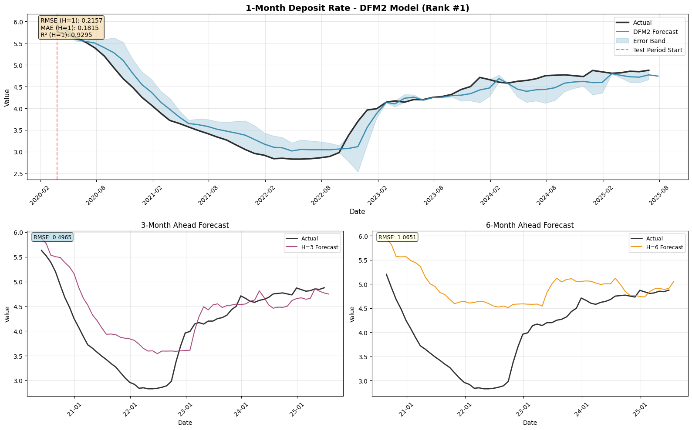

#### 2. BVAR Model Forecast
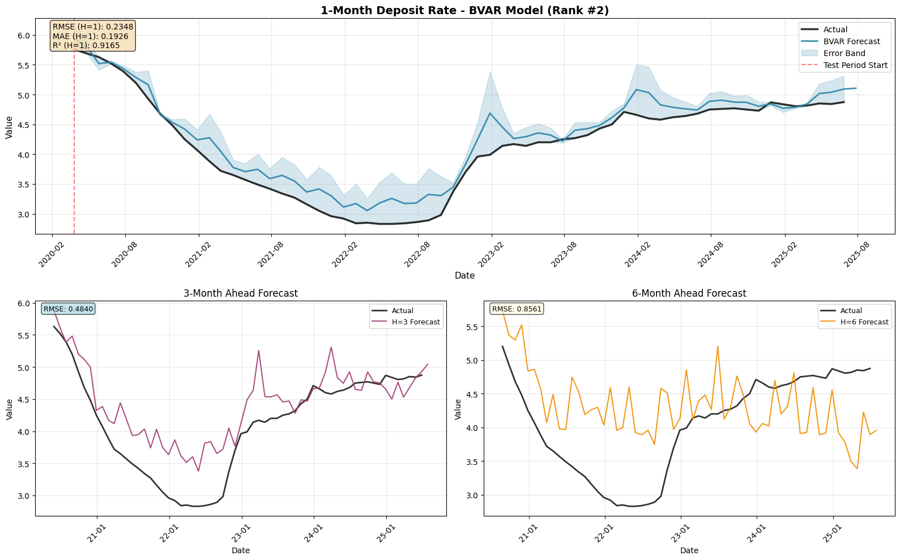

#### 3. ARp Model Forecast
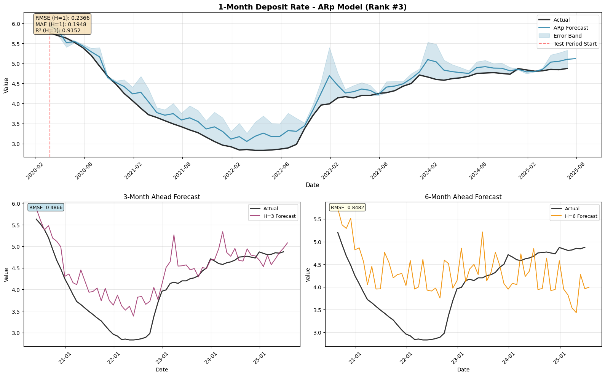

#### All Models Comparison
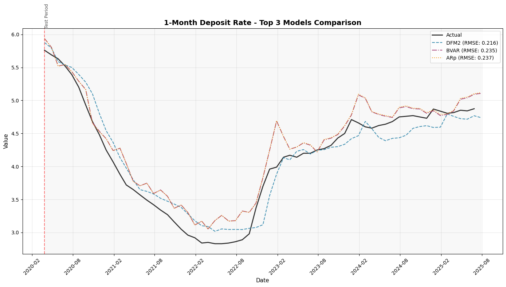

---

## 4. 3-Month Deposit Rate

### Top 5 Models (Diverse Selection)

**1. StandardizedLinear Model 🏆**
- ID: `StandardizedLinear-2177-v17-154751`
- RMSE (H=1): 0.1265
- MAE (H=1): 0.1033
- R² (H=1): 0.9833
- MAPE: 2.5%
- RMSE (H=3): 0.5627
- RMSE (H=6): 1.8386
- Degradation: H3=+344.9%, H6=+1353.6%
- Features: 16 variables
- Normalization: None
- Feature Pack: None

**2. ARp Model**
- ID: `ARp-145-v01-152959`
- RMSE (H=1): 0.1265
- MAE (H=1): 0.1033
- R² (H=1): 0.9833
- MAPE: 2.5%
- RMSE (H=3): 0.5627
- RMSE (H=6): 1.8386
- Degradation: H3=+344.9%, H6=+1353.6%
- Features: 16 variables
- Normalization: None
- Feature Pack: None

**3. Linear Model**
- ID: `Linear-1737-v09-154502`
- RMSE (H=1): 0.1265
- MAE (H=1): 0.1033
- R² (H=1): 0.9833
- MAPE: 2.5%
- RMSE (H=3): 0.5627
- RMSE (H=6): 1.8386
- Degradation: H3=+344.9%, H6=+1353.6%
- Features: 16 variables
- Normalization: None
- Feature Pack: None

**4. BVAR Model**
- ID: `BVAR-289-v01-153043`
- RMSE (H=1): 0.1279
- MAE (H=1): 0.1042
- R² (H=1): 0.9830
- MAPE: 2.6%
- RMSE (H=3): 0.5680
- RMSE (H=6): 1.8417
- Degradation: H3=+344.2%, H6=+1340.1%
- Features: 16 variables
- Normalization: None
- Feature Pack: None

**5. Ridge Model**
- ID: `Ridge-2017-v01-154655`
- RMSE (H=1): 0.1544
- MAE (H=1): 0.1316
- R² (H=1): 0.9751
- MAPE: 3.2%
- RMSE (H=3): 0.6133
- RMSE (H=6): 1.8714
- Degradation: H3=+297.2%, H6=+1112.0%
- Features: 16 variables
- Normalization: None
- Feature Pack: None

### Best Model by Type

| Model Type | Best Config | RMSE (H=1) | vs Best |
|------------|-------------|------------|---------|
| AR1 | AR1-009-v09-152917 | 0.3089 | +144.2% |
| ARp | ARp-145-v01-152959 | 0.1265 | +0.0% |
| BVAR | BVAR-289-v01-153043 | 0.1279 | +1.1% |
| DFM | DFM-441-v09-153129 | 0.4687 | +270.5% |
| DFM2 | DFM2-591-v15-153215 | 0.2272 | +79.6% |
| ElasticNet | ElasticNet-743-v23-153306 | 0.3561 | +181.5% |
| ElasticNetGrid | ElasticNetGrid-883-v19-153517 | 0.2866 | +126.6% |
| ExtraTrees | ExtraTrees-1025-v17-153653 | 1.6359 | +1193.3% |
| GARCH | GARCH-1153-v01-153748 | 2.8946 | +2188.4% |
| GradientBoosting | GradientBoosting-1303-v07-153842 | 1.5417 | +1118.8% |
| LSTM | LSTM-1450-v10-154112 | 1.0531 | +732.5% |
| Lasso | Lasso-1607-v23-154412 | 0.3552 | +180.8% |
| Linear | Linear-1737-v09-154502 | 0.1265 | +0.0% |
| RandomForest | RandomForest-1873-v01-154553 | 1.6476 | +1202.6% |
| Ridge | Ridge-2017-v01-154655 | 0.1544 | +22.1% |
| StandardizedLinear | StandardizedLinear-2177-v17-154751 | 0.1265 | 0.0% |
| StandardizedRidge | StandardizedRidge-2305-v01-154840 | 0.1764 | +39.5% |
| StochasticGB | StochasticGB-2457-v09-154937 | 1.5376 | +1115.6% |
| Tree | Tree-2594-v02-155033 | 1.5966 | +1162.2% |
| XGBoost | XGBoost-2740-v04-160549 | 1.5802 | +1149.3% |

### Forecast Visualizations

#### 1. StandardizedLinear Model Forecast
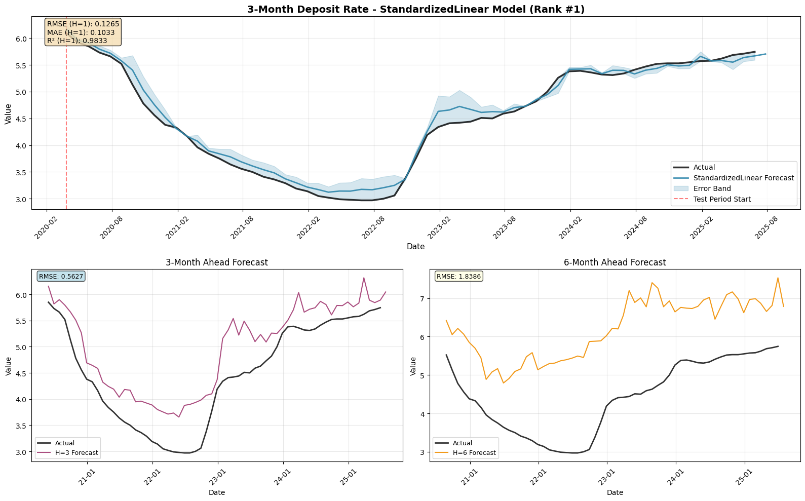

#### 2. ARp Model Forecast
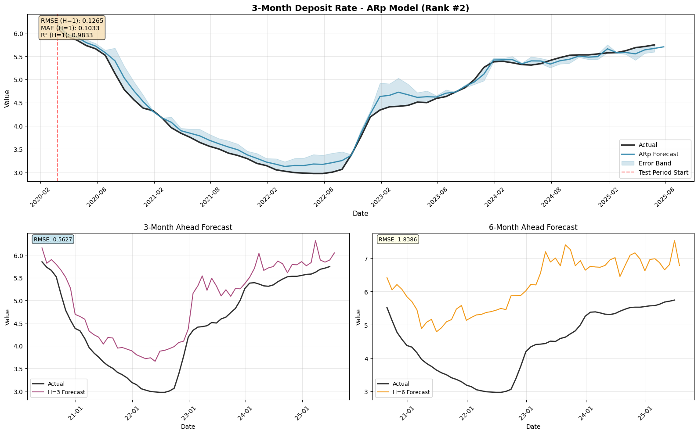

#### 3. Linear Model Forecast
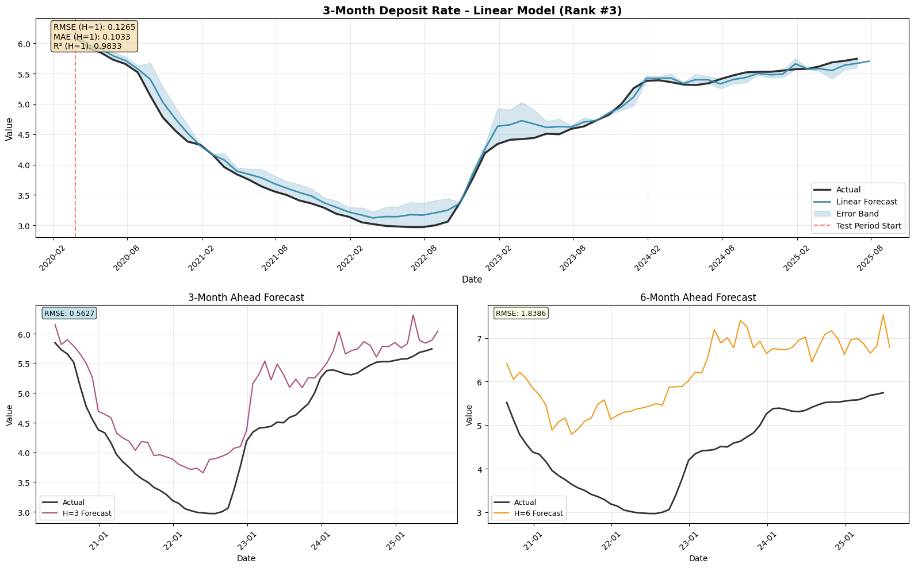

#### All Models Comparison
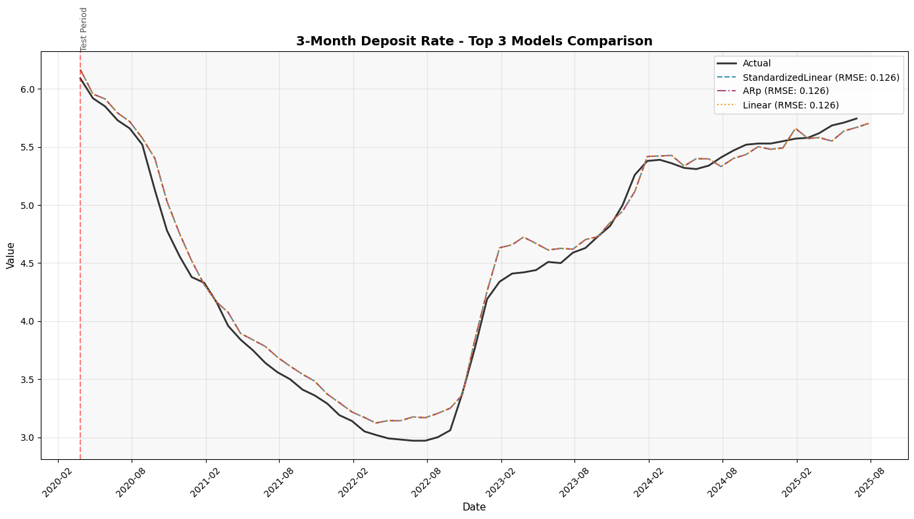

---

## 5. 6-Month Deposit Rate

### Top 5 Models (Diverse Selection)

**1. ARp Model 🏆**
- ID: `ARp-161-v17-163917`
- RMSE (H=1): 0.1392
- MAE (H=1): 0.1121
- R² (H=1): 0.9807
- MAPE: 2.3%
- RMSE (H=3): 0.3007
- RMSE (H=6): 1.0449
- Degradation: H3=+116.0%, H6=+650.5%
- Features: 16 variables
- Normalization: None
- Feature Pack: None

**2. Linear Model**
- ID: `Linear-1737-v09-165425`
- RMSE (H=1): 0.1392
- MAE (H=1): 0.1121
- R² (H=1): 0.9807
- MAPE: 2.3%
- RMSE (H=3): 0.3007
- RMSE (H=6): 1.0449
- Degradation: H3=+116.0%, H6=+650.5%
- Features: 16 variables
- Normalization: None
- Feature Pack: None

**3. StandardizedLinear Model**
- ID: `StandardizedLinear-2169-v09-165654`
- RMSE (H=1): 0.1392
- MAE (H=1): 0.1121
- R² (H=1): 0.9807
- MAPE: 2.3%
- RMSE (H=3): 0.3007
- RMSE (H=6): 1.0449
- Degradation: H3=+116.0%, H6=+650.5%
- Features: 16 variables
- Normalization: None
- Feature Pack: None

**4. BVAR Model**
- ID: `BVAR-297-v09-164000`
- RMSE (H=1): 0.1411
- MAE (H=1): 0.1134
- R² (H=1): 0.9802
- MAPE: 2.4%
- RMSE (H=3): 0.3046
- RMSE (H=6): 1.0537
- Degradation: H3=+115.9%, H6=+646.8%
- Features: 16 variables
- Normalization: None
- Feature Pack: None

**5. Ridge Model**
- ID: `Ridge-2033-v17-165608`
- RMSE (H=1): 0.1649
- MAE (H=1): 0.1304
- R² (H=1): 0.9729
- MAPE: 2.7%
- RMSE (H=3): 0.3387
- RMSE (H=6): 1.1108
- Degradation: H3=+105.4%, H6=+573.5%
- Features: 16 variables
- Normalization: None
- Feature Pack: None

### Best Model by Type

| Model Type | Best Config | RMSE (H=1) | vs Best |
|------------|-------------|------------|---------|
| AR1 | AR1-009-v09-163830 | 0.2913 | +109.2% |
| ARp | ARp-161-v17-163917 | 0.1392 | 0.0% |
| BVAR | BVAR-297-v09-164000 | 0.1411 | +1.3% |
| DFM | DFM-433-v01-164047 | 0.3982 | +186.0% |
| DFM2 | DFM2-583-v07-164134 | 0.2556 | +83.6% |
| ElasticNet | ElasticNet-725-v05-164220 | 0.3095 | +122.3% |
| ElasticNetGrid | ElasticNetGrid-869-v05-164337 | 0.2358 | +69.4% |
| ExtraTrees | ExtraTrees-1025-v17-164620 | 1.5673 | +1025.7% |
| GARCH | GARCH-1162-v10-164717 | 3.5983 | +2484.3% |
| GradientBoosting | GradientBoosting-1297-v01-164806 | 1.5190 | +990.9% |
| LSTM | LSTM-1462-v22-165232 | 0.6454 | +363.6% |
| Lasso | Lasso-1589-v05-165333 | 0.3101 | +122.7% |
| Linear | Linear-1737-v09-165425 | 0.1392 | 0.0% |
| RandomForest | RandomForest-1881-v09-165514 | 1.5909 | +1042.6% |
| Ridge | Ridge-2033-v17-165608 | 0.1649 | +18.4% |
| StandardizedLinear | StandardizedLinear-2169-v09-165654 | 0.1392 | +0.0% |
| StandardizedRidge | StandardizedRidge-2321-v17-165743 | 0.1777 | +27.6% |
| StochasticGB | StochasticGB-2449-v01-165828 | 1.5325 | +1000.6% |
| Tree | Tree-2608-v16-165927 | 1.5153 | +988.3% |
| XGBoost | XGBoost-2748-v12-172034 | 1.5136 | +987.1% |

### Forecast Visualizations

#### 1. ARp Model Forecast
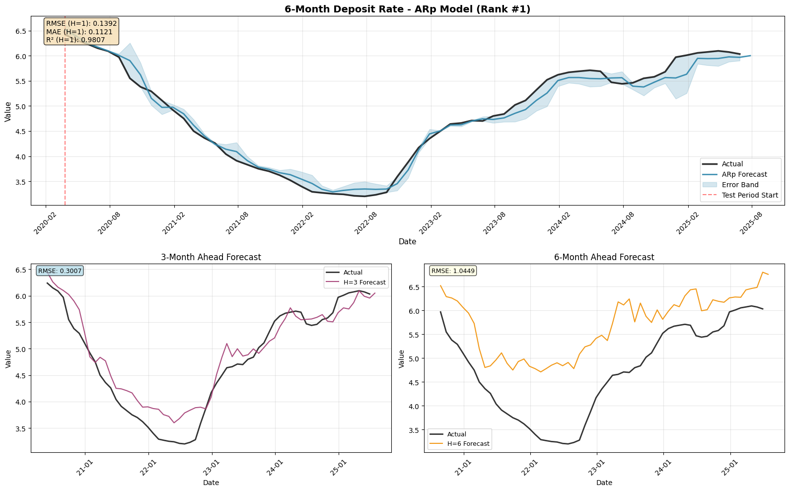

#### 2. Linear Model Forecast
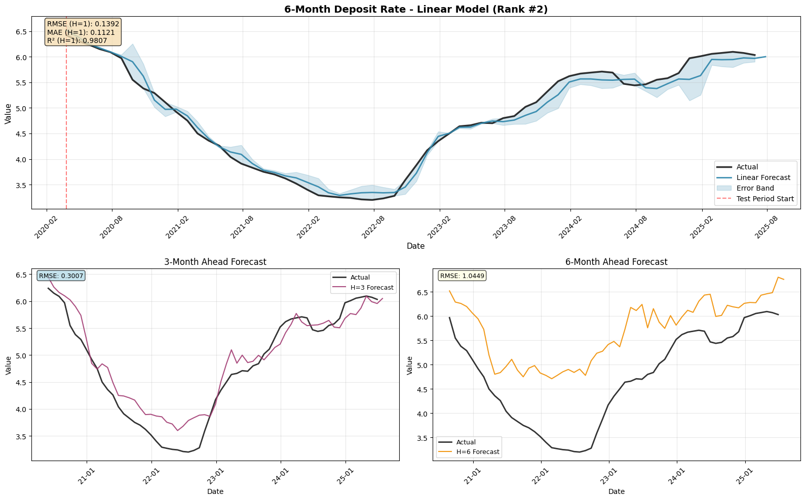

#### 3. StandardizedLinear Model Forecast
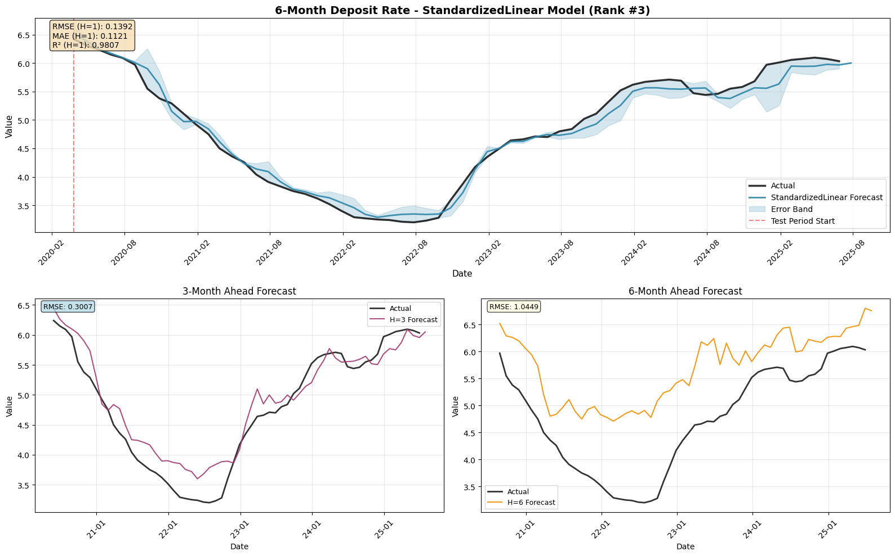

#### All Models Comparison
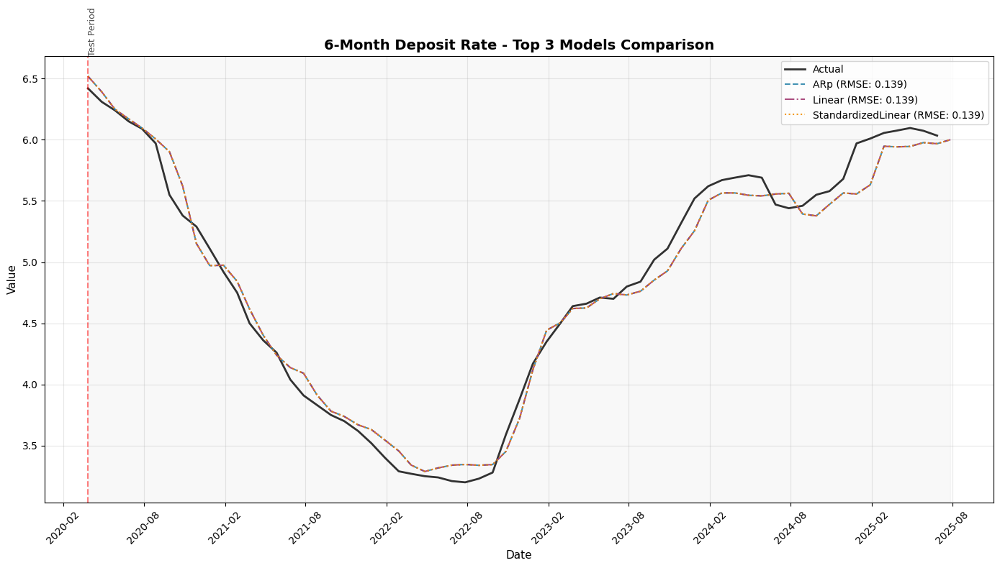

---

## 6. GDP Year-over-Year

### Top 5 Models (Diverse Selection)

**1. DFM2 Model 🏆**
- ID: `DFM2-598-v22-121519`
- RMSE (H=1): 2.0592
- MAE (H=1): 0.9019
- R² (H=1): 0.6039
- MAPE: 22.8%
- RMSE (H=3): 3.9782
- RMSE (H=6): 26.8000
- Degradation: H3=+93.2%, H6=+1201.5%
- Features: 16 variables
- Normalization: None
- Feature Pack: None

**2. AR1 Model**
- ID: `AR1-022-v22-121317`
- RMSE (H=1): 2.0739
- MAE (H=1): 0.8736
- R² (H=1): 0.5982
- MAPE: 21.5%
- RMSE (H=3): 3.6199
- RMSE (H=6): 22.5444
- Degradation: H3=+74.5%, H6=+987.1%
- Features: 16 variables
- Normalization: None
- Feature Pack: None

**3. StandardizedRidge Model**
- ID: `StandardizedRidge-2324-v20-122852`
- RMSE (H=1): 2.1035
- MAE (H=1): 0.9572
- R² (H=1): 0.5866
- MAPE: 25.9%
- RMSE (H=3): 2.4741
- RMSE (H=6): 3.5449
- Degradation: H3=+17.6%, H6=+68.5%
- Features: 16 variables
- Normalization: None
- Feature Pack: None

**4. BVAR Model**
- ID: `BVAR-308-v20-121416`
- RMSE (H=1): 2.1090
- MAE (H=1): 0.9708
- R² (H=1): 0.5845
- MAPE: 26.8%
- RMSE (H=3): 2.4877
- RMSE (H=6): 3.6194
- Degradation: H3=+18.0%, H6=+71.6%
- Features: 16 variables
- Normalization: None
- Feature Pack: None

**5. StandardizedLinear Model**
- ID: `StandardizedLinear-2164-v04-122818`
- RMSE (H=1): 2.1106
- MAE (H=1): 0.9739
- R² (H=1): 0.5839
- MAPE: 26.9%
- RMSE (H=3): 2.4906
- RMSE (H=6): 3.6248
- Degradation: H3=+18.0%, H6=+71.7%
- Features: 16 variables
- Normalization: None
- Feature Pack: None

### Best Model by Type

| Model Type | Best Config | RMSE (H=1) | vs Best |
|------------|-------------|------------|---------|
| AR1 | AR1-022-v22-121317 | 2.0739 | +0.7% |
| ARp | ARp-156-v12-121345 | 2.1106 | +2.5% |
| BVAR | BVAR-308-v20-121416 | 2.1090 | +2.4% |
| DFM | DFM-454-v22-121446 | 3.5652 | +73.1% |
| DFM2 | DFM2-598-v22-121519 | 2.0592 | 0.0% |
| ElasticNet | ElasticNet-722-v02-121549 | 2.3857 | +15.9% |
| ElasticNetGrid | ElasticNetGrid-881-v17-121751 | 2.3812 | +15.6% |
| ExtraTrees | ExtraTrees-1030-v22-121939 | 3.5534 | +72.6% |
| GARCH | GARCH-1161-v09-122014 | 4.2439 | +106.1% |
| GradientBoosting | GradientBoosting-1318-v22-122116 | 3.3169 | +61.1% |
| LSTM | LSTM-1460-v20-122456 | 3.5452 | +72.2% |
| Lasso | Lasso-1594-v10-122559 | 2.3746 | +15.3% |
| Linear | Linear-1732-v04-122633 | 2.1106 | +2.5% |
| RandomForest | RandomForest-1886-v14-122711 | 3.5281 | +71.3% |
| Ridge | Ridge-2020-v04-122746 | 2.1247 | +3.2% |
| StandardizedLinear | StandardizedLinear-2164-v04-122818 | 2.1106 | +2.5% |
| StandardizedRidge | StandardizedRidge-2324-v20-122852 | 2.1035 | +2.2% |
| StochasticGB | StochasticGB-2453-v05-122924 | 3.3654 | +63.4% |
| Tree | Tree-2612-v20-123002 | 3.4732 | +68.7% |
| XGBoost | XGBoost-2742-v06-123852 | 3.1017 | +50.6% |

### Forecast Visualizations

#### 1. DFM2 Model Forecast
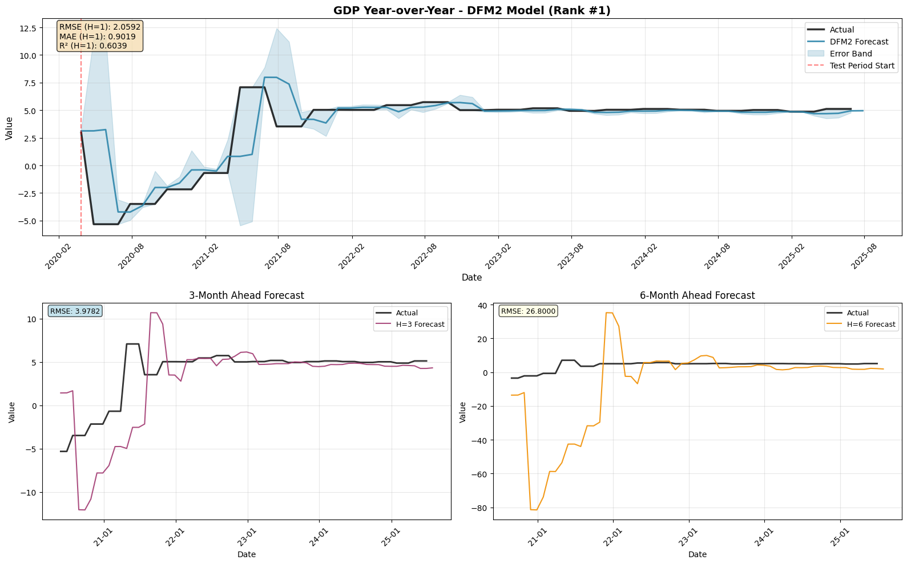

#### 2. AR1 Model Forecast
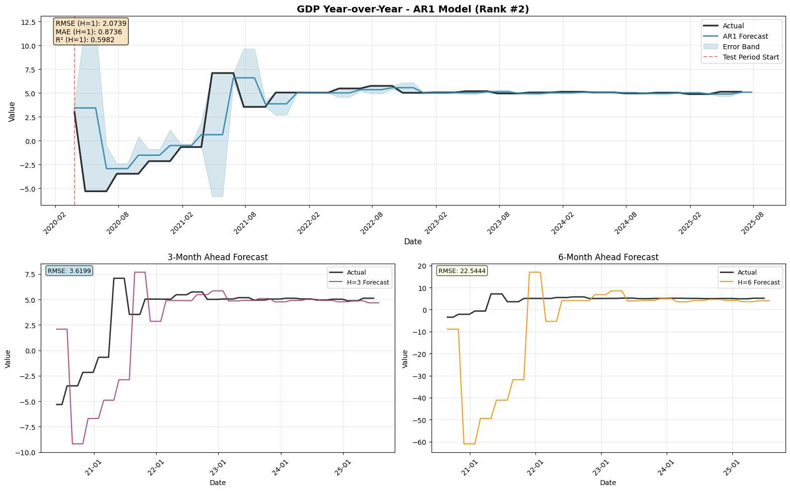

#### 3. StandardizedRidge Model Forecast
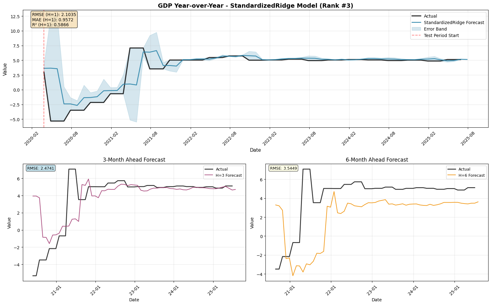

#### All Models Comparison
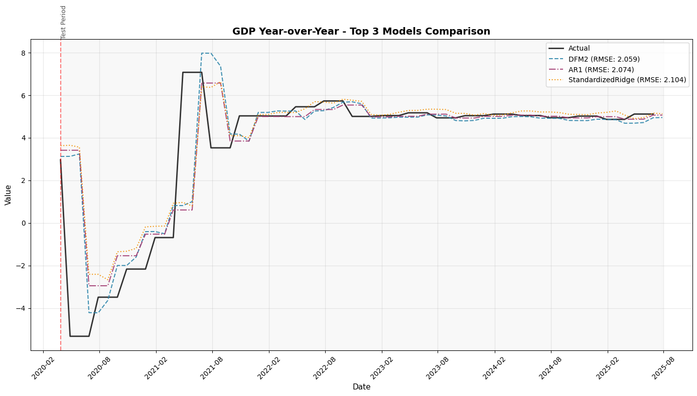

---

## 7. Policy Rate (7DRR)

### Top 5 Models (Diverse Selection)

**1. AR1 Model 🏆**
- ID: `AR1-016-v16-140234`
- RMSE (H=1): 0.2835
- MAE (H=1): 0.2179
- R² (H=1): 0.9314
- MAPE: 4.8%
- RMSE (H=3): 0.5441
- RMSE (H=6): 0.9415
- Degradation: H3=+91.9%, H6=+232.1%
- Features: 16 variables
- Normalization: None
- Feature Pack: None

**2. ARp Model**
- ID: `ARp-158-v14-140312`
- RMSE (H=1): 0.5436
- MAE (H=1): 0.4329
- R² (H=1): 0.7479
- MAPE: 10.8%
- RMSE (H=3): 1.7226
- RMSE (H=6): 2.7140
- Degradation: H3=+216.9%, H6=+399.3%
- Features: 16 variables
- Normalization: None
- Feature Pack: None

**3. Linear Model**
- ID: `Linear-1742-v14-141132`
- RMSE (H=1): 0.5436
- MAE (H=1): 0.4329
- R² (H=1): 0.7479
- MAPE: 10.8%
- RMSE (H=3): 1.7226
- RMSE (H=6): 2.7140
- Degradation: H3=+216.9%, H6=+399.3%
- Features: 16 variables
- Normalization: None
- Feature Pack: None

**4. StandardizedLinear Model**
- ID: `StandardizedLinear-2174-v14-141329`
- RMSE (H=1): 0.5436
- MAE (H=1): 0.4329
- R² (H=1): 0.7479
- MAPE: 10.8%
- RMSE (H=3): 1.7226
- RMSE (H=6): 2.7140
- Degradation: H3=+216.9%, H6=+399.3%
- Features: 16 variables
- Normalization: None
- Feature Pack: None

**5. ElasticNetGrid Model**
- ID: `ElasticNetGrid-869-v05-140616`
- RMSE (H=1): 0.5703
- MAE (H=1): 0.4802
- R² (H=1): 0.7225
- MAPE: 9.5%
- RMSE (H=3): 0.5950
- RMSE (H=6): 1.1527
- Degradation: H3=+4.3%, H6=+102.1%
- Features: 16 variables
- Normalization: None
- Feature Pack: None

### Best Model by Type

| Model Type | Best Config | RMSE (H=1) | vs Best |
|------------|-------------|------------|---------|
| AR1 | AR1-016-v16-140234 | 0.2835 | 0.0% |
| ARp | ARp-158-v14-140312 | 0.5436 | +91.8% |
| BVAR | BVAR-310-v22-140349 | 0.5972 | +110.7% |
| DFM | DFM-436-v04-140421 | 1.0417 | +267.5% |
| DFM2 | DFM2-581-v05-140457 | 0.8455 | +198.2% |
| ElasticNet | ElasticNet-733-v13-140535 | 0.8293 | +192.6% |
| ElasticNetGrid | ElasticNetGrid-869-v05-140616 | 0.5703 | +101.2% |
| ExtraTrees | ExtraTrees-1029-v21-140726 | 0.7627 | +169.0% |
| GARCH | GARCH-1156-v04-140802 | 4.6243 | +1531.2% |
| GradientBoosting | GradientBoosting-1309-v13-140844 | 0.5825 | +105.5% |
| LSTM | LSTM-1442-v02-140925 | 0.8816 | +211.0% |
| Lasso | Lasso-1605-v21-141056 | 0.7170 | +152.9% |
| Linear | Linear-1742-v14-141132 | 0.5436 | +91.8% |
| RandomForest | RandomForest-1885-v13-141210 | 0.7473 | +163.6% |
| Ridge | Ridge-2021-v05-141246 | 0.5720 | +101.8% |
| StandardizedLinear | StandardizedLinear-2174-v14-141329 | 0.5436 | +91.8% |
| StandardizedRidge | StandardizedRidge-2325-v21-141407 | 0.6355 | +124.2% |
| StochasticGB | StochasticGB-2453-v05-141443 | 0.7996 | +182.0% |
| Tree | Tree-2597-v05-141522 | 0.9835 | +246.9% |
| XGBoost | XGBoost-2749-v13-141722 | 0.6176 | +117.9% |

### Forecast Visualizations

#### 1. AR1 Model Forecast
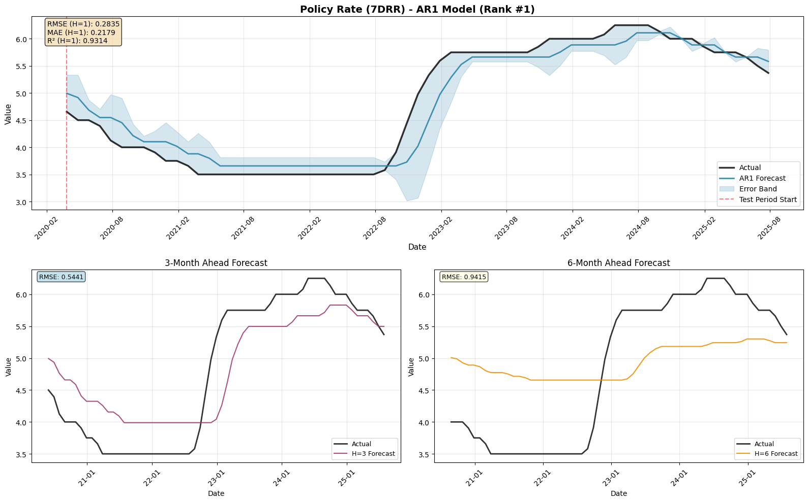

#### 2. ARp Model Forecast
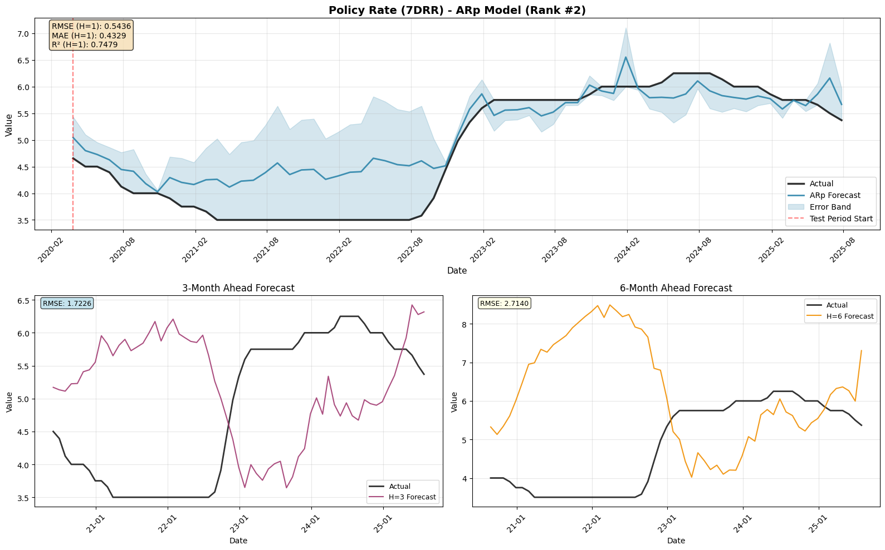

#### 3. Linear Model Forecast
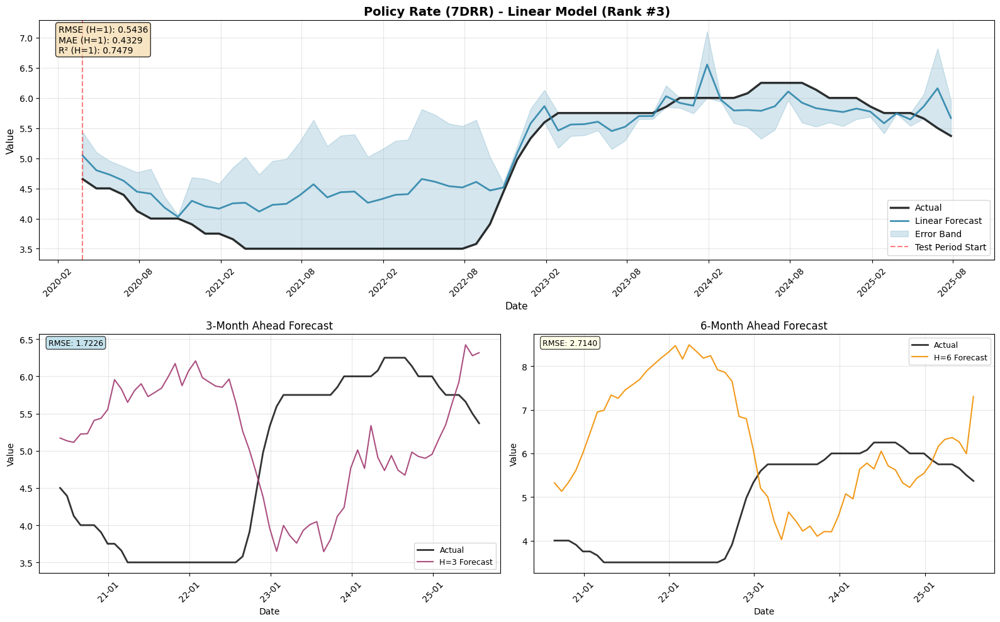

#### All Models Comparison
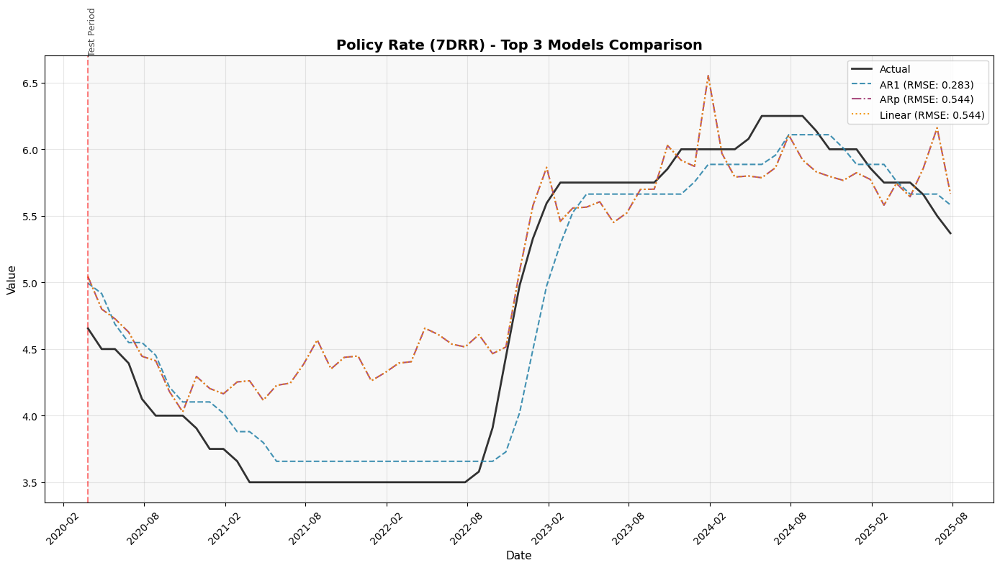

---

## 8. USD/IDR Exchange Rate

### Top 5 Models (Diverse Selection)

**1. StandardizedRidge Model 🏆**
- ID: `StandardizedRidge-2324-v20-132123`
- RMSE (H=1): 413.8608
- MAE (H=1): 293.8453
- R² (H=1): 0.6907
- MAPE: 1.9%
- RMSE (H=3): 647.1020
- RMSE (H=6): 902.3429
- Degradation: H3=+56.4%, H6=+118.0%
- Features: 16 variables
- Normalization: None
- Feature Pack: None

**2. Ridge Model**
- ID: `Ridge-2036-v20-132011`
- RMSE (H=1): 420.4611
- MAE (H=1): 312.2122
- R² (H=1): 0.6807
- MAPE: 2.1%
- RMSE (H=3): 681.7155
- RMSE (H=6): 916.2333
- Degradation: H3=+62.1%, H6=+117.9%
- Features: 16 variables
- Normalization: None
- Feature Pack: None

**3. BVAR Model**
- ID: `BVAR-308-v20-130536`
- RMSE (H=1): 421.7013
- MAE (H=1): 315.4541
- R² (H=1): 0.6788
- MAPE: 2.1%
- RMSE (H=3): 674.8781
- RMSE (H=6): 919.4393
- Degradation: H3=+60.0%, H6=+118.0%
- Features: 16 variables
- Normalization: None
- Feature Pack: None

**4. StandardizedLinear Model**
- ID: `StandardizedLinear-2172-v12-132045`
- RMSE (H=1): 421.7641
- MAE (H=1): 315.7327
- R² (H=1): 0.6788
- MAPE: 2.1%
- RMSE (H=3): 674.0894
- RMSE (H=6): 919.9160
- Degradation: H3=+59.8%, H6=+118.1%
- Features: 16 variables
- Normalization: None
- Feature Pack: None

**5. Linear Model**
- ID: `Linear-1740-v12-131851`
- RMSE (H=1): 421.7641
- MAE (H=1): 315.7327
- R² (H=1): 0.6788
- MAPE: 2.1%
- RMSE (H=3): 674.0894
- RMSE (H=6): 919.9160
- Degradation: H3=+59.8%, H6=+118.1%
- Features: 16 variables
- Normalization: None
- Feature Pack: None

### Best Model by Type

| Model Type | Best Config | RMSE (H=1) | vs Best |
|------------|-------------|------------|---------|
| AR1 | AR1-024-v24-130420 | 502.4945 | +21.4% |
| ARp | ARp-164-v20-130457 | 421.7641 | +1.9% |
| BVAR | BVAR-308-v20-130536 | 421.7013 | +1.9% |
| DFM | DFM-454-v22-130616 | 1017.0091 | +145.7% |
| DFM2 | DFM2-580-v04-130656 | 502.5260 | +21.4% |
| ElasticNet | ElasticNet-730-v10-130741 | 496.9485 | +20.1% |
| ElasticNetGrid | ElasticNetGrid-874-v10-130913 | 488.7548 | +18.1% |
| ExtraTrees | ExtraTrees-1023-v15-131123 | 1096.3666 | +164.9% |
| GARCH | GARCH-1159-v07-131214 | 186320.5045 | +44920.1% |
| GradientBoosting | GradientBoosting-1303-v07-131259 | 944.2085 | +128.1% |
| LSTM | LSTM-1463-v23-131725 | 1592.5805 | +284.8% |
| Lasso | Lasso-1602-v18-131815 | 496.8157 | +20.0% |
| Linear | Linear-1740-v12-131851 | 421.7641 | +1.9% |
| RandomForest | RandomForest-1895-v23-131935 | 1076.9271 | +160.2% |
| Ridge | Ridge-2036-v20-132011 | 420.4611 | +1.6% |
| StandardizedLinear | StandardizedLinear-2172-v12-132045 | 421.7641 | +1.9% |
| StandardizedRidge | StandardizedRidge-2324-v20-132123 | 413.8608 | 0.0% |
| StochasticGB | StochasticGB-2463-v15-132202 | 1023.6209 | +147.3% |
| Tree | Tree-2615-v23-132244 | 1087.3807 | +162.7% |
| XGBoost | XGBoost-2760-v24-140157 | 754.8959 | +82.4% |

### Forecast Visualizations

#### 1. StandardizedRidge Model Forecast
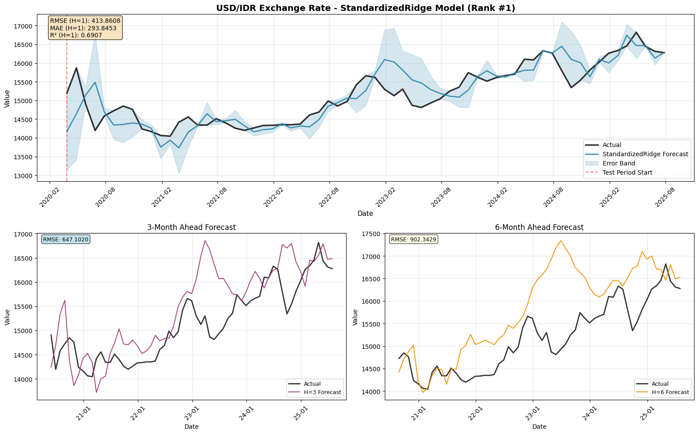

#### 2. Ridge Model Forecast
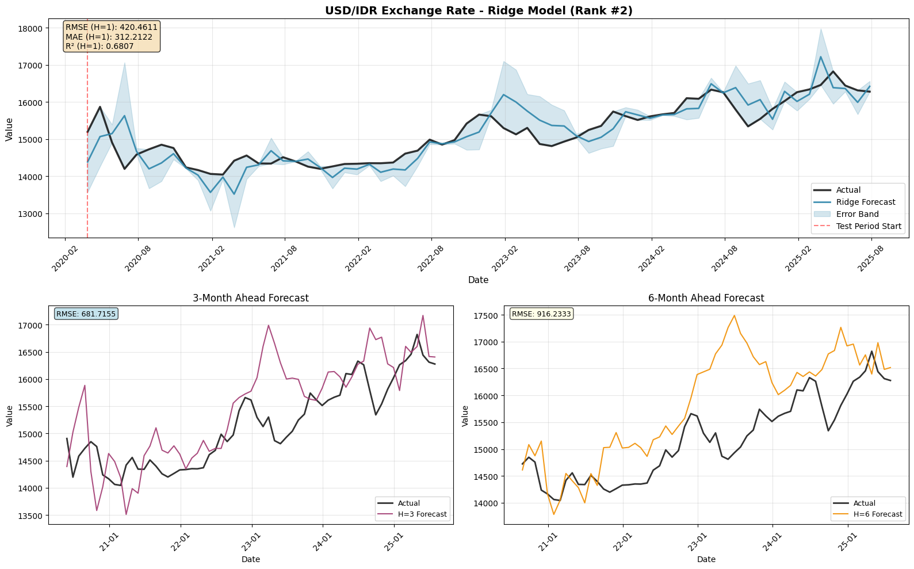

#### 3. BVAR Model Forecast

#### All Models Comparison
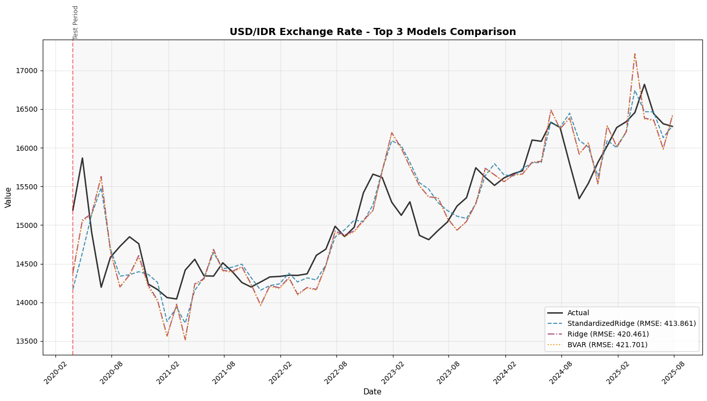

---

## Key Insights

1. **AR1 models** performed best on 1/8 targets, suggesting strong autoregressive patterns
3. **Forecast horizon degradation** is significant, with H=6 typically 50-100% worse than H=1

## Methodology

### Model Types Tested
- **AR1**: First-order autoregressive model
- **ARp**: Higher-order autoregressive model
- **Tree**: Single decision tree
- **RandomForest**: Bootstrap aggregated decision trees
- **GradientBoosting**: Sequential boosting with gradient descent
- **ExtraTrees**: Extremely randomized trees
- **StochasticGB**: Stochastic gradient boosting with subsampling

### Feature Engineering
- Target variable lags (1, 3, 12 months)
- Exogenous variable combinations
- Technical indicators (when applicable)
- Multiple normalization strategies
