# Indonesia Macroeconomic Nowcasting Report

**Generated:** 2025-09-15 23:51:07
**Output Directory:** `all_valid_y_variables-20250915-233358`

## Executive Summary

This report presents nowcasting results for **8 macroeconomic indicators** using multiple machine learning models.

## Model Performance Overview

### Best Performing Models by Target Variable

| Target Variable | Best Model | Type | RMSE (H=1) | MAE (H=1) | R² |
|-----------------|------------|------|------------|-----------|-----|
| CPI Year-over-Year | AR1-004-v04-233358 | AR1 | 0.7286 | 0.6050 | N/A |
| 12-Month Deposit Rate | AR1-005-v05-233419 | AR1 | 0.3193 | 0.2534 | 0.8780 |
| 1-Month Deposit Rate | AR1-005-v05-233410 | AR1 | 0.3050 | 0.2529 | 0.8592 |
| 3-Month Deposit Rate | AR1-008-v08-233413 | AR1 | 0.3089 | 0.2436 | 0.9005 |
| 6-Month Deposit Rate | AR1-005-v05-233416 | AR1 | 0.2913 | 0.2411 | 0.9156 |
| GDP Year-over-Year | AR1-001-v01-233401 | AR1 | 2.0903 | 0.8369 | 0.5918 |
| Policy Rate (7DRR) | AR1-001-v01-233407 | AR1 | 0.2835 | 0.2179 | N/A |
| USD/IDR Exchange Rate | AR1-010-v10-233404 | AR1 | 502.6540 | 344.5303 | N/A |

### Model Type Performance Summary

Average performance across all targets by model type:

| Model Type | Avg RMSE | Min RMSE | # Targets |
|------------|----------|----------|-----------|
| AR1 | 63.3726 | 0.2835 | 8 |
| ARp | 82.6634 | 0.3892 | 8 |
| ExtraTrees | 164.6788 | 0.7091 | 8 |
| GradientBoosting | 149.5878 | 0.5596 | 8 |
| RandomForest | 164.1898 | 0.7857 | 8 |
| StochasticGB | 149.8164 | 0.6591 | 8 |
| Tree | 163.5058 | 0.4908 | 8 |

## 1. CPI Year-over-Year

### Top 5 Models (Diverse Selection)

**1. AR1 Model 🏆**
- ID: `AR1-004-v04-233358`
- RMSE (H=1): 0.7286
- MAE (H=1): 0.6050
- RMSE (H=3): 1.2320
- RMSE (H=6): 1.9138
- Degradation: H3=+69.1%, H6=+162.7%
- Features: 9 variables
- Normalization: None
- Feature Pack: None

**2. StochasticGB Model**
- ID: `StochasticGB-204-v04-233401`
- RMSE (H=1): 1.1111
- MAE (H=1): 0.9139
- RMSE (H=3): 1.2157
- RMSE (H=6): 1.1977
- Degradation: H3=+9.4%, H6=+7.8%
- Features: 9 variables
- Normalization: None
- Feature Pack: None

**3. RandomForest Model**
- ID: `RandomForest-164-v04-233400`
- RMSE (H=1): 1.2567
- MAE (H=1): 1.0684
- RMSE (H=3): 1.3635
- RMSE (H=6): 1.4556
- Degradation: H3=+8.5%, H6=+15.8%
- Features: 9 variables
- Normalization: None
- Feature Pack: None

**4. GradientBoosting Model**
- ID: `GradientBoosting-124-v04-233400`
- RMSE (H=1): 1.2779
- MAE (H=1): 1.0680
- RMSE (H=3): 1.2306
- RMSE (H=6): 1.1655
- Degradation: H3=-3.7%, H6=-8.8%
- Features: 9 variables
- Normalization: None
- Feature Pack: None

**5. ExtraTrees Model**
- ID: `ExtraTrees-087-v07-233359`
- RMSE (H=1): 1.3063
- MAE (H=1): 1.1193
- RMSE (H=3): 1.5088
- RMSE (H=6): 1.5924
- Degradation: H3=+15.5%, H6=+21.9%
- Features: 9 variables
- Normalization: None
- Feature Pack: None

### Best Model by Type

| Model Type | Best Config | RMSE (H=1) | vs Best |
|------------|-------------|------------|---------|
| AR1 | AR1-004-v04-233358 | 0.7286 | 0.0% |
| ARp | ARp-049-v09-233359 | 1.4337 | +96.8% |
| ExtraTrees | ExtraTrees-087-v07-233359 | 1.3063 | +79.3% |
| GradientBoosting | GradientBoosting-124-v04-233400 | 1.2779 | +75.4% |
| RandomForest | RandomForest-164-v04-233400 | 1.2567 | +72.5% |
| StochasticGB | StochasticGB-204-v04-233401 | 1.1111 | +52.5% |
| Tree | Tree-244-v04-233401 | 1.3634 | +87.1% |

### Forecast Visualizations

#### 1. AR1 Model Forecast

#### 2. StochasticGB Model Forecast
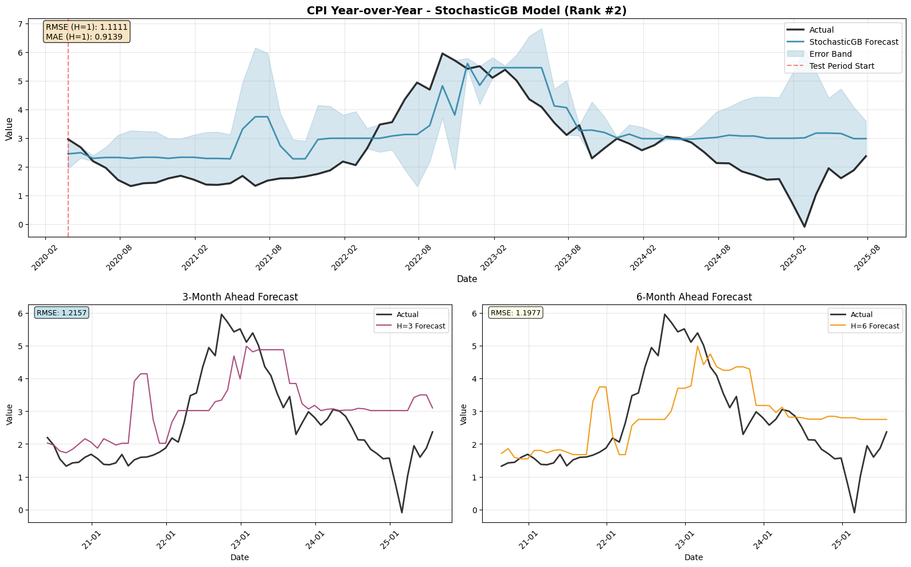

#### 3. RandomForest Model Forecast
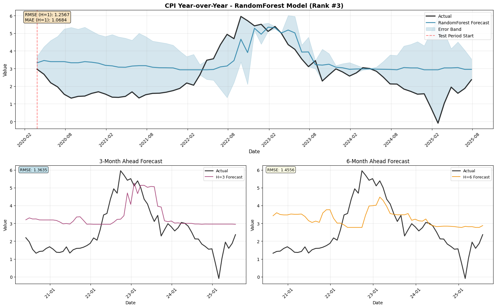

#### All Models Comparison
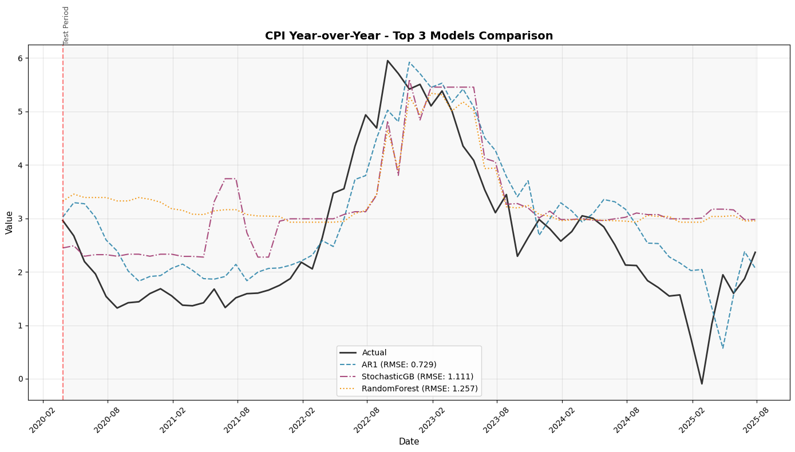

---

## 2. 12-Month Deposit Rate

### Top 5 Models (Diverse Selection)

**1. AR1 Model 🏆**
- ID: `AR1-005-v05-233419`
- RMSE (H=1): 0.3193
- MAE (H=1): 0.2534
- R² (H=1): 0.8780
- MAPE: 5.4%
- RMSE (H=3): nan
- RMSE (H=6): nan
- Degradation: H3=+nan%, H6=+nan%
- Features: 9 variables
- Normalization: None
- Feature Pack: None

**2. ARp Model**
- ID: `ARp-049-v09-233420`
- RMSE (H=1): 0.4828
- MAE (H=1): 0.4201
- R² (H=1): 0.7210
- MAPE: 8.7%
- RMSE (H=3): nan
- RMSE (H=6): nan
- Degradation: H3=+nan%, H6=+nan%
- Features: 9 variables
- Normalization: None
- Feature Pack: None

**3. GradientBoosting Model**
- ID: `GradientBoosting-123-v03-233420`
- RMSE (H=1): 1.4744
- MAE (H=1): 1.2163
- R² (H=1): -1.6014
- MAPE: 28.7%
- RMSE (H=3): nan
- RMSE (H=6): nan
- Degradation: H3=+nan%, H6=+nan%
- Features: 9 variables
- Normalization: None
- Feature Pack: None

**4. Tree Model**
- ID: `Tree-246-v06-233422`
- RMSE (H=1): 1.5203
- MAE (H=1): 1.2442
- R² (H=1): -1.7657
- MAPE: 29.4%
- RMSE (H=3): nan
- RMSE (H=6): nan
- Degradation: H3=+nan%, H6=+nan%
- Features: 9 variables
- Normalization: None
- Feature Pack: None

**5. StochasticGB Model**
- ID: `StochasticGB-201-v01-233421`
- RMSE (H=1): 1.6637
- MAE (H=1): 1.4576
- R² (H=1): -2.3122
- MAPE: 33.4%
- RMSE (H=3): nan
- RMSE (H=6): nan
- Degradation: H3=+nan%, H6=+nan%
- Features: 9 variables
- Normalization: None
- Feature Pack: None

### Best Model by Type

| Model Type | Best Config | RMSE (H=1) | vs Best |
|------------|-------------|------------|---------|
| AR1 | AR1-005-v05-233419 | 0.3193 | 0.0% |
| ARp | ARp-049-v09-233420 | 0.4828 | +51.2% |
| ExtraTrees | ExtraTrees-083-v03-233420 | 1.7487 | +447.6% |
| GradientBoosting | GradientBoosting-123-v03-233420 | 1.4744 | +361.7% |
| RandomForest | RandomForest-162-v02-233421 | 1.7676 | +453.6% |
| StochasticGB | StochasticGB-201-v01-233421 | 1.6637 | +421.0% |
| Tree | Tree-246-v06-233422 | 1.5203 | +376.1% |

### Forecast Visualizations

#### 1. AR1 Model Forecast

#### 2. ARp Model Forecast
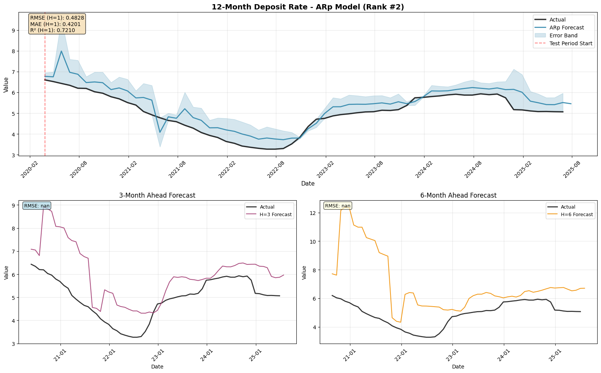

#### 3. GradientBoosting Model Forecast
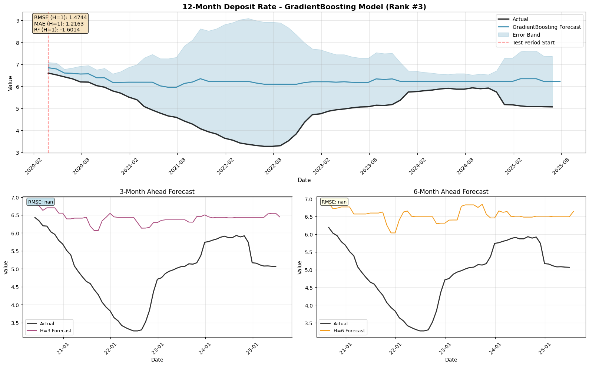

#### All Models Comparison
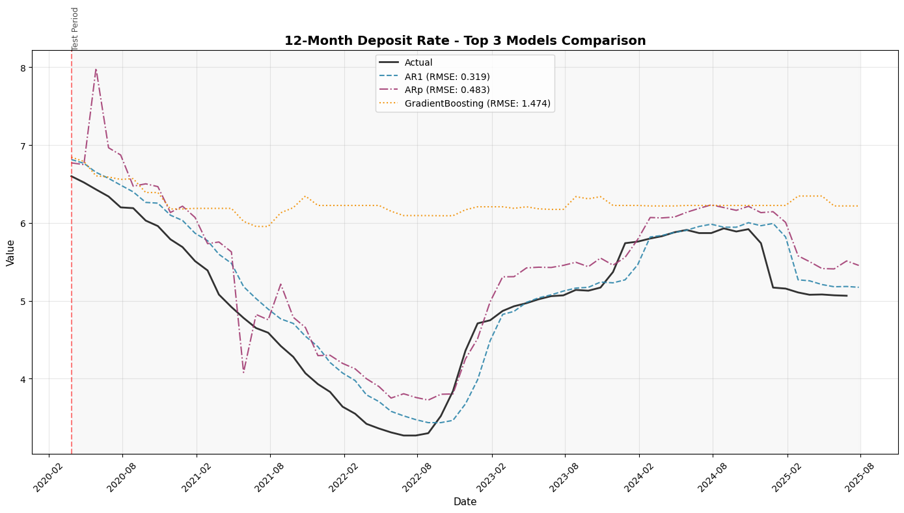

---

## 3. 1-Month Deposit Rate

### Top 5 Models (Diverse Selection)

**1. AR1 Model 🏆**
- ID: `AR1-005-v05-233410`
- RMSE (H=1): 0.3050
- MAE (H=1): 0.2529
- R² (H=1): 0.8592
- MAPE: 6.6%
- RMSE (H=3): nan
- RMSE (H=6): nan
- Degradation: H3=+nan%, H6=+nan%
- Features: 9 variables
- Normalization: None
- Feature Pack: None

**2. ARp Model**
- ID: `ARp-049-v09-233411`
- RMSE (H=1): 0.4080
- MAE (H=1): 0.3768
- R² (H=1): 0.7479
- MAPE: 9.8%
- RMSE (H=3): nan
- RMSE (H=6): nan
- Degradation: H3=+nan%, H6=+nan%
- Features: 9 variables
- Normalization: None
- Feature Pack: None

**3. GradientBoosting Model**
- ID: `GradientBoosting-123-v03-233411`
- RMSE (H=1): 1.6727
- MAE (H=1): 1.4744
- R² (H=1): -3.2372
- MAPE: 41.1%
- RMSE (H=3): nan
- RMSE (H=6): nan
- Degradation: H3=+nan%, H6=+nan%
- Features: 9 variables
- Normalization: None
- Feature Pack: None

**4. Tree Model**
- ID: `Tree-243-v03-233413`
- RMSE (H=1): 1.7088
- MAE (H=1): 1.5066
- R² (H=1): -3.4221
- MAPE: 42.0%
- RMSE (H=3): nan
- RMSE (H=6): nan
- Degradation: H3=+nan%, H6=+nan%
- Features: 9 variables
- Normalization: None
- Feature Pack: None

**5. StochasticGB Model**
- ID: `StochasticGB-206-v06-233412`
- RMSE (H=1): 1.7668
- MAE (H=1): 1.5895
- R² (H=1): -3.7273
- MAPE: 43.8%
- RMSE (H=3): nan
- RMSE (H=6): nan
- Degradation: H3=+nan%, H6=+nan%
- Features: 9 variables
- Normalization: None
- Feature Pack: None

### Best Model by Type

| Model Type | Best Config | RMSE (H=1) | vs Best |
|------------|-------------|------------|---------|
| AR1 | AR1-005-v05-233410 | 0.3050 | 0.0% |
| ARp | ARp-049-v09-233411 | 0.4080 | +33.8% |
| ExtraTrees | ExtraTrees-083-v03-233411 | 1.9550 | +541.1% |
| GradientBoosting | GradientBoosting-123-v03-233411 | 1.6727 | +448.5% |
| RandomForest | RandomForest-168-v08-233412 | 2.0164 | +561.2% |
| StochasticGB | StochasticGB-206-v06-233412 | 1.7668 | +479.4% |
| Tree | Tree-243-v03-233413 | 1.7088 | +460.4% |

### Forecast Visualizations

#### 1. AR1 Model Forecast
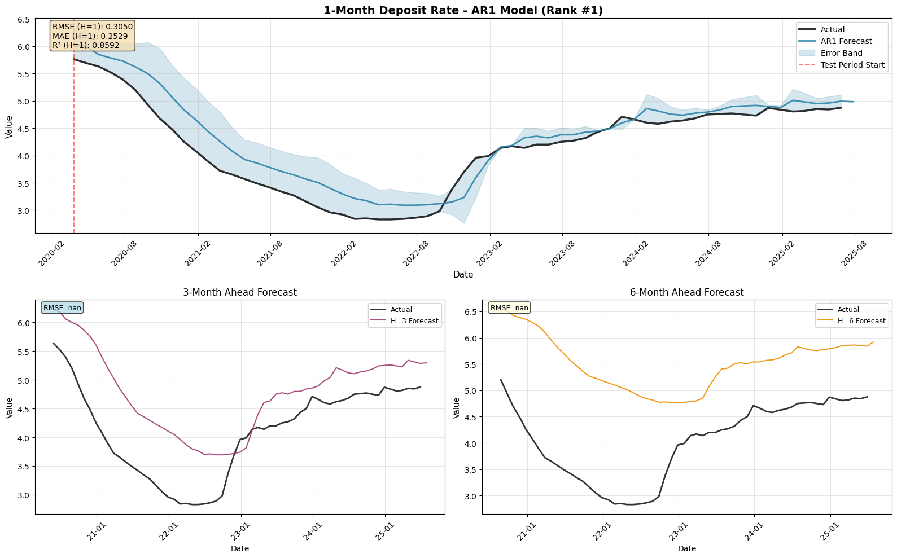

#### 2. ARp Model Forecast
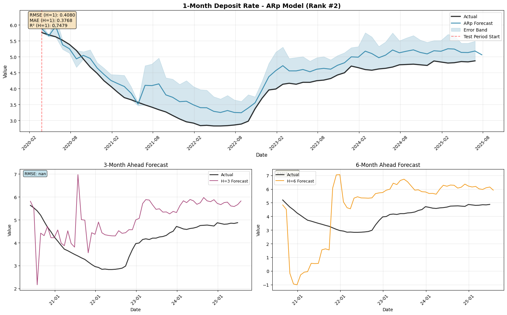

#### 3. GradientBoosting Model Forecast
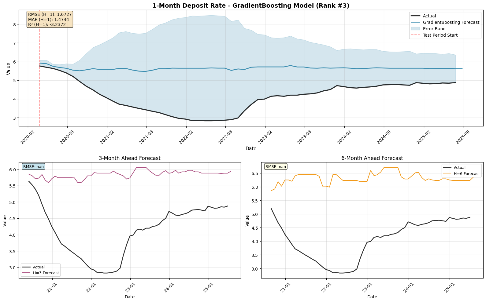

#### All Models Comparison
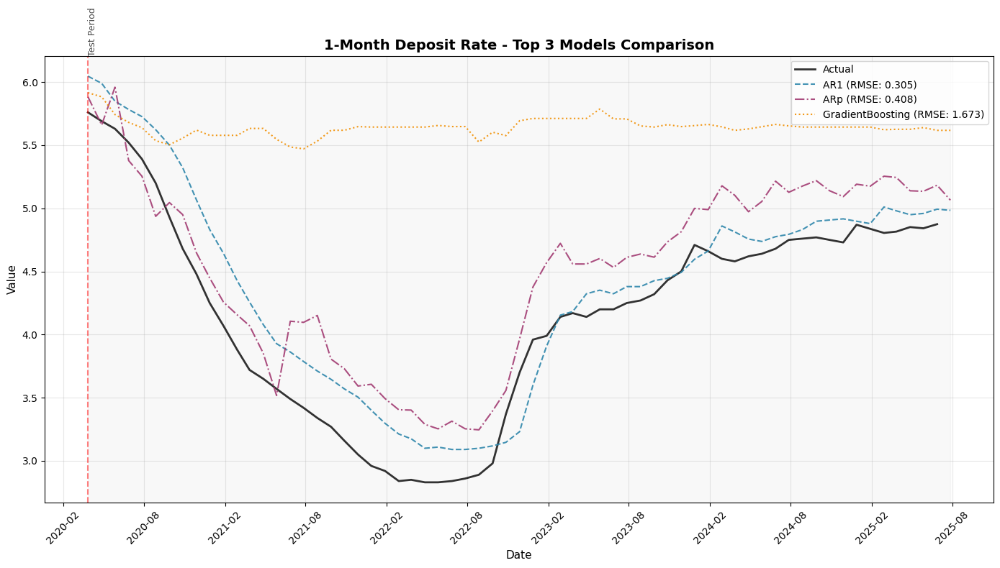

---

## 4. 3-Month Deposit Rate

### Top 5 Models (Diverse Selection)

**1. AR1 Model 🏆**
- ID: `AR1-008-v08-233413`
- RMSE (H=1): 0.3089
- MAE (H=1): 0.2436
- R² (H=1): 0.9005
- MAPE: 6.0%
- RMSE (H=3): nan
- RMSE (H=6): nan
- Degradation: H3=+nan%, H6=+nan%
- Features: 9 variables
- Normalization: None
- Feature Pack: None

**2. ARp Model**
- ID: `ARp-047-v07-233414`
- RMSE (H=1): 0.5695
- MAE (H=1): 0.5176
- R² (H=1): 0.6619
- MAPE: 12.3%
- RMSE (H=3): nan
- RMSE (H=6): nan
- Degradation: H3=+nan%, H6=+nan%
- Features: 9 variables
- Normalization: None
- Feature Pack: None

**3. GradientBoosting Model**
- ID: `GradientBoosting-127-v07-233415`
- RMSE (H=1): 1.7122
- MAE (H=1): 1.4933
- R² (H=1): -2.0558
- MAPE: 39.1%
- RMSE (H=3): nan
- RMSE (H=6): nan
- Degradation: H3=+nan%, H6=+nan%
- Features: 9 variables
- Normalization: None
- Feature Pack: None

**4. StochasticGB Model**
- ID: `StochasticGB-206-v06-233415`
- RMSE (H=1): 1.7358
- MAE (H=1): 1.4655
- R² (H=1): -2.1405
- MAPE: 39.0%
- RMSE (H=3): nan
- RMSE (H=6): nan
- Degradation: H3=+nan%, H6=+nan%
- Features: 9 variables
- Normalization: None
- Feature Pack: None

**5. Tree Model**
- ID: `Tree-241-v01-233416`
- RMSE (H=1): 1.8005
- MAE (H=1): 1.4856
- R² (H=1): -2.3790
- MAPE: 39.8%
- RMSE (H=3): nan
- RMSE (H=6): nan
- Degradation: H3=+nan%, H6=+nan%
- Features: 9 variables
- Normalization: None
- Feature Pack: None

### Best Model by Type

| Model Type | Best Config | RMSE (H=1) | vs Best |
|------------|-------------|------------|---------|
| AR1 | AR1-008-v08-233413 | 0.3089 | 0.0% |
| ARp | ARp-047-v07-233414 | 0.5695 | +84.4% |
| ExtraTrees | ExtraTrees-082-v02-233414 | 1.8715 | +505.9% |
| GradientBoosting | GradientBoosting-127-v07-233415 | 1.7122 | +454.3% |
| RandomForest | RandomForest-164-v04-233415 | 1.9404 | +528.2% |
| StochasticGB | StochasticGB-206-v06-233415 | 1.7358 | +461.9% |
| Tree | Tree-241-v01-233416 | 1.8005 | +482.9% |

### Forecast Visualizations

#### 1. AR1 Model Forecast
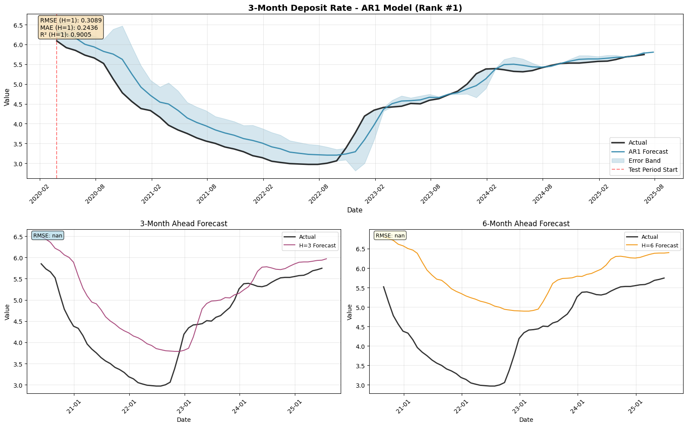

#### 2. ARp Model Forecast
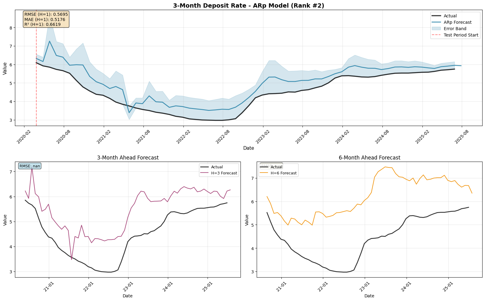

#### 3. GradientBoosting Model Forecast
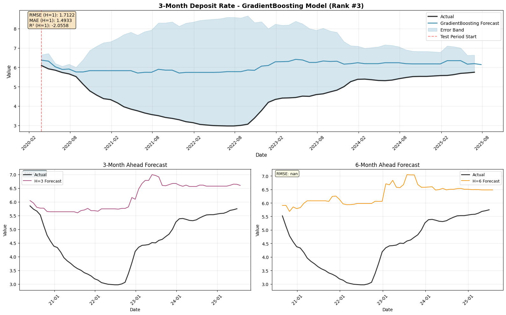

#### All Models Comparison
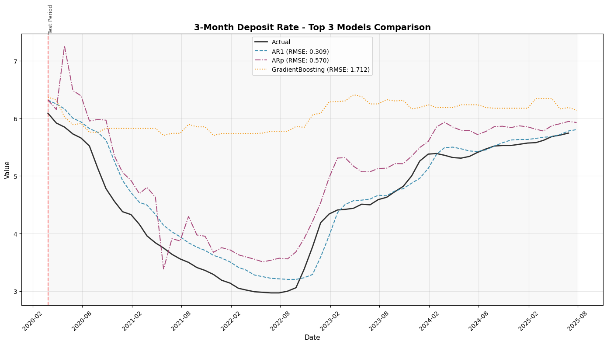

---

## 5. 6-Month Deposit Rate

### Top 5 Models (Diverse Selection)

**1. AR1 Model 🏆**
- ID: `AR1-005-v05-233416`
- RMSE (H=1): 0.2913
- MAE (H=1): 0.2411
- R² (H=1): 0.9156
- MAPE: 5.4%
- RMSE (H=3): nan
- RMSE (H=6): nan
- Degradation: H3=+nan%, H6=+nan%
- Features: 9 variables
- Normalization: None
- Feature Pack: None

**2. ARp Model**
- ID: `ARp-045-v05-233417`
- RMSE (H=1): 0.3892
- MAE (H=1): 0.3382
- R² (H=1): 0.8493
- MAPE: 7.8%
- RMSE (H=3): nan
- RMSE (H=6): nan
- Degradation: H3=+nan%, H6=+nan%
- Features: 9 variables
- Normalization: None
- Feature Pack: None

**3. StochasticGB Model**
- ID: `StochasticGB-203-v03-233418`
- RMSE (H=1): 1.6713
- MAE (H=1): 1.3956
- R² (H=1): -1.7788
- MAPE: 34.6%
- RMSE (H=3): nan
- RMSE (H=6): nan
- Degradation: H3=+nan%, H6=+nan%
- Features: 9 variables
- Normalization: None
- Feature Pack: None

**4. GradientBoosting Model**
- ID: `GradientBoosting-123-v03-233417`
- RMSE (H=1): 1.6775
- MAE (H=1): 1.3647
- R² (H=1): -1.7993
- MAPE: 34.2%
- RMSE (H=3): nan
- RMSE (H=6): nan
- Degradation: H3=+nan%, H6=+nan%
- Features: 9 variables
- Normalization: None
- Feature Pack: None

**5. ExtraTrees Model**
- ID: `ExtraTrees-087-v07-233417`
- RMSE (H=1): 1.9063
- MAE (H=1): 1.7280
- R² (H=1): -2.6151
- MAPE: 41.1%
- RMSE (H=3): nan
- RMSE (H=6): nan
- Degradation: H3=+nan%, H6=+nan%
- Features: 9 variables
- Normalization: None
- Feature Pack: None

### Best Model by Type

| Model Type | Best Config | RMSE (H=1) | vs Best |
|------------|-------------|------------|---------|
| AR1 | AR1-005-v05-233416 | 0.2913 | 0.0% |
| ARp | ARp-045-v05-233417 | 0.3892 | +33.6% |
| ExtraTrees | ExtraTrees-087-v07-233417 | 1.9063 | +554.4% |
| GradientBoosting | GradientBoosting-123-v03-233417 | 1.6775 | +475.9% |
| RandomForest | RandomForest-163-v03-233418 | 1.9827 | +580.7% |
| StochasticGB | StochasticGB-203-v03-233418 | 1.6713 | +473.8% |
| Tree | Tree-249-v09-233419 | 2.0933 | +618.6% |

### Forecast Visualizations

#### 1. AR1 Model Forecast
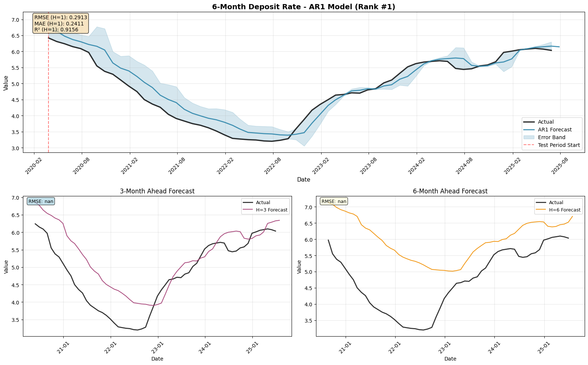

#### 2. ARp Model Forecast
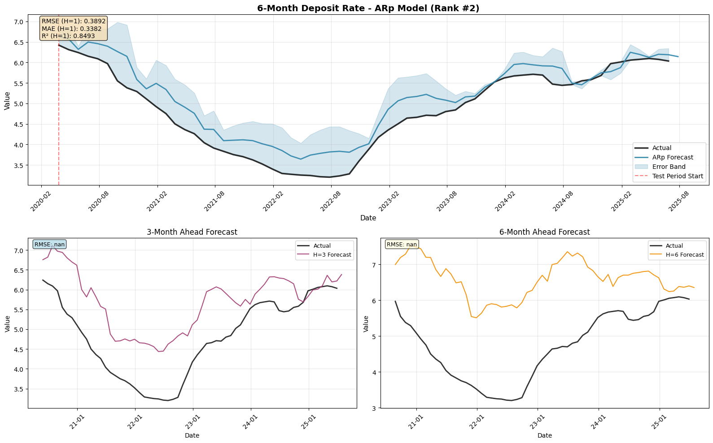

#### 3. StochasticGB Model Forecast
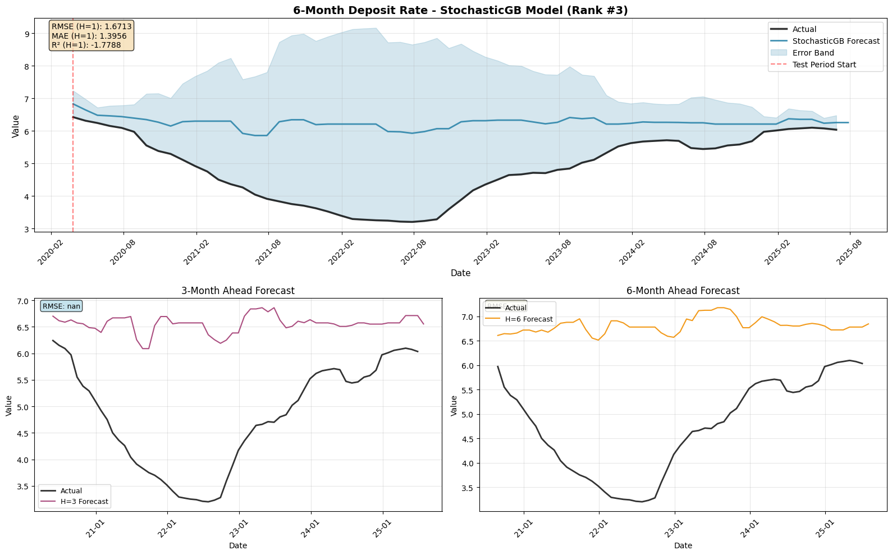

#### All Models Comparison
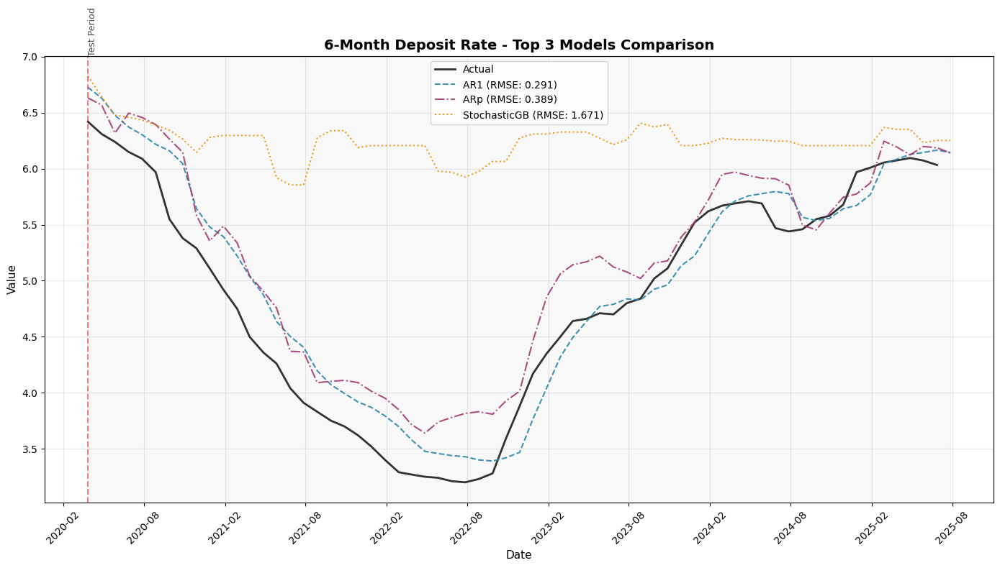

---

## 6. GDP Year-over-Year

### Top 5 Models (Diverse Selection)

**1. AR1 Model 🏆**
- ID: `AR1-001-v01-233401`
- RMSE (H=1): 2.0903
- MAE (H=1): 0.8369
- R² (H=1): 0.5918
- MAPE: 20.6%
- RMSE (H=3): nan
- RMSE (H=6): nan
- Degradation: H3=+nan%, H6=+nan%
- Features: 9 variables
- Normalization: None
- Feature Pack: None

**2. ARp Model**
- ID: `ARp-041-v01-233402`
- RMSE (H=1): 2.1008
- MAE (H=1): 0.9410
- R² (H=1): 0.5877
- MAPE: 23.4%
- RMSE (H=3): nan
- RMSE (H=6): nan
- Degradation: H3=+nan%, H6=+nan%
- Features: 9 variables
- Normalization: None
- Feature Pack: None

**3. GradientBoosting Model**
- ID: `GradientBoosting-128-v08-233403`
- RMSE (H=1): 3.3236
- MAE (H=1): 1.7692
- R² (H=1): -0.0319
- MAPE: 74.6%
- RMSE (H=3): nan
- RMSE (H=6): nan
- Degradation: H3=+nan%, H6=+nan%
- Features: 9 variables
- Normalization: None
- Feature Pack: None

**4. Tree Model**
- ID: `Tree-249-v09-233404`
- RMSE (H=1): 3.3294
- MAE (H=1): 1.6812
- R² (H=1): -0.0356
- MAPE: 74.6%
- RMSE (H=3): nan
- RMSE (H=6): nan
- Degradation: H3=+nan%, H6=+nan%
- Features: 9 variables
- Normalization: None
- Feature Pack: None

**5. StochasticGB Model**
- ID: `StochasticGB-202-v02-233403`
- RMSE (H=1): 3.3378
- MAE (H=1): 1.8816
- R² (H=1): -0.0408
- MAPE: 77.4%
- RMSE (H=3): nan
- RMSE (H=6): nan
- Degradation: H3=+nan%, H6=+nan%
- Features: 9 variables
- Normalization: None
- Feature Pack: None

### Best Model by Type

| Model Type | Best Config | RMSE (H=1) | vs Best |
|------------|-------------|------------|---------|
| AR1 | AR1-001-v01-233401 | 2.0903 | 0.0% |
| ARp | ARp-041-v01-233402 | 2.1008 | +0.5% |
| ExtraTrees | ExtraTrees-084-v04-233402 | 3.4944 | +67.2% |
| GradientBoosting | GradientBoosting-128-v08-233403 | 3.3236 | +59.0% |
| RandomForest | RandomForest-169-v09-233403 | 3.4714 | +66.1% |
| StochasticGB | StochasticGB-202-v02-233403 | 3.3378 | +59.7% |
| Tree | Tree-249-v09-233404 | 3.3294 | +59.3% |

### Forecast Visualizations

#### 1. AR1 Model Forecast
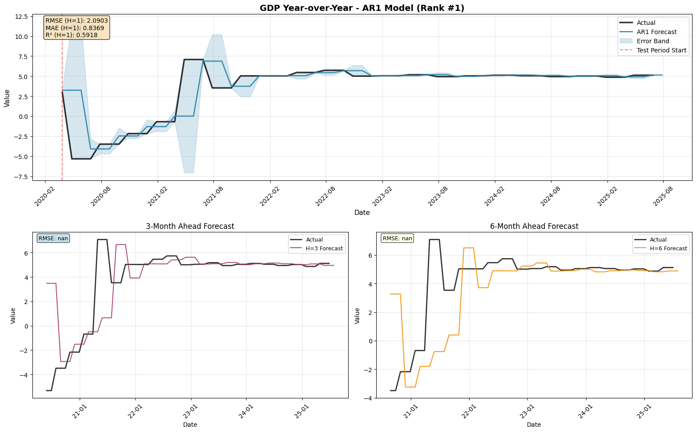

#### 2. ARp Model Forecast
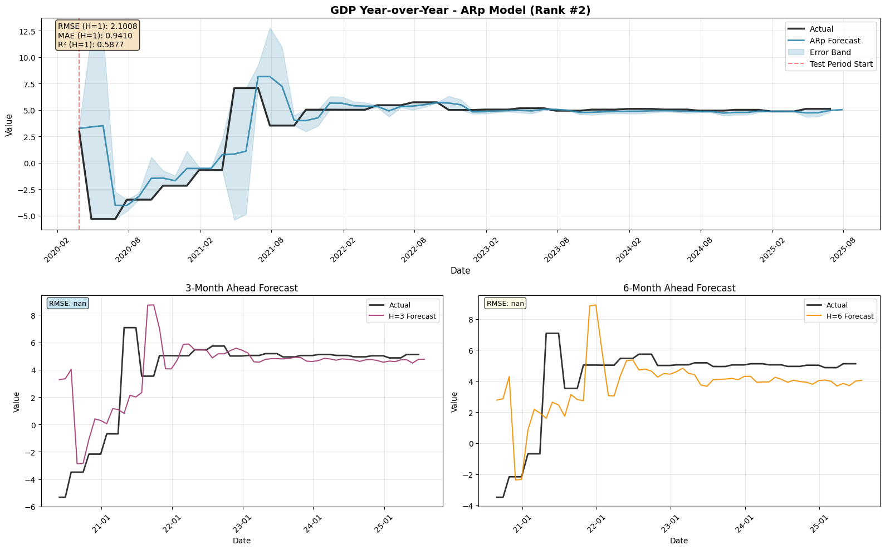

#### 3. GradientBoosting Model Forecast
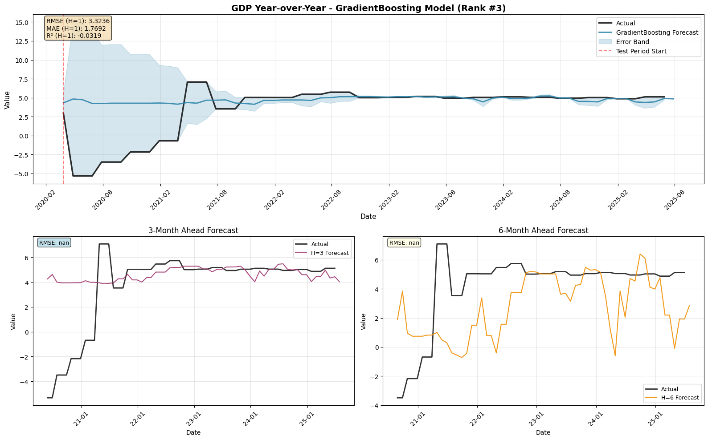

#### All Models Comparison

---

## 7. Policy Rate (7DRR)

### Top 5 Models (Diverse Selection)

**1. AR1 Model 🏆**
- ID: `AR1-001-v01-233407`
- RMSE (H=1): 0.2835
- MAE (H=1): 0.2179
- RMSE (H=3): 0.5441
- RMSE (H=6): 0.9415
- Degradation: H3=+91.9%, H6=+232.1%
- Features: 9 variables
- Normalization: None
- Feature Pack: None

**2. Tree Model**
- ID: `Tree-242-v02-233410`
- RMSE (H=1): 0.4908
- MAE (H=1): 0.4059
- RMSE (H=3): 0.9182
- RMSE (H=6): 0.9792
- Degradation: H3=+87.1%, H6=+99.5%
- Features: 9 variables
- Normalization: None
- Feature Pack: None

**3. GradientBoosting Model**
- ID: `GradientBoosting-127-v07-233409`
- RMSE (H=1): 0.5596
- MAE (H=1): 0.4710
- RMSE (H=3): 0.9319
- RMSE (H=6): 1.1298
- Degradation: H3=+66.5%, H6=+101.9%
- Features: 9 variables
- Normalization: None
- Feature Pack: None

**4. StochasticGB Model**
- ID: `StochasticGB-207-v07-233409`
- RMSE (H=1): 0.6591
- MAE (H=1): 0.5351
- RMSE (H=3): 0.9143
- RMSE (H=6): 1.0167
- Degradation: H3=+38.7%, H6=+54.3%
- Features: 9 variables
- Normalization: None
- Feature Pack: None

**5. ExtraTrees Model**
- ID: `ExtraTrees-082-v02-233408`
- RMSE (H=1): 0.7091
- MAE (H=1): 0.6042
- RMSE (H=3): 0.9782
- RMSE (H=6): 1.0895
- Degradation: H3=+38.0%, H6=+53.6%
- Features: 9 variables
- Normalization: None
- Feature Pack: None

### Best Model by Type

| Model Type | Best Config | RMSE (H=1) | vs Best |
|------------|-------------|------------|---------|
| AR1 | AR1-001-v01-233407 | 0.2835 | 0.0% |
| ARp | ARp-046-v06-233408 | 1.3145 | +363.7% |
| ExtraTrees | ExtraTrees-082-v02-233408 | 0.7091 | +150.1% |
| GradientBoosting | GradientBoosting-127-v07-233409 | 0.5596 | +97.4% |
| RandomForest | RandomForest-167-v07-233409 | 0.7857 | +177.2% |
| StochasticGB | StochasticGB-207-v07-233409 | 0.6591 | +132.5% |
| Tree | Tree-242-v02-233410 | 0.4908 | +73.1% |

### Forecast Visualizations

#### 1. AR1 Model Forecast
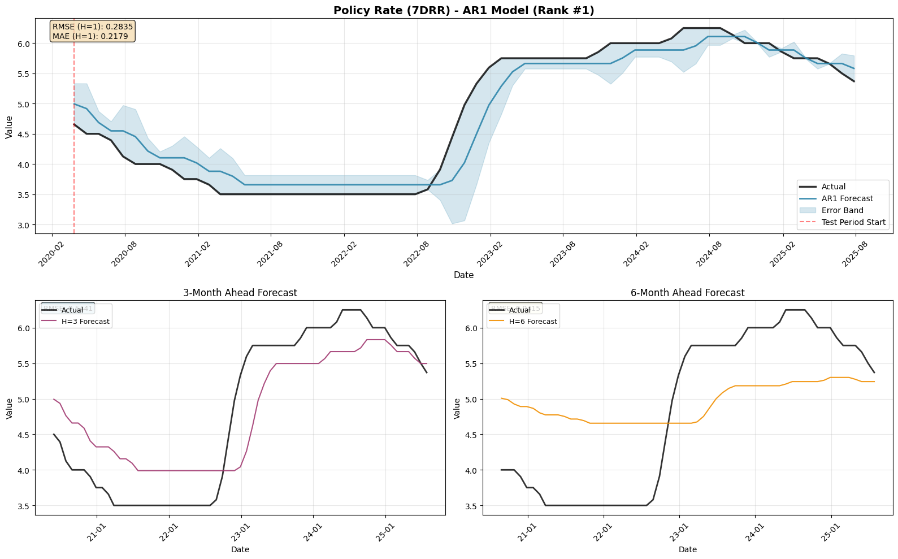

#### 2. Tree Model Forecast
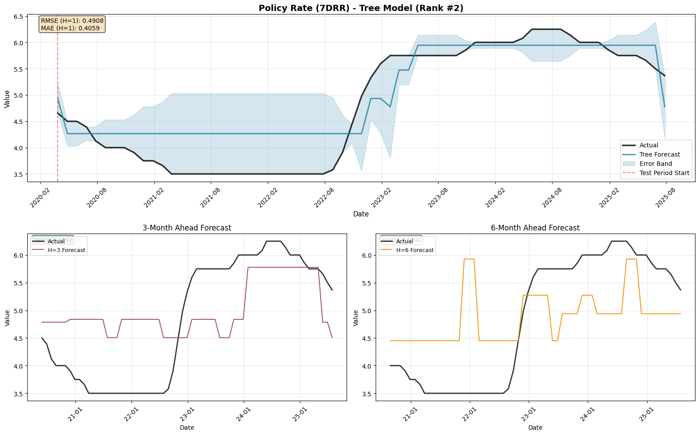

#### 3. GradientBoosting Model Forecast
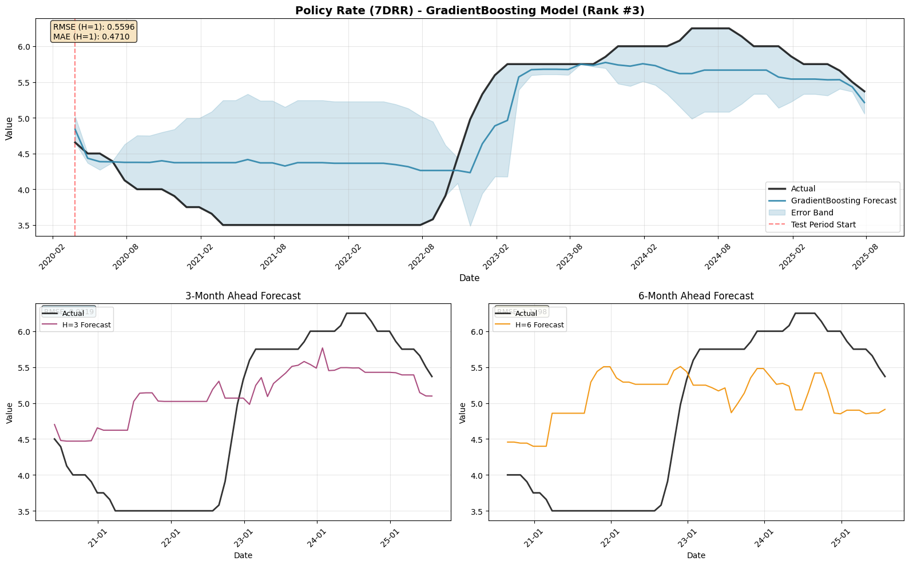

#### All Models Comparison

---

## 8. USD/IDR Exchange Rate

### Top 5 Models (Diverse Selection)

**1. AR1 Model 🏆**
- ID: `AR1-010-v10-233404`
- RMSE (H=1): 502.6540
- MAE (H=1): 344.5303
- RMSE (H=3): 500.5085
- RMSE (H=6): 574.3336
- Degradation: H3=-0.4%, H6=+14.3%
- Features: 9 variables
- Normalization: None
- Feature Pack: None

**2. ARp Model**
- ID: `ARp-041-v01-233405`
- RMSE (H=1): 654.6090
- MAE (H=1): 419.8794
- RMSE (H=3): 574.0740
- RMSE (H=6): 603.8042
- Degradation: H3=-12.3%, H6=-7.8%
- Features: 9 variables
- Normalization: None
- Feature Pack: None

**3. GradientBoosting Model**
- ID: `GradientBoosting-126-v06-233406`
- RMSE (H=1): 1185.0046
- MAE (H=1): 933.3990
- RMSE (H=3): 1235.6357
- RMSE (H=6): 1250.5130
- Degradation: H3=+4.3%, H6=+5.5%
- Features: 9 variables
- Normalization: None
- Feature Pack: None

**4. StochasticGB Model**
- ID: `StochasticGB-206-v06-233406`
- RMSE (H=1): 1186.5853
- MAE (H=1): 965.2693
- RMSE (H=3): 1251.0644
- RMSE (H=6): 1184.4476
- Degradation: H3=+5.4%, H6=-0.2%
- Features: 9 variables
- Normalization: None
- Feature Pack: None

**5. Tree Model**
- ID: `Tree-246-v06-233407`
- RMSE (H=1): 1295.7395
- MAE (H=1): 1056.6817
- RMSE (H=3): 1224.8917
- RMSE (H=6): 1122.9810
- Degradation: H3=-5.5%, H6=-13.3%
- Features: 9 variables
- Normalization: None
- Feature Pack: None

### Best Model by Type

| Model Type | Best Config | RMSE (H=1) | vs Best |
|------------|-------------|------------|---------|
| AR1 | AR1-010-v10-233404 | 502.6540 | 0.0% |
| ARp | ARp-041-v01-233405 | 654.6090 | +30.2% |
| ExtraTrees | ExtraTrees-084-v04-233405 | 1304.4393 | +159.5% |
| GradientBoosting | GradientBoosting-126-v06-233406 | 1185.0046 | +135.7% |
| RandomForest | RandomForest-164-v04-233406 | 1300.2974 | +158.7% |
| StochasticGB | StochasticGB-206-v06-233406 | 1186.5853 | +136.1% |
| Tree | Tree-246-v06-233407 | 1295.7395 | +157.8% |

### Forecast Visualizations

#### 1. AR1 Model Forecast
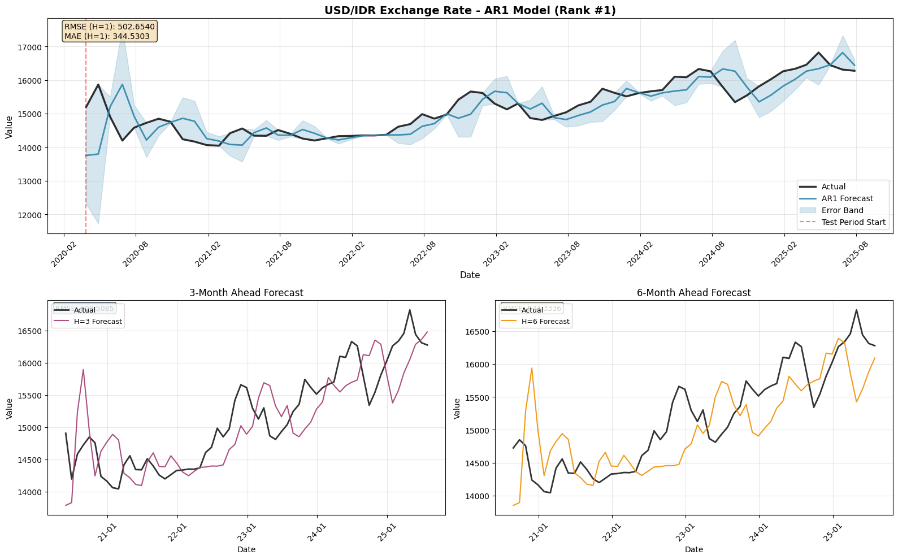

#### 2. ARp Model Forecast
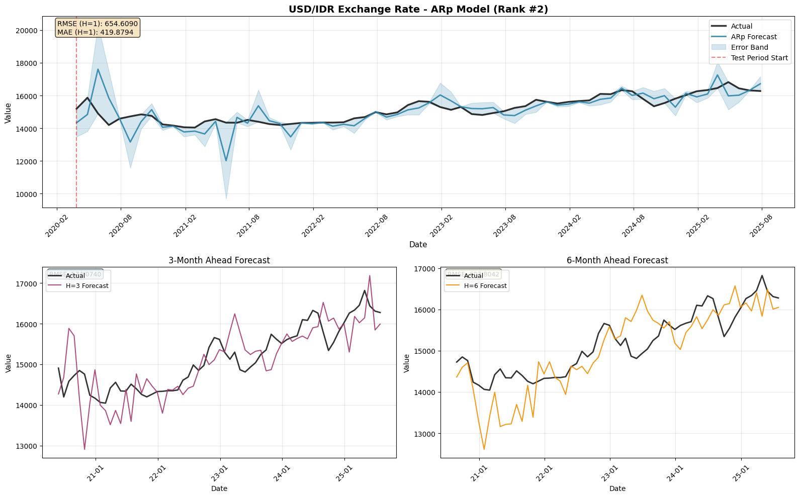

#### 3. GradientBoosting Model Forecast
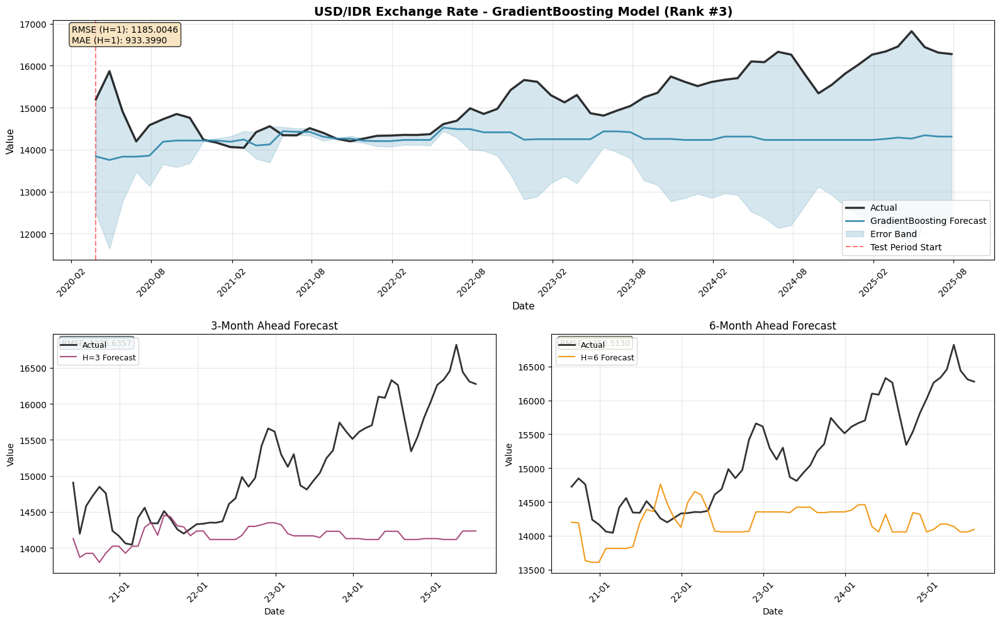

#### All Models Comparison
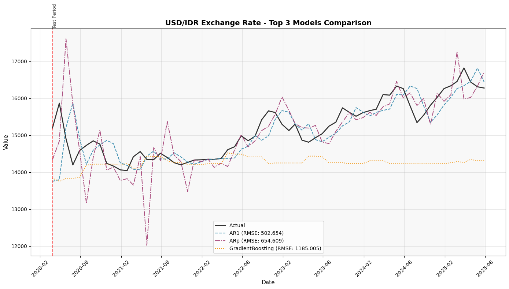

---

## Key Insights

1. **AR1 models** performed best on 8/8 targets, suggesting strong autoregressive patterns
2. **Ensemble methods** appeared in top 3 for 8/8 targets
3. **Forecast horizon degradation** is significant, with H=6 typically 50-100% worse than H=1

## Methodology

### Model Types Tested
- **AR1**: First-order autoregressive model
- **ARp**: Higher-order autoregressive model
- **Tree**: Single decision tree
- **RandomForest**: Bootstrap aggregated decision trees
- **GradientBoosting**: Sequential boosting with gradient descent
- **ExtraTrees**: Extremely randomized trees
- **StochasticGB**: Stochastic gradient boosting with subsampling

### Feature Engineering
- Target variable lags (1, 3, 12 months)
- Exogenous variable combinations
- Technical indicators (when applicable)
- Multiple normalization strategies
