# Indonesia Macroeconomic Nowcasting Report

**Generated:** 2025-09-22 09:39:45
**Output Directory:** `outputs/comprehensive_nowcasting_analysis-20250922`

## Executive Summary

This report presents nowcasting results for **8 macroeconomic indicators** using multiple machine learning models.

## Model Performance Overview

### Best Performing Models by Target Variable

| Target Variable | Best Model | Type | RMSE (H=1) | MAE (H=1) | R² |
|-----------------|------------|------|------------|-----------|-----|
| CPI Year-over-Year | Lasso-326-v06-013847 | Lasso | 0.6572 | 0.4963 | N/A |
| 12-Month Deposit Rate | AR1-003-v03-015220 | AR1 | 0.3174 | 0.2519 | 0.8836 |
| 1-Month Deposit Rate | AR1-005-v05-014538 | AR1 | 0.3036 | 0.2521 | 0.8676 |
| 3-Month Deposit Rate | AR1-001-v01-014749 | AR1 | 0.3073 | 0.2426 | 0.9042 |
| 6-Month Deposit Rate | AR1-007-v07-015003 | AR1 | 0.2915 | 0.2420 | 0.9179 |
| GDP Year-over-Year | DFM2-127-v07-013938 | DFM2 | 2.0717 | 0.8690 | 0.5930 |
| Policy Rate (7DRR) | AR1-001-v01-014406 | AR1 | 0.2815 | 0.2159 | N/A |
| USD/IDR Exchange Rate | StandardizedRidge-445-v05-014346 | StandardizedRidge | 426.5940 | 295.5182 | N/A |

### Model Type Performance Summary

Average performance across all targets by model type:

| Model Type | Avg RMSE | Min RMSE | # Targets |
|------------|----------|----------|-----------|
| AR1 | 63.0284 | 0.2815 | 8 |
| ARp | 56.2005 | 0.3890 | 8 |
| DFM | 186.7308 | 0.8802 | 8 |
| DFM2 | 61.2657 | 0.7605 | 8 |
| ElasticNet | 62.6867 | 0.5441 | 8 |
| ElasticNetGrid | 60.0786 | 0.4004 | 8 |
| ExtraTrees | 162.8415 | 0.6969 | 8 |
| GradientBoosting | 150.2185 | 0.5374 | 8 |
| Lasso | 62.6746 | 0.5211 | 8 |
| RandomForest | 162.9670 | 0.7653 | 8 |
| Ridge | 56.2718 | 0.4066 | 8 |
| StandardizedRidge | 54.1457 | 0.4218 | 8 |
| StochasticGB | 152.1485 | 0.6328 | 8 |
| Tree | 162.3953 | 0.4792 | 8 |

## 1. CPI Year-over-Year

### Top 5 Models (Diverse Selection)

**1. Lasso Model 🏆**
- ID: `Lasso-326-v06-013847`
- RMSE (H=1): 0.6572
- MAE (H=1): 0.4963
- RMSE (H=3): 0.9355
- RMSE (H=6): 1.2535
- Degradation: H3=+42.4%, H6=+90.7%
- Features: 9 variables
- Normalization: None
- Feature Pack: None

**2. ElasticNet Model**
- ID: `ElasticNet-166-v06-013736`
- RMSE (H=1): 0.6594
- MAE (H=1): 0.5003
- RMSE (H=3): 0.9412
- RMSE (H=6): 1.2574
- Degradation: H3=+42.7%, H6=+90.7%
- Features: 9 variables
- Normalization: None
- Feature Pack: None

**3. AR1 Model**
- ID: `AR1-005-v05-013714`
- RMSE (H=1): 0.7251
- MAE (H=1): 0.5987
- RMSE (H=3): 1.2313
- RMSE (H=6): 1.9298
- Degradation: H3=+69.8%, H6=+166.2%
- Features: 9 variables
- Normalization: None
- Feature Pack: None

**4. ElasticNetGrid Model**
- ID: `ElasticNetGrid-204-v04-013752`
- RMSE (H=1): 0.7987
- MAE (H=1): 0.6197
- RMSE (H=3): 1.0093
- RMSE (H=6): 1.3839
- Degradation: H3=+26.4%, H6=+73.3%
- Features: 9 variables
- Normalization: None
- Feature Pack: None

**5. StochasticGB Model**
- ID: `StochasticGB-487-v07-013913`
- RMSE (H=1): 1.1357
- MAE (H=1): 0.9572
- RMSE (H=3): 1.2468
- RMSE (H=6): 1.2723
- Degradation: H3=+9.8%, H6=+12.0%
- Features: 9 variables
- Normalization: None
- Feature Pack: None

### Best Model by Type

| Model Type | Best Config | RMSE (H=1) | vs Best |
|------------|-------------|------------|---------|
| AR1 | AR1-005-v05-013714 | 0.7251 | +10.3% |
| ARp | ARp-044-v04-013719 | 1.2213 | +85.8% |
| DFM | DFM-086-v06-013724 | 1.7877 | +172.0% |
| DFM2 | DFM2-121-v01-013729 | 1.3862 | +110.9% |
| ElasticNet | ElasticNet-166-v06-013736 | 0.6594 | +0.3% |
| ElasticNetGrid | ElasticNetGrid-204-v04-013752 | 0.7987 | +21.5% |
| ExtraTrees | ExtraTrees-247-v07-013825 | 1.3055 | +98.7% |
| GradientBoosting | GradientBoosting-289-v09-013840 | 1.2370 | +88.2% |
| Lasso | Lasso-326-v06-013847 | 0.6572 | 0.0% |
| RandomForest | RandomForest-362-v02-013852 | 1.2580 | +91.4% |
| Ridge | Ridge-409-v09-013900 | 1.1547 | +75.7% |
| StandardizedRidge | StandardizedRidge-449-v09-013905 | 1.1802 | +79.6% |
| StochasticGB | StochasticGB-487-v07-013913 | 1.1357 | +72.8% |
| Tree | Tree-525-v05-013918 | 1.2530 | +90.7% |

### Forecast Visualizations

#### 1. Lasso Model Forecast
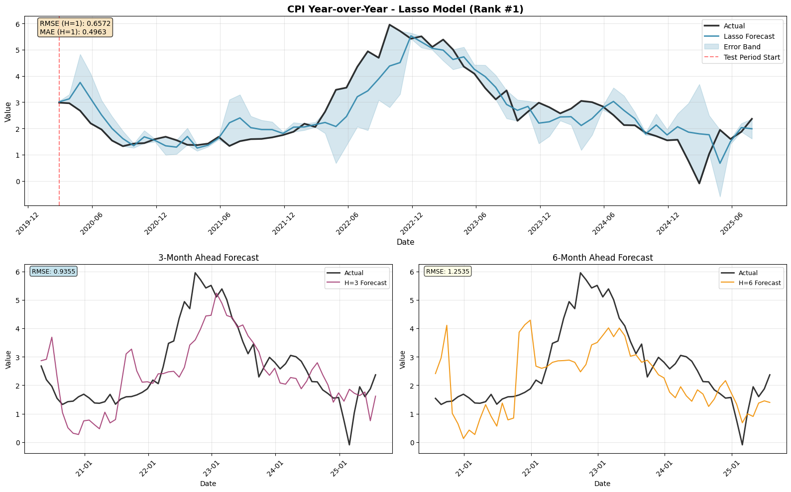

#### 2. ElasticNet Model Forecast
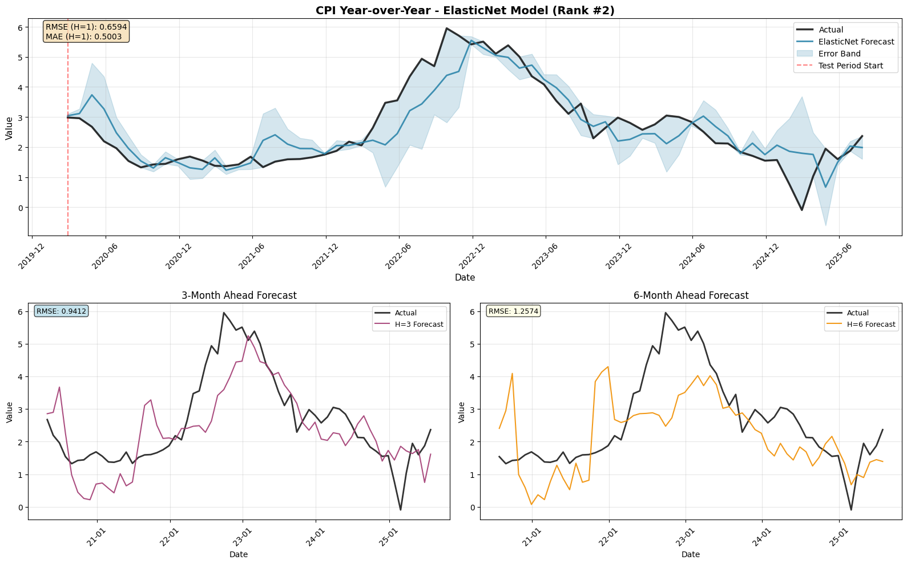

#### 3. AR1 Model Forecast
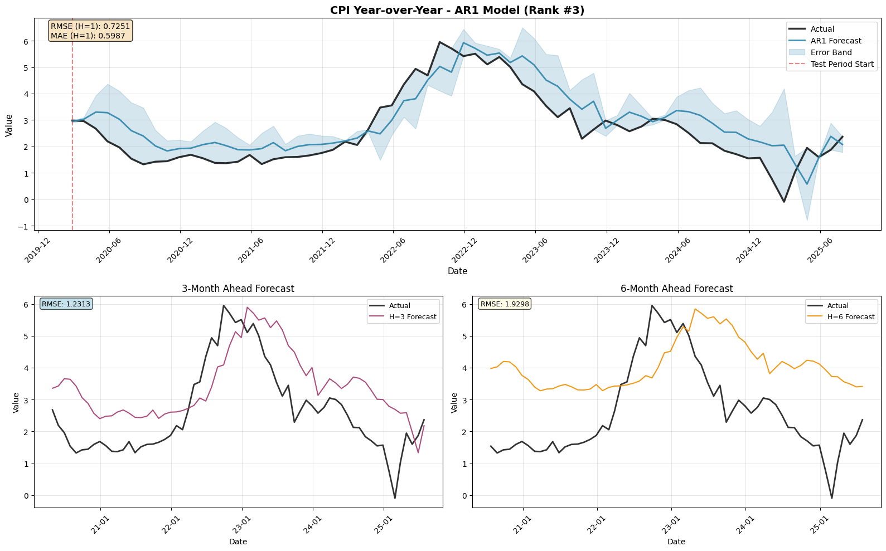

#### All Models Comparison
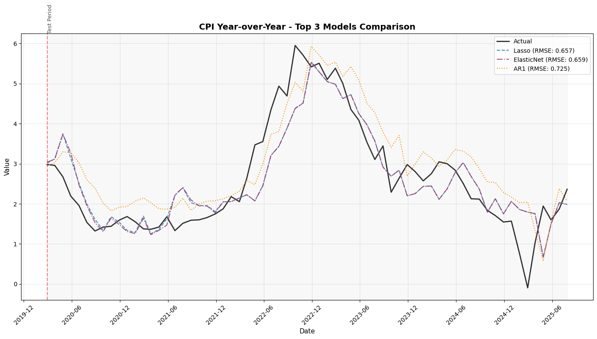

---

## 2. 12-Month Deposit Rate

### Top 5 Models (Diverse Selection)

**1. AR1 Model 🏆**
- ID: `AR1-003-v03-015220`
- RMSE (H=1): 0.3174
- MAE (H=1): 0.2519
- R² (H=1): 0.8836
- MAPE: 5.4%
- RMSE (H=3): nan
- RMSE (H=6): nan
- Degradation: H3=+nan%, H6=+nan%
- Features: 9 variables
- Normalization: None
- Feature Pack: None

**2. ARp Model**
- ID: `ARp-044-v04-015226`
- RMSE (H=1): 0.4808
- MAE (H=1): 0.4185
- R² (H=1): 0.7331
- MAPE: 8.7%
- RMSE (H=3): nan
- RMSE (H=6): nan
- Degradation: H3=+nan%, H6=+nan%
- Features: 9 variables
- Normalization: None
- Feature Pack: None

**3. Ridge Model**
- ID: `Ridge-404-v04-015412`
- RMSE (H=1): 0.6468
- MAE (H=1): 0.5772
- R² (H=1): 0.5169
- MAPE: 12.0%
- RMSE (H=3): nan
- RMSE (H=6): nan
- Degradation: H3=+nan%, H6=+nan%
- Features: 9 variables
- Normalization: None
- Feature Pack: None

**4. StandardizedRidge Model**
- ID: `StandardizedRidge-447-v07-015419`
- RMSE (H=1): 0.8044
- MAE (H=1): 0.6618
- R² (H=1): 0.2527
- MAPE: 13.1%
- RMSE (H=3): nan
- RMSE (H=6): nan
- Degradation: H3=+nan%, H6=+nan%
- Features: 9 variables
- Normalization: None
- Feature Pack: None

**5. DFM Model**
- ID: `DFM-082-v02-015232`
- RMSE (H=1): 0.9053
- MAE (H=1): 0.8032
- R² (H=1): 0.0535
- MAPE: 17.9%
- RMSE (H=3): nan
- RMSE (H=6): nan
- Degradation: H3=+nan%, H6=+nan%
- Features: 9 variables
- Normalization: None
- Feature Pack: None

### Best Model by Type

| Model Type | Best Config | RMSE (H=1) | vs Best |
|------------|-------------|------------|---------|
| AR1 | AR1-003-v03-015220 | 0.3174 | 0.0% |
| ARp | ARp-044-v04-015226 | 0.4808 | +51.4% |
| DFM | DFM-082-v02-015232 | 0.9053 | +185.2% |
| DFM2 | DFM2-127-v07-015238 | 0.9883 | +211.3% |
| ElasticNet | ElasticNet-162-v02-015244 | 2.3023 | +625.3% |
| ElasticNetGrid | ElasticNetGrid-202-v02-015257 | 1.5265 | +380.9% |
| ExtraTrees | ExtraTrees-243-v03-015328 | 1.7363 | +447.0% |
| GradientBoosting | GradientBoosting-288-v08-015349 | 1.4275 | +349.7% |
| Lasso | Lasso-322-v02-015356 | 2.2723 | +615.8% |
| RandomForest | RandomForest-367-v07-015406 | 1.6322 | +414.2% |
| Ridge | Ridge-404-v04-015412 | 0.6468 | +103.8% |
| StandardizedRidge | StandardizedRidge-447-v07-015419 | 0.8044 | +153.4% |
| StochasticGB | StochasticGB-487-v07-015427 | 1.5868 | +399.9% |
| Tree | Tree-521-v01-015433 | 1.5088 | +375.3% |

### Forecast Visualizations

#### 1. AR1 Model Forecast
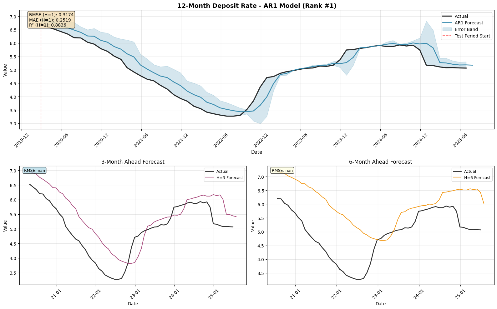

#### 2. ARp Model Forecast
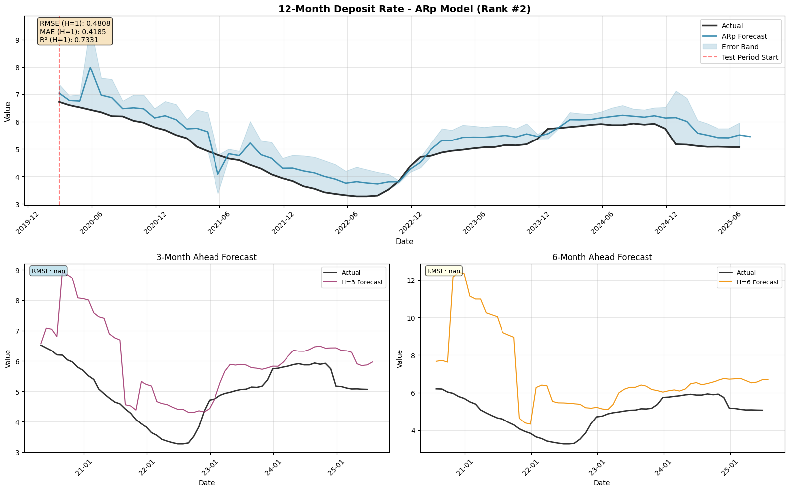

#### 3. Ridge Model Forecast
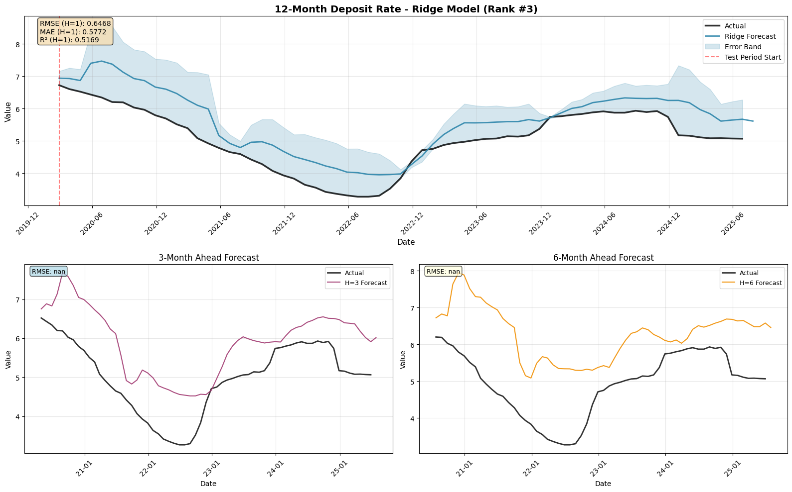

#### All Models Comparison
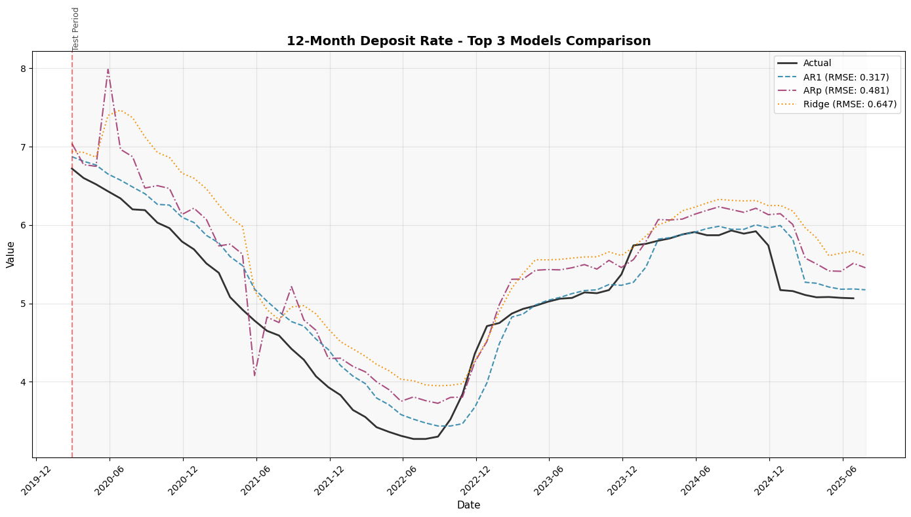

---

## 3. 1-Month Deposit Rate

### Top 5 Models (Diverse Selection)

**1. AR1 Model 🏆**
- ID: `AR1-005-v05-014538`
- RMSE (H=1): 0.3036
- MAE (H=1): 0.2521
- R² (H=1): 0.8676
- MAPE: 6.5%
- RMSE (H=3): nan
- RMSE (H=6): nan
- Degradation: H3=+nan%, H6=+nan%
- Features: 9 variables
- Normalization: None
- Feature Pack: None

**2. ARp Model**
- ID: `ARp-044-v04-014543`
- RMSE (H=1): 0.4063
- MAE (H=1): 0.3752
- R² (H=1): 0.7629
- MAPE: 9.8%
- RMSE (H=3): nan
- RMSE (H=6): nan
- Degradation: H3=+nan%, H6=+nan%
- Features: 9 variables
- Normalization: None
- Feature Pack: None

**3. Ridge Model**
- ID: `Ridge-410-v10-014725`
- RMSE (H=1): 0.5824
- MAE (H=1): 0.5251
- R² (H=1): 0.5128
- MAPE: 13.9%
- RMSE (H=3): nan
- RMSE (H=6): nan
- Degradation: H3=+nan%, H6=+nan%
- Features: 9 variables
- Normalization: None
- Feature Pack: None

**4. StandardizedRidge Model**
- ID: `StandardizedRidge-450-v10-014731`
- RMSE (H=1): 0.6522
- MAE (H=1): 0.5936
- R² (H=1): 0.3890
- MAPE: 15.7%
- RMSE (H=3): nan
- RMSE (H=6): nan
- Degradation: H3=+nan%, H6=+nan%
- Features: 9 variables
- Normalization: None
- Feature Pack: None

**5. DFM2 Model**
- ID: `DFM2-124-v04-014554`
- RMSE (H=1): 0.7605
- MAE (H=1): 0.7273
- R² (H=1): 0.1693
- MAPE: 18.3%
- RMSE (H=3): nan
- RMSE (H=6): nan
- Degradation: H3=+nan%, H6=+nan%
- Features: 9 variables
- Normalization: None
- Feature Pack: None

### Best Model by Type

| Model Type | Best Config | RMSE (H=1) | vs Best |
|------------|-------------|------------|---------|
| AR1 | AR1-005-v05-014538 | 0.3036 | 0.0% |
| ARp | ARp-044-v04-014543 | 0.4063 | +33.8% |
| DFM | DFM-083-v03-014549 | 0.8837 | +191.1% |
| DFM2 | DFM2-124-v04-014554 | 0.7605 | +150.5% |
| ElasticNet | ElasticNet-167-v07-014601 | 2.0572 | +577.7% |
| ElasticNetGrid | ElasticNetGrid-209-v09-014630 | 1.5221 | +401.4% |
| ExtraTrees | ExtraTrees-243-v03-014643 | 1.9486 | +541.9% |
| GradientBoosting | GradientBoosting-283-v03-014659 | 1.6902 | +456.8% |
| Lasso | Lasso-329-v09-014711 | 1.9741 | +550.3% |
| RandomForest | RandomForest-368-v08-014719 | 1.9705 | +549.1% |
| Ridge | Ridge-410-v10-014725 | 0.5824 | +91.8% |
| StandardizedRidge | StandardizedRidge-450-v10-014731 | 0.6522 | +114.8% |
| StochasticGB | StochasticGB-490-v10-014738 | 1.7392 | +472.9% |
| Tree | Tree-522-v02-014743 | 2.0435 | +573.2% |

### Forecast Visualizations

#### 1. AR1 Model Forecast
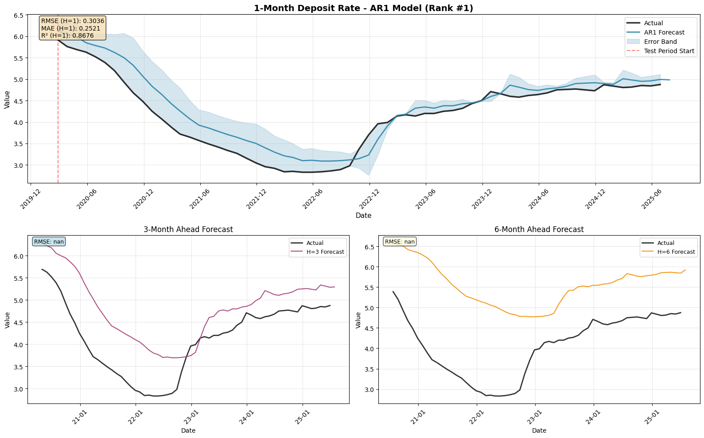

#### 2. ARp Model Forecast
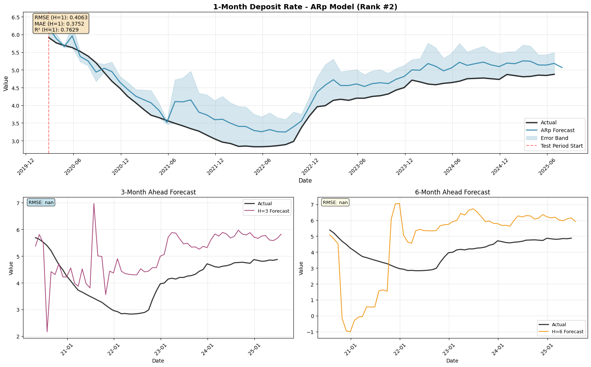

#### 3. Ridge Model Forecast
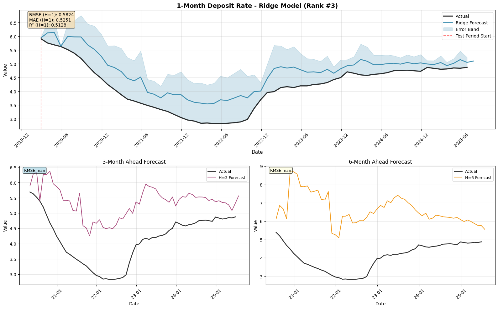

#### All Models Comparison
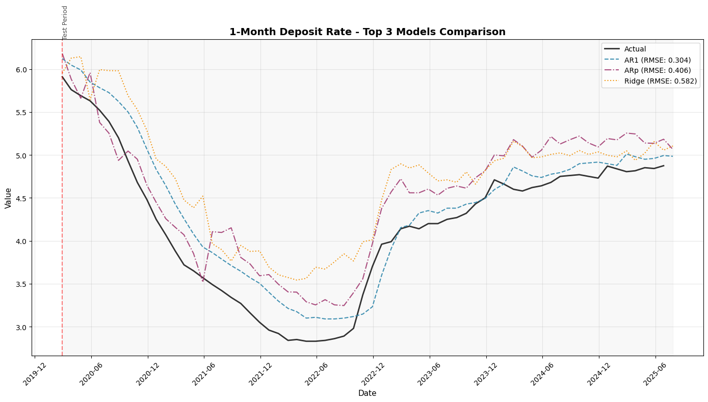

---

## 4. 3-Month Deposit Rate

### Top 5 Models (Diverse Selection)

**1. AR1 Model 🏆**
- ID: `AR1-001-v01-014749`
- RMSE (H=1): 0.3073
- MAE (H=1): 0.2426
- R² (H=1): 0.9042
- MAPE: 6.0%
- RMSE (H=3): nan
- RMSE (H=6): nan
- Degradation: H3=+nan%, H6=+nan%
- Features: 9 variables
- Normalization: None
- Feature Pack: None

**2. ARp Model**
- ID: `ARp-047-v07-014755`
- RMSE (H=1): 0.5642
- MAE (H=1): 0.5111
- R² (H=1): 0.6769
- MAPE: 12.1%
- RMSE (H=3): nan
- RMSE (H=6): nan
- Degradation: H3=+nan%, H6=+nan%
- Features: 9 variables
- Normalization: None
- Feature Pack: None

**3. Ridge Model**
- ID: `Ridge-407-v07-014938`
- RMSE (H=1): 0.6789
- MAE (H=1): 0.6157
- R² (H=1): 0.5321
- MAPE: 14.5%
- RMSE (H=3): nan
- RMSE (H=6): nan
- Degradation: H3=+nan%, H6=+nan%
- Features: 9 variables
- Normalization: None
- Feature Pack: None

**4. StandardizedRidge Model**
- ID: `StandardizedRidge-445-v05-014943`
- RMSE (H=1): 0.8061
- MAE (H=1): 0.6296
- R² (H=1): 0.3404
- MAPE: 15.3%
- RMSE (H=3): nan
- RMSE (H=6): nan
- Degradation: H3=+nan%, H6=+nan%
- Features: 9 variables
- Normalization: None
- Feature Pack: None

**5. DFM Model**
- ID: `DFM-086-v06-014800`
- RMSE (H=1): 0.9693
- MAE (H=1): 0.7987
- R² (H=1): 0.0464
- MAPE: 20.5%
- RMSE (H=3): nan
- RMSE (H=6): nan
- Degradation: H3=+nan%, H6=+nan%
- Features: 9 variables
- Normalization: None
- Feature Pack: None

### Best Model by Type

| Model Type | Best Config | RMSE (H=1) | vs Best |
|------------|-------------|------------|---------|
| AR1 | AR1-001-v01-014749 | 0.3073 | 0.0% |
| ARp | ARp-047-v07-014755 | 0.5642 | +83.6% |
| DFM | DFM-086-v06-014800 | 0.9693 | +215.4% |
| DFM2 | DFM2-127-v07-014806 | 1.4211 | +362.5% |
| ElasticNet | ElasticNet-167-v07-014813 | 2.1228 | +590.9% |
| ElasticNetGrid | ElasticNetGrid-209-v09-014842 | 1.0378 | +237.8% |
| ExtraTrees | ExtraTrees-242-v02-014853 | 1.8928 | +516.0% |
| GradientBoosting | GradientBoosting-282-v02-014911 | 1.6944 | +451.4% |
| Lasso | Lasso-327-v07-014923 | 2.0907 | +580.4% |
| RandomForest | RandomForest-369-v09-014932 | 1.9255 | +526.7% |
| Ridge | Ridge-407-v07-014938 | 0.6789 | +121.0% |
| StandardizedRidge | StandardizedRidge-445-v05-014943 | 0.8061 | +162.3% |
| StochasticGB | StochasticGB-487-v07-014950 | 1.7142 | +457.9% |
| Tree | Tree-522-v02-014956 | 1.8951 | +516.7% |

### Forecast Visualizations

#### 1. AR1 Model Forecast
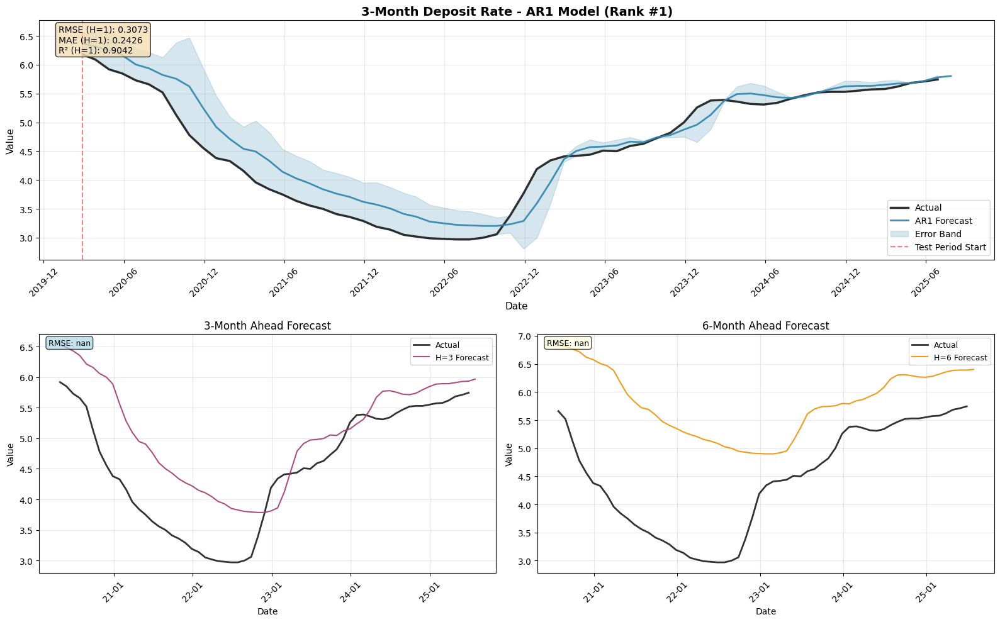

#### 2. ARp Model Forecast
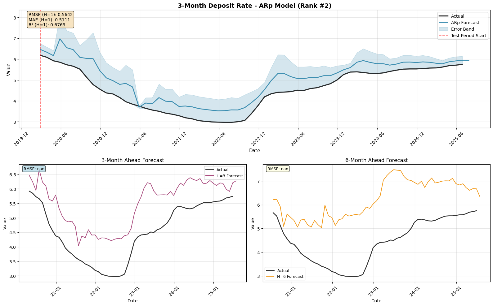

#### 3. Ridge Model Forecast
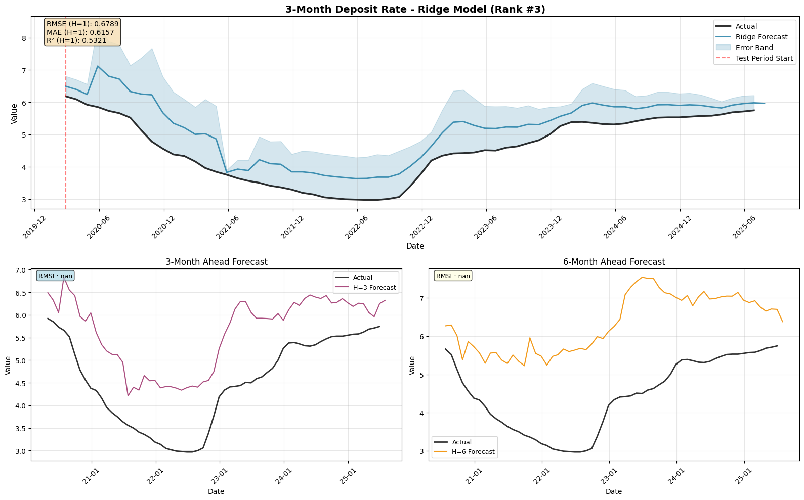

#### All Models Comparison
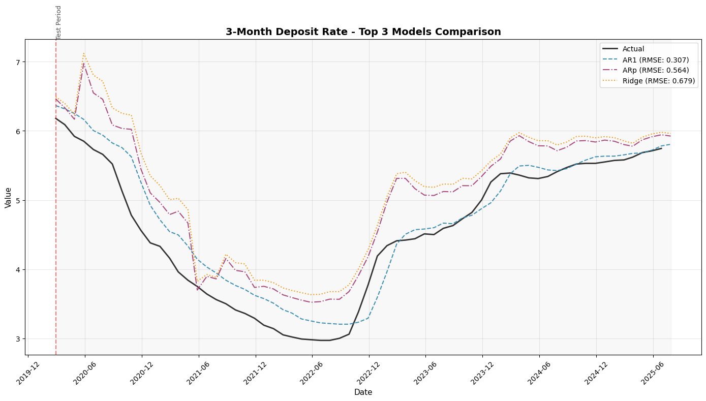

---

## 5. 6-Month Deposit Rate

### Top 5 Models (Diverse Selection)

**1. AR1 Model 🏆**
- ID: `AR1-007-v07-015003`
- RMSE (H=1): 0.2915
- MAE (H=1): 0.2420
- R² (H=1): 0.9179
- MAPE: 5.4%
- RMSE (H=3): nan
- RMSE (H=6): nan
- Degradation: H3=+nan%, H6=+nan%
- Features: 9 variables
- Normalization: None
- Feature Pack: None

**2. ARp Model**
- ID: `ARp-050-v10-015009`
- RMSE (H=1): 0.3890
- MAE (H=1): 0.3356
- R² (H=1): 0.8538
- MAPE: 7.8%
- RMSE (H=3): nan
- RMSE (H=6): nan
- Degradation: H3=+nan%, H6=+nan%
- Features: 9 variables
- Normalization: None
- Feature Pack: None

**3. Ridge Model**
- ID: `Ridge-405-v05-015154`
- RMSE (H=1): 0.4978
- MAE (H=1): 0.4332
- R² (H=1): 0.7605
- MAPE: 9.9%
- RMSE (H=3): nan
- RMSE (H=6): nan
- Degradation: H3=+nan%, H6=+nan%
- Features: 9 variables
- Normalization: None
- Feature Pack: None

**4. StandardizedRidge Model**
- ID: `StandardizedRidge-445-v05-015200`
- RMSE (H=1): 0.6110
- MAE (H=1): 0.5236
- R² (H=1): 0.6393
- MAPE: 11.8%
- RMSE (H=3): nan
- RMSE (H=6): nan
- Degradation: H3=+nan%, H6=+nan%
- Features: 9 variables
- Normalization: None
- Feature Pack: None

**5. ElasticNetGrid Model**
- ID: `ElasticNetGrid-204-v04-015044`
- RMSE (H=1): 0.9435
- MAE (H=1): 0.8424
- R² (H=1): 0.1398
- MAPE: 20.1%
- RMSE (H=3): nan
- RMSE (H=6): nan
- Degradation: H3=+nan%, H6=+nan%
- Features: 9 variables
- Normalization: None
- Feature Pack: None

### Best Model by Type

| Model Type | Best Config | RMSE (H=1) | vs Best |
|------------|-------------|------------|---------|
| AR1 | AR1-007-v07-015003 | 0.2915 | 0.0% |
| ARp | ARp-050-v10-015009 | 0.3890 | +33.4% |
| DFM | DFM-082-v02-015014 | 1.0788 | +270.1% |
| DFM2 | DFM2-127-v07-015021 | 1.2955 | +344.4% |
| ElasticNet | ElasticNet-167-v07-015028 | 2.1566 | +639.8% |
| ElasticNetGrid | ElasticNetGrid-204-v04-015044 | 0.9435 | +223.7% |
| ExtraTrees | ExtraTrees-248-v08-015118 | 1.8942 | +549.8% |
| GradientBoosting | GradientBoosting-283-v03-015128 | 1.6582 | +468.9% |
| Lasso | Lasso-322-v02-015138 | 2.1325 | +631.6% |
| RandomForest | RandomForest-367-v07-015148 | 1.8848 | +546.6% |
| Ridge | Ridge-405-v05-015154 | 0.4978 | +70.8% |
| StandardizedRidge | StandardizedRidge-445-v05-015200 | 0.6110 | +109.6% |
| StochasticGB | StochasticGB-483-v03-015207 | 1.6884 | +479.2% |
| Tree | Tree-529-v09-015214 | 2.0772 | +612.6% |

### Forecast Visualizations

#### 1. AR1 Model Forecast
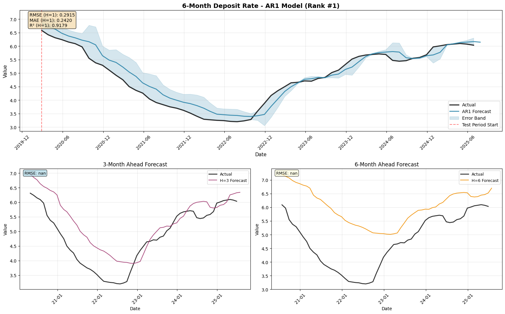

#### 2. ARp Model Forecast
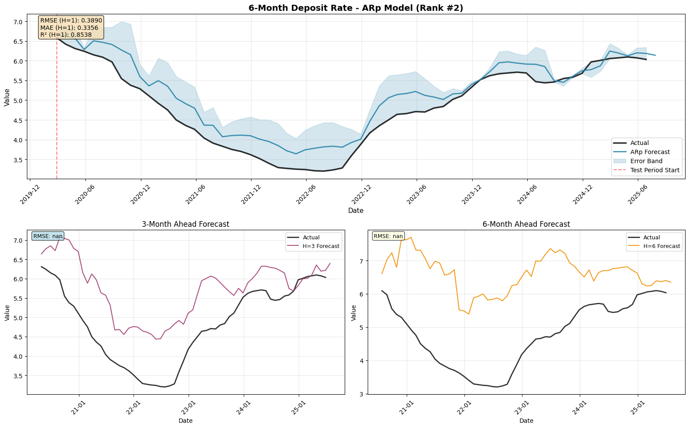

#### 3. Ridge Model Forecast
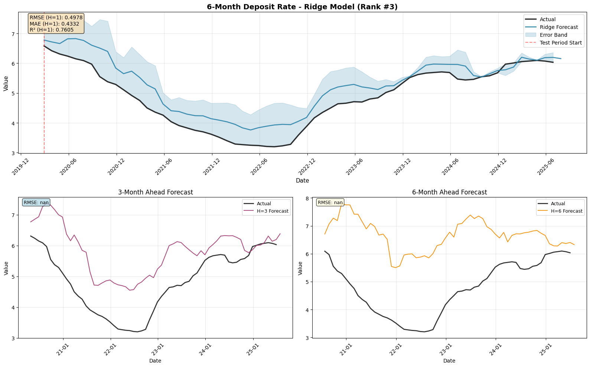

#### All Models Comparison
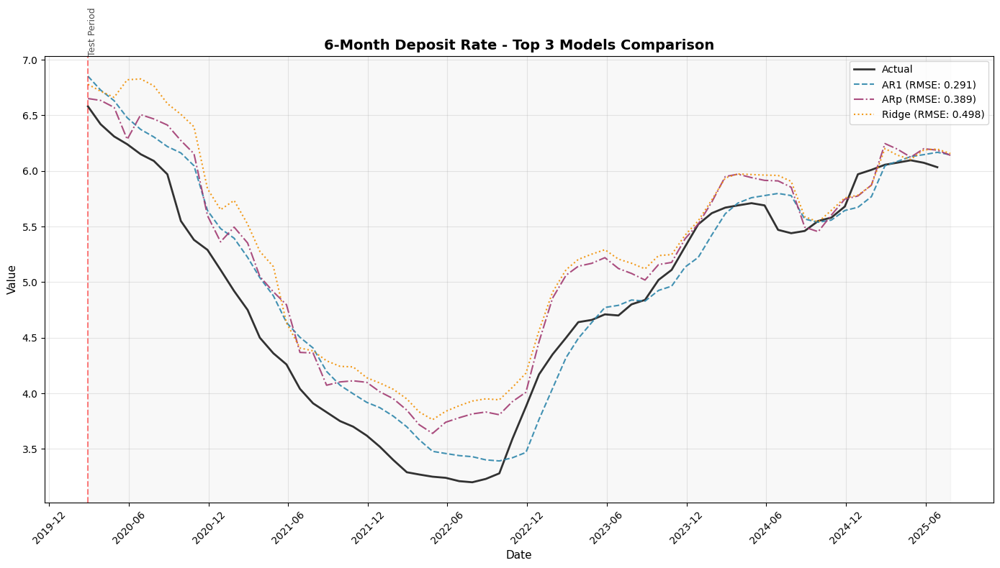

---

## 6. GDP Year-over-Year

### Top 5 Models (Diverse Selection)

**1. DFM2 Model 🏆**
- ID: `DFM2-127-v07-013938`
- RMSE (H=1): 2.0717
- MAE (H=1): 0.8690
- R² (H=1): 0.5930
- MAPE: 21.0%
- RMSE (H=3): nan
- RMSE (H=6): nan
- Degradation: H3=+nan%, H6=+nan%
- Features: 9 variables
- Normalization: None
- Feature Pack: None

**2. AR1 Model**
- ID: `AR1-005-v05-013923`
- RMSE (H=1): 2.0818
- MAE (H=1): 0.8454
- R² (H=1): 0.5890
- MAPE: 20.7%
- RMSE (H=3): nan
- RMSE (H=6): nan
- Degradation: H3=+nan%, H6=+nan%
- Features: 9 variables
- Normalization: None
- Feature Pack: None

**3. ElasticNetGrid Model**
- ID: `ElasticNetGrid-207-v07-014010`
- RMSE (H=1): 2.0914
- MAE (H=1): 1.0472
- R² (H=1): 0.5852
- MAPE: 25.3%
- RMSE (H=3): nan
- RMSE (H=6): nan
- Degradation: H3=+nan%, H6=+nan%
- Features: 9 variables
- Normalization: None
- Feature Pack: None

**4. StandardizedRidge Model**
- ID: `StandardizedRidge-441-v01-014117`
- RMSE (H=1): 2.0957
- MAE (H=1): 0.9531
- R² (H=1): 0.5835
- MAPE: 25.1%
- RMSE (H=3): nan
- RMSE (H=6): nan
- Degradation: H3=+nan%, H6=+nan%
- Features: 9 variables
- Normalization: None
- Feature Pack: None

**5. Ridge Model**
- ID: `Ridge-406-v06-014110`
- RMSE (H=1): 2.0991
- MAE (H=1): 0.9562
- R² (H=1): 0.5822
- MAPE: 25.3%
- RMSE (H=3): nan
- RMSE (H=6): nan
- Degradation: H3=+nan%, H6=+nan%
- Features: 9 variables
- Normalization: None
- Feature Pack: None

### Best Model by Type

| Model Type | Best Config | RMSE (H=1) | vs Best |
|------------|-------------|------------|---------|
| AR1 | AR1-005-v05-013923 | 2.0818 | +0.5% |
| ARp | ARp-046-v06-013928 | 2.0998 | +1.4% |
| DFM | DFM-089-v09-013933 | 3.1694 | +53.0% |
| DFM2 | DFM2-127-v07-013938 | 2.0717 | 0.0% |
| ElasticNet | ElasticNet-162-v02-013943 | 2.1770 | +5.1% |
| ElasticNetGrid | ElasticNetGrid-207-v07-014010 | 2.0914 | +0.9% |
| ExtraTrees | ExtraTrees-244-v04-014028 | 3.4806 | +68.0% |
| GradientBoosting | GradientBoosting-288-v08-014048 | 3.3022 | +59.4% |
| Lasso | Lasso-322-v02-014054 | 2.1743 | +4.9% |
| RandomForest | RandomForest-369-v09-014104 | 3.4495 | +66.5% |
| Ridge | Ridge-406-v06-014110 | 2.0991 | +1.3% |
| StandardizedRidge | StandardizedRidge-441-v01-014117 | 2.0957 | +1.2% |
| StochasticGB | StochasticGB-485-v05-014126 | 3.3011 | +59.3% |
| Tree | Tree-524-v04-014133 | 3.3140 | +60.0% |

### Forecast Visualizations

#### 1. DFM2 Model Forecast
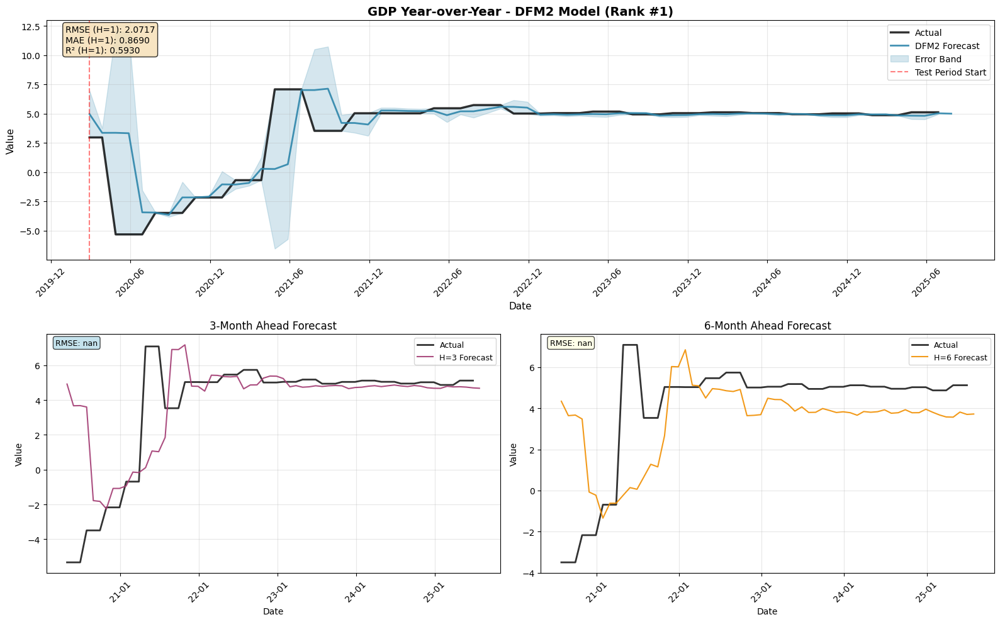

#### 2. AR1 Model Forecast
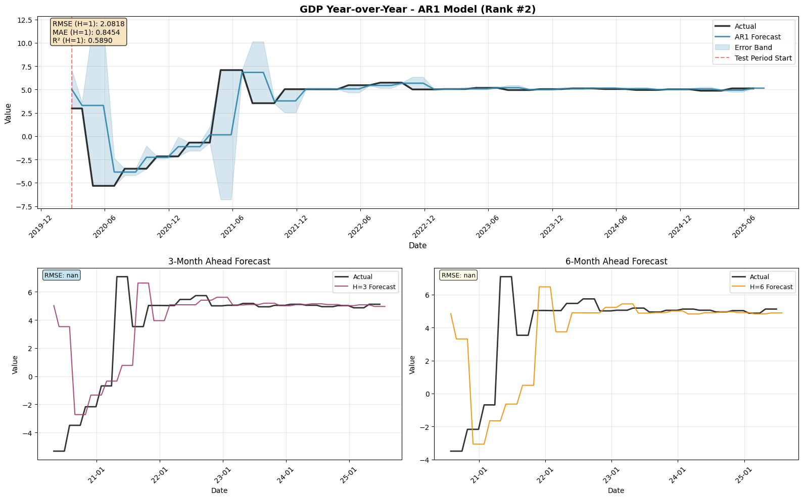

#### 3. ElasticNetGrid Model Forecast
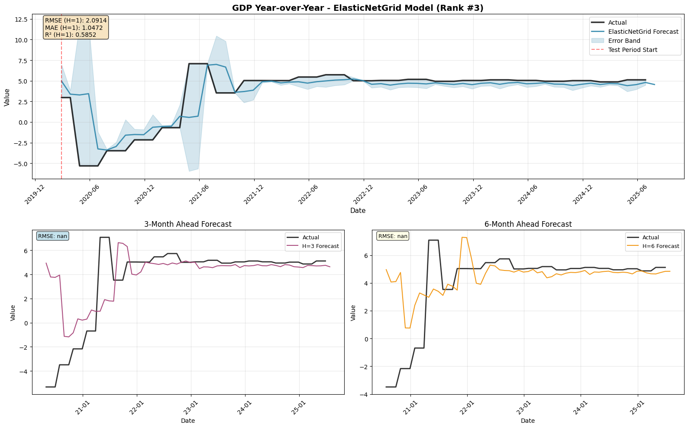

#### All Models Comparison
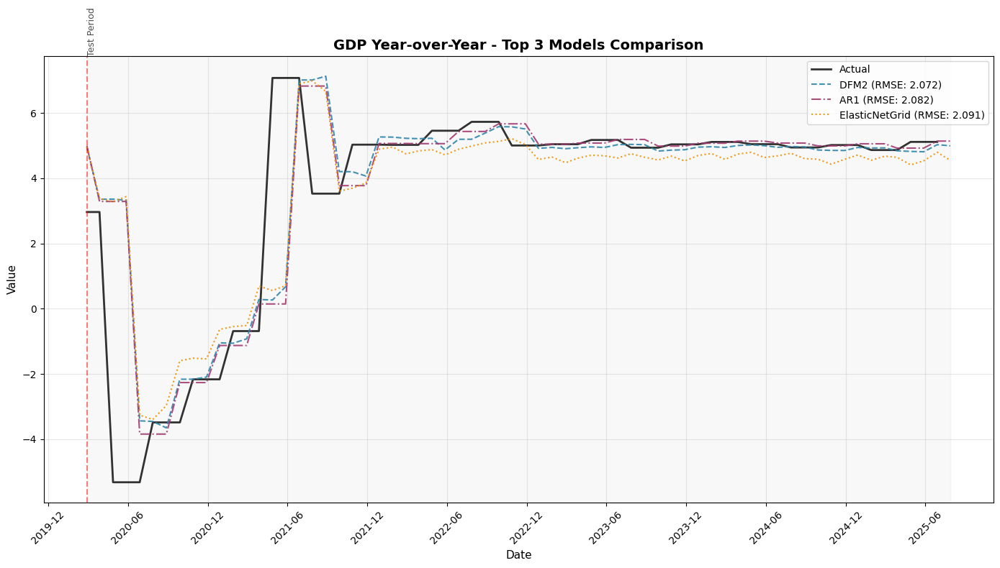

---

## 7. Policy Rate (7DRR)

### Top 5 Models (Diverse Selection)

**1. AR1 Model 🏆**
- ID: `AR1-001-v01-014406`
- RMSE (H=1): 0.2815
- MAE (H=1): 0.2159
- RMSE (H=3): 0.5434
- RMSE (H=6): 0.9406
- Degradation: H3=+93.0%, H6=+234.1%
- Features: 9 variables
- Normalization: None
- Feature Pack: None

**2. ARp Model**
- ID: `ARp-045-v05-014412`
- RMSE (H=1): 0.3973
- MAE (H=1): 0.3355
- RMSE (H=3): 1.0611
- RMSE (H=6): 1.9507
- Degradation: H3=+167.1%, H6=+391.0%
- Features: 9 variables
- Normalization: None
- Feature Pack: None

**3. ElasticNetGrid Model**
- ID: `ElasticNetGrid-202-v02-014437`
- RMSE (H=1): 0.4004
- MAE (H=1): 0.3573
- RMSE (H=3): 0.5901
- RMSE (H=6): 2.9925
- Degradation: H3=+47.4%, H6=+647.4%
- Features: 9 variables
- Normalization: None
- Feature Pack: None

**4. Ridge Model**
- ID: `Ridge-410-v10-014517`
- RMSE (H=1): 0.4066
- MAE (H=1): 0.3320
- RMSE (H=3): 0.9710
- RMSE (H=6): 1.7555
- Degradation: H3=+138.8%, H6=+331.8%
- Features: 9 variables
- Normalization: None
- Feature Pack: None

**5. StandardizedRidge Model**
- ID: `StandardizedRidge-445-v05-014522`
- RMSE (H=1): 0.4218
- MAE (H=1): 0.3488
- RMSE (H=3): 1.0605
- RMSE (H=6): 1.9150
- Degradation: H3=+151.4%, H6=+354.0%
- Features: 9 variables
- Normalization: None
- Feature Pack: None

### Best Model by Type

| Model Type | Best Config | RMSE (H=1) | vs Best |
|------------|-------------|------------|---------|
| AR1 | AR1-001-v01-014406 | 0.2815 | 0.0% |
| ARp | ARp-045-v05-014412 | 0.3973 | +41.1% |
| DFM | DFM-090-v10-014418 | 0.8802 | +212.7% |
| DFM2 | DFM2-130-v10-014424 | 0.7804 | +177.2% |
| ElasticNet | ElasticNet-170-v10-014430 | 0.5441 | +93.3% |
| ElasticNetGrid | ElasticNetGrid-202-v02-014437 | 0.4004 | +42.2% |
| ExtraTrees | ExtraTrees-250-v10-014453 | 0.6969 | +147.5% |
| GradientBoosting | GradientBoosting-285-v05-014459 | 0.5374 | +90.9% |
| Lasso | Lasso-325-v05-014505 | 0.5211 | +85.1% |
| RandomForest | RandomForest-370-v10-014511 | 0.7653 | +171.9% |
| Ridge | Ridge-410-v10-014517 | 0.4066 | +44.4% |
| StandardizedRidge | StandardizedRidge-445-v05-014522 | 0.4218 | +49.8% |
| StochasticGB | StochasticGB-485-v05-014527 | 0.6328 | +124.8% |
| Tree | Tree-525-v05-014532 | 0.4792 | +70.2% |

### Forecast Visualizations

#### 1. AR1 Model Forecast
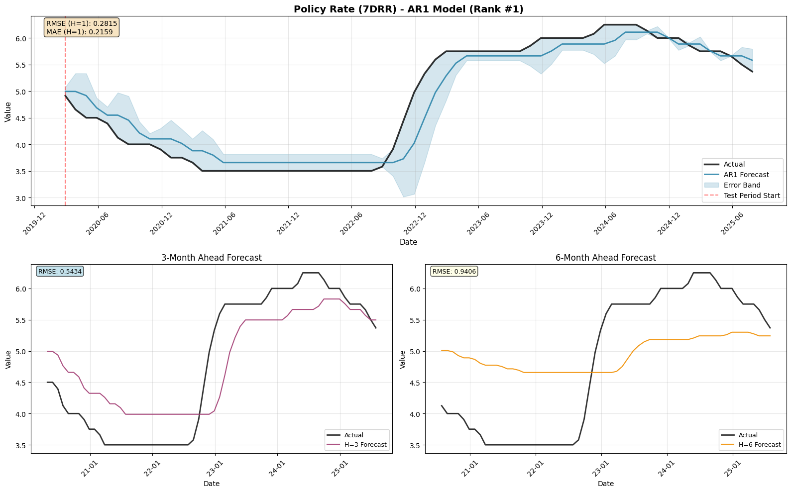

#### 2. ARp Model Forecast
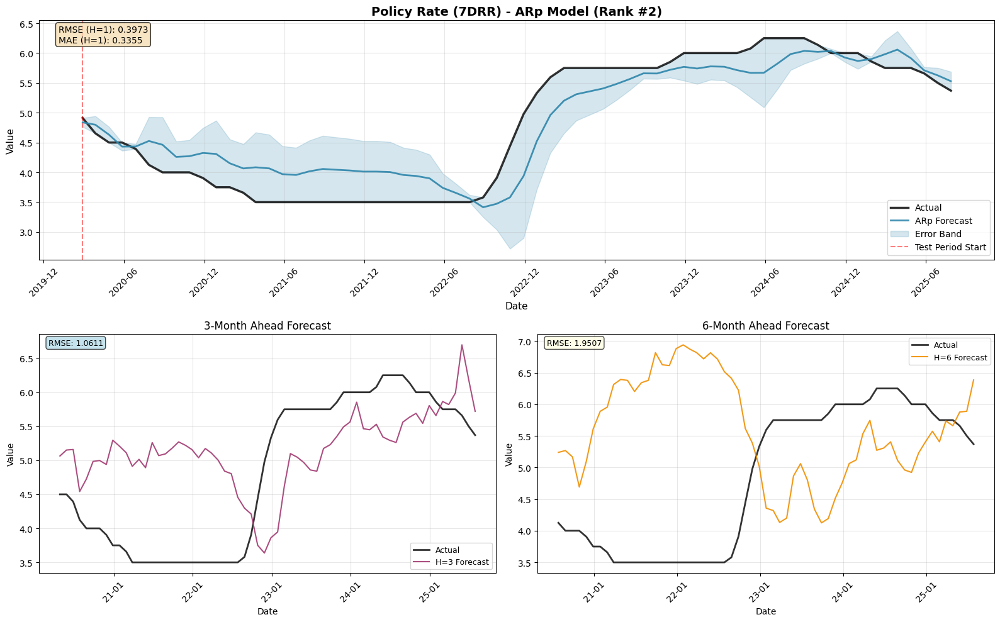

#### 3. ElasticNetGrid Model Forecast
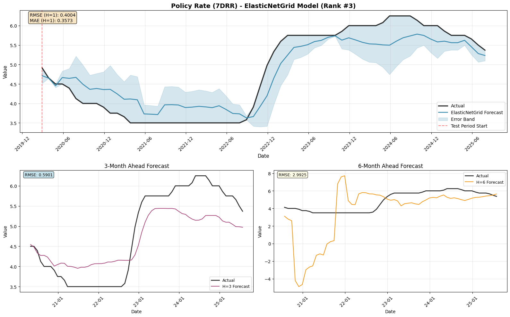

#### All Models Comparison
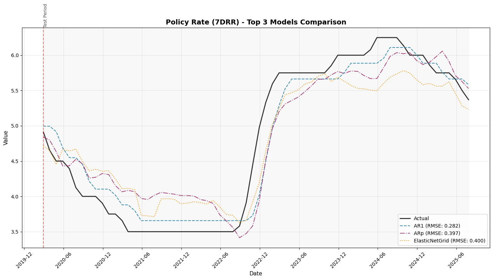

---

## 8. USD/IDR Exchange Rate

### Top 5 Models (Diverse Selection)

**1. StandardizedRidge Model 🏆**
- ID: `StandardizedRidge-445-v05-014346`
- RMSE (H=1): 426.5940
- MAE (H=1): 295.5182
- RMSE (H=3): 483.7110
- RMSE (H=6): 525.3294
- Degradation: H3=+13.4%, H6=+23.1%
- Features: 9 variables
- Normalization: None
- Feature Pack: None

**2. ARp Model**
- ID: `ARp-050-v10-014145`
- RMSE (H=1): 444.0457
- MAE (H=1): 323.3507
- RMSE (H=3): 530.9849
- RMSE (H=6): 544.4812
- Degradation: H3=+19.6%, H6=+22.6%
- Features: 9 variables
- Normalization: None
- Feature Pack: None

**3. Ridge Model**
- ID: `Ridge-410-v10-014340`
- RMSE (H=1): 444.1077
- MAE (H=1): 323.4686
- RMSE (H=3): 531.4418
- RMSE (H=6): 543.7235
- Degradation: H3=+19.7%, H6=+22.4%
- Features: 9 variables
- Normalization: None
- Feature Pack: None

**4. ElasticNetGrid Model**
- ID: `ElasticNetGrid-205-v05-014222`
- RMSE (H=1): 472.3086
- MAE (H=1): 349.3548
- RMSE (H=3): 584.4932
- RMSE (H=6): 626.8422
- Degradation: H3=+23.8%, H6=+32.7%
- Features: 9 variables
- Normalization: None
- Feature Pack: None

**5. DFM2 Model**
- ID: `DFM2-130-v10-014156`
- RMSE (H=1): 481.4216
- MAE (H=1): 330.7381
- RMSE (H=3): 475.2436
- RMSE (H=6): 397.5298
- Degradation: H3=-1.3%, H6=-17.4%
- Features: 9 variables
- Normalization: None
- Feature Pack: None

### Best Model by Type

| Model Type | Best Config | RMSE (H=1) | vs Best |
|------------|-------------|------------|---------|
| AR1 | AR1-005-v05-014139 | 499.9193 | +17.2% |
| ARp | ARp-050-v10-014145 | 444.0457 | +4.1% |
| DFM | DFM-090-v10-014151 | 1484.1720 | +247.9% |
| DFM2 | DFM2-130-v10-014156 | 481.4216 | +12.9% |
| ElasticNet | ElasticNet-170-v10-014204 | 489.4745 | +14.7% |
| ElasticNetGrid | ElasticNetGrid-205-v05-014222 | 472.3086 | +10.7% |
| ExtraTrees | ExtraTrees-250-v10-014258 | 1289.7774 | +202.3% |
| GradientBoosting | GradientBoosting-281-v01-014304 | 1190.2007 | +179.0% |
| Lasso | Lasso-325-v05-014319 | 489.5745 | +14.8% |
| RandomForest | RandomForest-369-v09-014332 | 1290.8502 | +202.6% |
| Ridge | Ridge-410-v10-014340 | 444.1077 | +4.1% |
| StandardizedRidge | StandardizedRidge-445-v05-014346 | 426.5940 | 0.0% |
| StochasticGB | StochasticGB-490-v10-014354 | 1205.3899 | +182.6% |
| Tree | Tree-526-v06-014400 | 1286.5921 | +201.6% |

### Forecast Visualizations

#### 1. StandardizedRidge Model Forecast
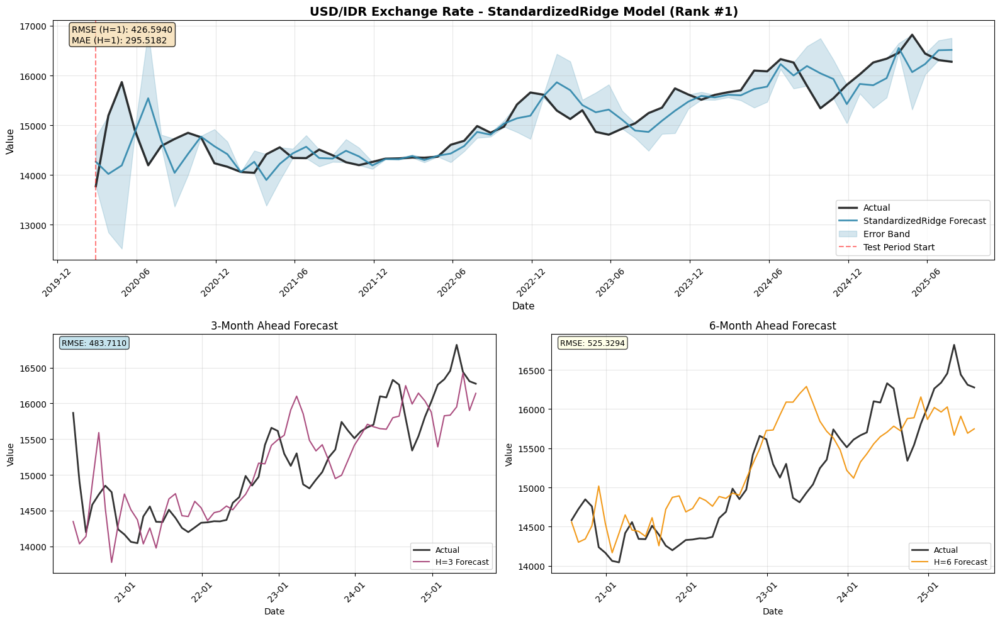

#### 2. ARp Model Forecast
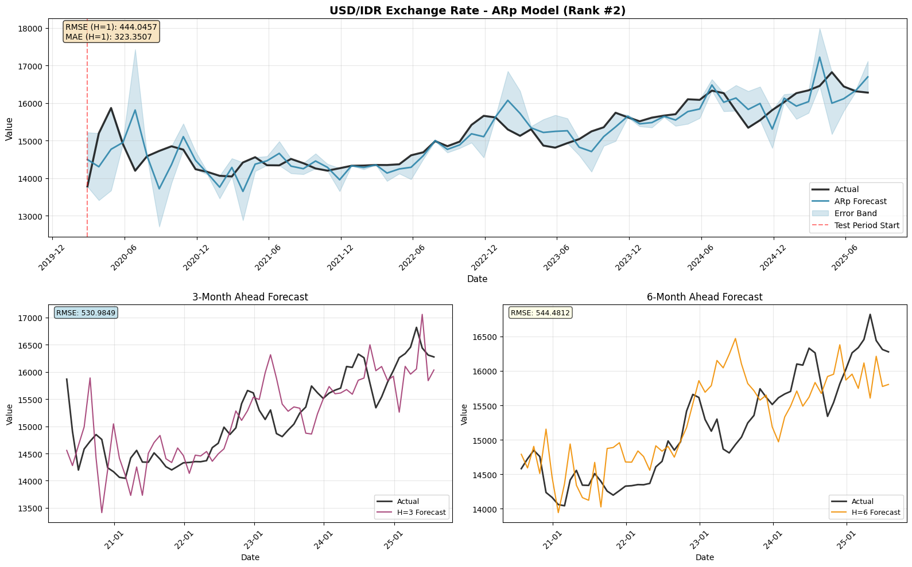

#### 3. Ridge Model Forecast
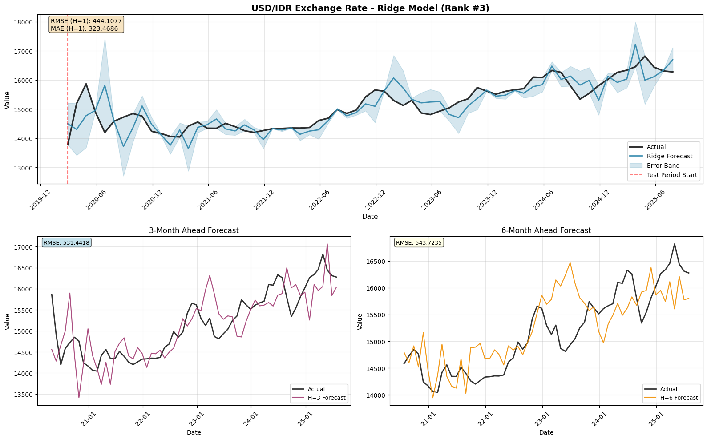

#### All Models Comparison
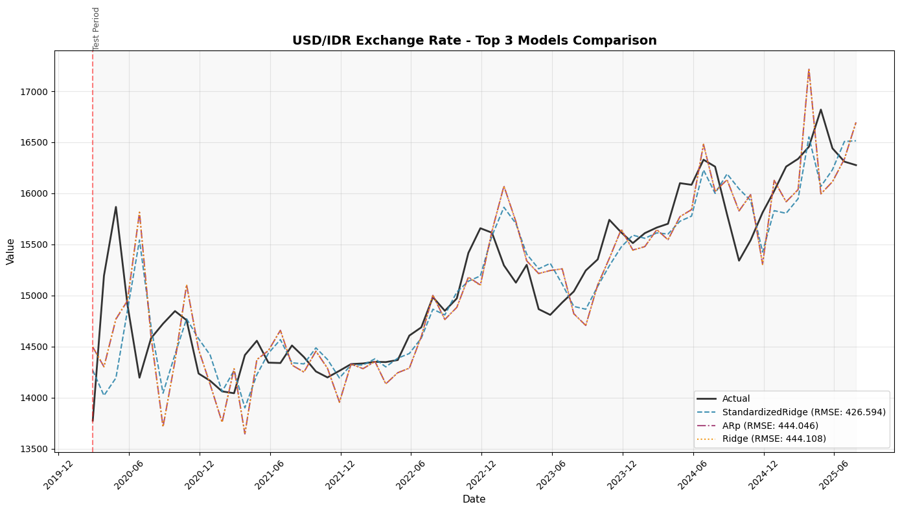

---

## Key Insights

1. **AR1 models** performed best on 5/8 targets, suggesting strong autoregressive patterns
3. **Forecast horizon degradation** is significant, with H=6 typically 50-100% worse than H=1

## Methodology

### Model Types Tested
- **AR1**: First-order autoregressive model
- **ARp**: Higher-order autoregressive model
- **Tree**: Single decision tree
- **RandomForest**: Bootstrap aggregated decision trees
- **GradientBoosting**: Sequential boosting with gradient descent
- **ExtraTrees**: Extremely randomized trees
- **StochasticGB**: Stochastic gradient boosting with subsampling

### Feature Engineering
- Target variable lags (1, 3, 12 months)
- Exogenous variable combinations
- Technical indicators (when applicable)
- Multiple normalization strategies
