# Indonesia Macroeconomic Nowcasting Report

**Generated:** 2025-10-10 08:07:18
**Output Directory:** `enhanced_comprehensive_all_models_indonesia_macro_monthly-20251009-071654`

## Executive Summary

This report presents nowcasting results for **10 macroeconomic indicators** using multiple machine learning models.

## Model Performance Overview

### Best Performing Models by Target Variable

| Target Variable | Best Model | Type | RMSE (H=1) | MAE (H=1) | R² |
|-----------------|------------|------|------------|-----------|-----|
| Bi7Drr | XGBoost-1459-v19-112751 | XGBoost | 1.3329 | 1.0160 | N/A |
| Cpi | Naive-938-v38-074658 | Naive | 0.5645 | 0.4475 | N/A |
| Deposit Rate 12M | SeasonalNaive-1198-v58-162717 | SeasonalNaive | 0.3021 | 0.2322 | N/A |
| Deposit Rate 1M | Naive-933-v33-120851 | Naive | 0.2400 | 0.1815 | N/A |
| Deposit Rate 3M | Naive-917-v17-133726 | Naive | 0.2735 | 0.2012 | N/A |
| Deposit Rate 6M | SeasonalNaive-1198-v58-150617 | SeasonalNaive | 0.2724 | 0.2275 | N/A |
| Fx | LSTM-759-v39-203357 | LSTM | 66144.6218 | 59231.9935 | N/A |
| Govt Bond Yield 10 Yr | SeasonalNaive-1153-v13-174003 | SeasonalNaive | 0.3575 | 0.2770 | N/A |
| Jisdor Exchange Rate | DFM2-355-v55-182707 | DFM2 | 492.1879 | 374.0470 | N/A |
| Real Gdp Growth | PLS1-1001-v41-090003 | PLS1 | 2.1558 | 1.0973 | 0.5593 |

### Model Type Performance Summary

Average performance across all targets by model type:

| Model Type | Avg RMSE | Min RMSE | # Targets |
|------------|----------|----------|-----------|
| AR1 | 8881.4670 | 0.3640 | 9 |
| ARp | 25140.2971 | 0.6297 | 9 |
| BVAR | 22256.7932 | 0.3496 | 9 |
| Bagging | 10146.8756 | 0.8152 | 9 |
| DFM | 7761.4090 | 0.3480 | 9 |
| DFM2 | 7745.0260 | 0.2716 | 9 |
| ElasticNet | 13164.9535 | 0.8251 | 9 |
| ElasticNetGrid | 15208.1803 | 0.7911 | 9 |
| ExtraTrees | 10103.7529 | 0.9230 | 9 |
| GARCH | 427526916.5520 | 2.8148 | 9 |
| GradientBoosting | 10513.2160 | 0.8937 | 9 |
| Huber | 50967.1774 | 0.6297 | 9 |
| LSTM | 7424.6454 | 0.3996 | 9 |
| Lasso | 13228.3424 | 0.8406 | 9 |
| Linear | 25140.2971 | 0.6297 | 9 |
| Naive | 9787.9303 | 0.2400 | 9 |
| PLS1 | 8451.2521 | 0.3374 | 9 |
| RandomForest | 9525.1814 | 0.9052 | 9 |
| Ridge | 12318.9994 | 0.3868 | 9 |
| SeasonalNaive | 9787.9303 | 0.2400 | 9 |
| StandardizedLinear | 25140.2971 | 0.6297 | 9 |
| StandardizedRidge | 13194.9836 | 0.3078 | 9 |
| StochasticGB | 11124.7956 | 0.9308 | 9 |
| Tree | 10354.3242 | 1.0590 | 9 |
| XGBoost | 7256.0283 | 0.7106 | 10 |

## 1. Bi7Drr

### Top 5 Models (Diverse Selection)

**1. XGBoost Model 🏆**
- ID: `XGBoost-1459-v19-112751`
- RMSE (H=1): 1.3329
- MAE (H=1): 1.0160
- RMSE (H=3): 0.7474
- RMSE (H=6): 1.4286
- Degradation: H3=-43.9%, H6=+7.2%
- Features: 9 variables
- Normalization: {'method': 'robust', 'window': 12}
- Feature Pack: None

**2. XGBoost Model**
- ID: `XGBoost-1499-v59-113817`
- RMSE (H=1): 1.3329
- MAE (H=1): 1.0160
- RMSE (H=3): 0.7474
- RMSE (H=6): 1.4286
- Degradation: H3=-43.9%, H6=+7.2%
- Features: 9 variables
- Normalization: {'method': 'robust', 'window': 12}
- Feature Pack: ta_advanced

**3. XGBoost Model**
- ID: `XGBoost-1495-v55-113647`
- RMSE (H=1): 1.3329
- MAE (H=1): 1.0160
- RMSE (H=3): 0.7474
- RMSE (H=6): 1.4286
- Degradation: H3=-43.9%, H6=+7.2%
- Features: 9 variables
- Normalization: {'method': 'minmax', 'window': 12}
- Feature Pack: ta_advanced

**4. XGBoost Model**
- ID: `XGBoost-1483-v43-113444`
- RMSE (H=1): 1.3329
- MAE (H=1): 1.0160
- RMSE (H=3): 0.7474
- RMSE (H=6): 1.4286
- Degradation: H3=-43.9%, H6=+7.2%
- Features: 9 variables
- Normalization: None
- Feature Pack: ta_advanced

**5. XGBoost Model**
- ID: `XGBoost-1479-v39-113248`
- RMSE (H=1): 1.3329
- MAE (H=1): 1.0160
- RMSE (H=3): 0.7474
- RMSE (H=6): 1.4286
- Degradation: H3=-43.9%, H6=+7.2%
- Features: 16 variables
- Normalization: {'method': 'robust', 'window': 12}
- Feature Pack: ta_basic

### Forecast Visualizations

#### 1. XGBoost Model Forecast
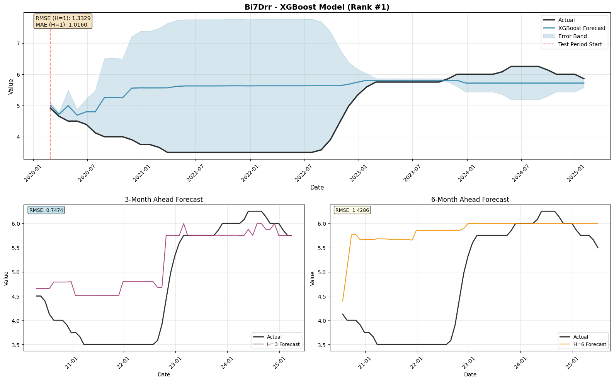

#### 2. XGBoost Model Forecast

#### 3. XGBoost Model Forecast

#### All Models Comparison
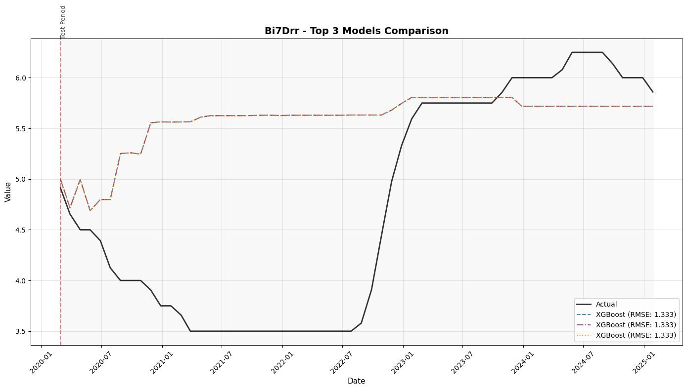

---

## 2. Cpi

### Top 5 Models (Diverse Selection)

**1. Naive Model 🏆**
- ID: `Naive-938-v38-074658`
- RMSE (H=1): 0.5645
- MAE (H=1): 0.4475
- RMSE (H=3): 0.9778
- RMSE (H=6): 1.4648
- Degradation: H3=+73.2%, H6=+159.5%
- Features: 16 variables
- Normalization: {'method': 'robust', 'window': 12}
- Feature Pack: ta_basic

**2. SeasonalNaive Model**
- ID: `SeasonalNaive-1197-v57-075434`
- RMSE (H=1): 0.5645
- MAE (H=1): 0.4475
- RMSE (H=3): 0.9778
- RMSE (H=6): 1.4648
- Degradation: H3=+73.2%, H6=+159.5%
- Features: 9 variables
- Normalization: {'method': 'robust', 'window': 12}
- Feature Pack: ta_advanced

**3. AR1 Model**
- ID: `AR1-053-v53-071801`
- RMSE (H=1): 0.7008
- MAE (H=1): 0.6027
- RMSE (H=3): 1.1008
- RMSE (H=6): 1.3328
- Degradation: H3=+57.1%, H6=+90.2%
- Features: 9 variables
- Normalization: {'method': 'minmax', 'window': 12}
- Feature Pack: ta_advanced

**4. DFM2 Model**
- ID: `DFM2-303-v03-072304`
- RMSE (H=1): 0.9801
- MAE (H=1): 0.8150
- RMSE (H=3): 1.4089
- RMSE (H=6): 1.6910
- Degradation: H3=+43.8%, H6=+72.5%
- Features: 9 variables
- Normalization: None
- Feature Pack: None

**5. PLS1 Model**
- ID: `PLS1-1013-v53-074918`
- RMSE (H=1): 0.9982
- MAE (H=1): 0.7654
- RMSE (H=3): 1.4085
- RMSE (H=6): 1.7229
- Degradation: H3=+41.1%, H6=+72.6%
- Features: 9 variables
- Normalization: {'method': 'minmax', 'window': 12}
- Feature Pack: ta_advanced

### Best Model by Type

| Model Type | Best Config | RMSE (H=1) | vs Best |
|------------|-------------|------------|---------|
| AR1 | AR1-053-v53-071801 | 0.7008 | +24.1% |
| ARp | ARp-093-v33-071850 | 2.1806 | +286.3% |
| BVAR | BVAR-174-v54-072024 | 1.7066 | +202.3% |
| Bagging | Bagging-219-v39-072129 | 1.3233 | +134.4% |
| DFM | DFM-261-v21-072214 | 1.5297 | +171.0% |
| DFM2 | DFM2-303-v03-072304 | 0.9801 | +73.6% |
| ElasticNet | ElasticNet-393-v33-072505 | 1.3486 | +138.9% |
| ElasticNetGrid | ElasticNetGrid-433-v13-072631 | 1.4778 | +161.8% |
| ExtraTrees | ExtraTrees-493-v13-073149 | 1.4047 | +148.8% |
| GARCH | GARCH-574-v34-073424 | 2.8148 | +398.6% |
| GradientBoosting | GradientBoosting-621-v21-073532 | 1.3359 | +136.6% |
| Huber | Huber-661-v01-073707 | 2.1806 | +286.3% |
| LSTM | LSTM-758-v38-074136 | 1.3438 | +138.0% |
| Lasso | Lasso-817-v37-074340 | 1.3880 | +145.9% |
| Linear | Linear-841-v01-074410 | 2.1806 | +286.3% |
| Naive | Naive-938-v38-074658 | 0.5645 | 0.0% |
| PLS1 | PLS1-1013-v53-074918 | 0.9982 | +76.8% |
| RandomForest | RandomForest-1061-v41-075048 | 1.3533 | +139.7% |
| Ridge | Ridge-1093-v13-075148 | 1.5264 | +170.4% |
| SeasonalNaive | SeasonalNaive-1197-v57-075434 | 0.5645 | 0.0% |
| StandardizedLinear | StandardizedLinear-1237-v37-075538 | 2.1806 | +286.3% |
| StandardizedRidge | StandardizedRidge-1263-v03-075603 | 1.5466 | +174.0% |
| StochasticGB | StochasticGB-1358-v38-075825 | 1.2750 | +125.9% |
| Tree | Tree-1395-v15-075918 | 1.3123 | +132.5% |
| XGBoost | XGBoost-1497-v57-082722 | 1.2986 | +130.0% |

### Forecast Visualizations

#### 1. Naive Model Forecast
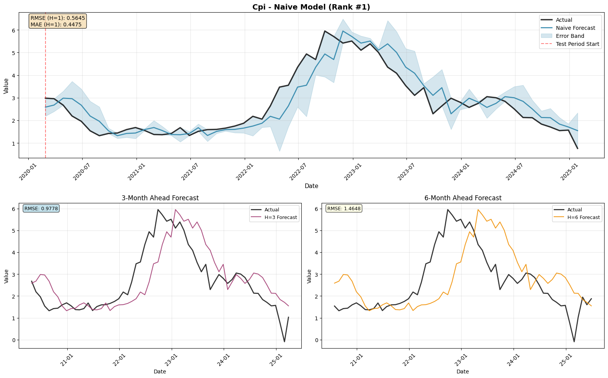

#### 2. SeasonalNaive Model Forecast
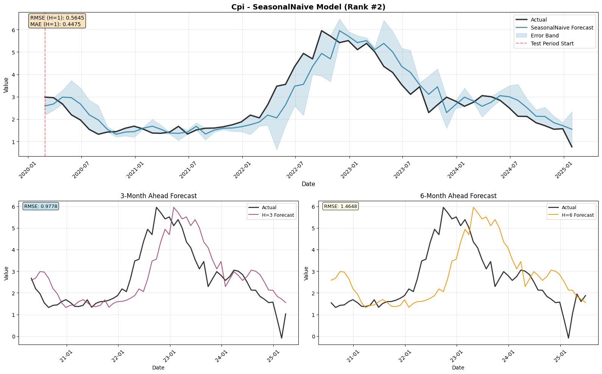

#### 3. AR1 Model Forecast
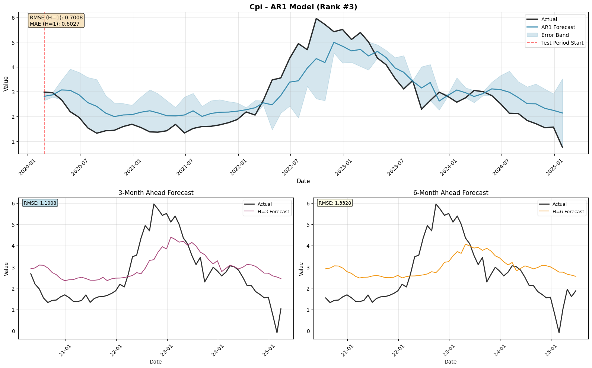

#### All Models Comparison
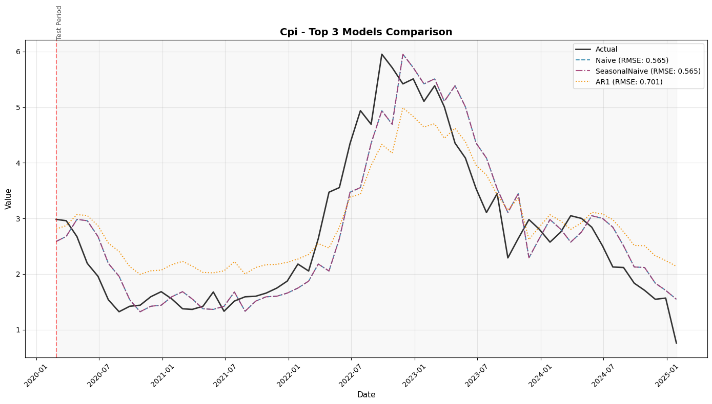

---

## 3. Deposit Rate 12M

### Top 5 Models (Diverse Selection)

**1. SeasonalNaive Model 🏆**
- ID: `SeasonalNaive-1198-v58-162717`
- RMSE (H=1): 0.3021
- MAE (H=1): 0.2322
- RMSE (H=3): 0.5445
- RMSE (H=6): 0.8551
- Degradation: H3=+80.2%, H6=+183.0%
- Features: 9 variables
- Normalization: {'method': 'robust', 'window': 12}
- Feature Pack: ta_advanced

**2. Naive Model**
- ID: `Naive-938-v38-162043`
- RMSE (H=1): 0.3021
- MAE (H=1): 0.2322
- RMSE (H=3): 0.5445
- RMSE (H=6): 0.8551
- Degradation: H3=+80.2%, H6=+183.0%
- Features: 16 variables
- Normalization: {'method': 'robust', 'window': 12}
- Feature Pack: ta_basic

**3. DFM2 Model**
- ID: `DFM2-313-v13-155654`
- RMSE (H=1): 0.3077
- MAE (H=1): 0.2584
- RMSE (H=3): 0.5826
- RMSE (H=6): 0.9675
- Degradation: H3=+89.3%, H6=+214.4%
- Features: 9 variables
- Normalization: {'method': 'minmax', 'window': 12}
- Feature Pack: None

**4. PLS1 Model**
- ID: `PLS1-1001-v41-162209`
- RMSE (H=1): 0.3374
- MAE (H=1): 0.2917
- RMSE (H=3): 0.5654
- RMSE (H=6): 0.8794
- Degradation: H3=+67.6%, H6=+160.6%
- Features: 9 variables
- Normalization: None
- Feature Pack: ta_advanced

**5. DFM Model**
- ID: `DFM-273-v33-155609`
- RMSE (H=1): 0.3480
- MAE (H=1): 0.3019
- RMSE (H=3): 0.6377
- RMSE (H=6): 1.0641
- Degradation: H3=+83.3%, H6=+205.8%
- Features: 16 variables
- Normalization: {'method': 'minmax', 'window': 12}
- Feature Pack: ta_basic

### Best Model by Type

| Model Type | Best Config | RMSE (H=1) | vs Best |
|------------|-------------|------------|---------|
| AR1 | AR1-017-v17-154948 | 0.4001 | +32.4% |
| ARp | ARp-061-v01-155040 | 1.4933 | +394.3% |
| BVAR | BVAR-174-v54-155327 | 0.4513 | +49.4% |
| Bagging | Bagging-201-v21-155400 | 1.6684 | +452.2% |
| DFM | DFM-273-v33-155609 | 0.3480 | +15.2% |
| DFM2 | DFM2-313-v13-155654 | 0.3077 | +1.8% |
| ElasticNet | ElasticNet-382-v22-155833 | 0.8251 | +173.1% |
| ElasticNetGrid | ElasticNetGrid-441-v21-160206 | 0.7911 | +161.8% |
| ExtraTrees | ExtraTrees-481-v01-160546 | 1.6741 | +454.1% |
| GARCH | GARCH-575-v35-160838 | 5.0170 | +1560.5% |
| GradientBoosting | GradientBoosting-617-v17-160947 | 1.6837 | +457.3% |
| Huber | Huber-713-v53-161305 | 1.4933 | +394.3% |
| LSTM | LSTM-743-v23-161427 | 1.0713 | +254.6% |
| Lasso | Lasso-822-v42-161746 | 0.8406 | +178.2% |
| Linear | Linear-873-v33-161918 | 1.4933 | +394.3% |
| Naive | Naive-938-v38-162043 | 0.3021 | 0.0% |
| PLS1 | PLS1-1001-v41-162209 | 0.3374 | +11.7% |
| RandomForest | RandomForest-1073-v53-162412 | 1.6698 | +452.6% |
| Ridge | Ridge-1121-v41-162521 | 0.3868 | +28.0% |
| SeasonalNaive | SeasonalNaive-1198-v58-162717 | 0.3021 | 0.0% |
| StandardizedLinear | StandardizedLinear-1217-v17-162743 | 1.4933 | +394.3% |
| StandardizedRidge | StandardizedRidge-1319-v59-162957 | 0.4376 | +44.8% |
| StochasticGB | StochasticGB-1337-v17-163020 | 1.6485 | +445.6% |
| Tree | Tree-1403-v23-163155 | 1.6518 | +446.7% |
| XGBoost | XGBoost-1453-v13-163646 | 1.5515 | +413.5% |

### Forecast Visualizations

#### 1. SeasonalNaive Model Forecast
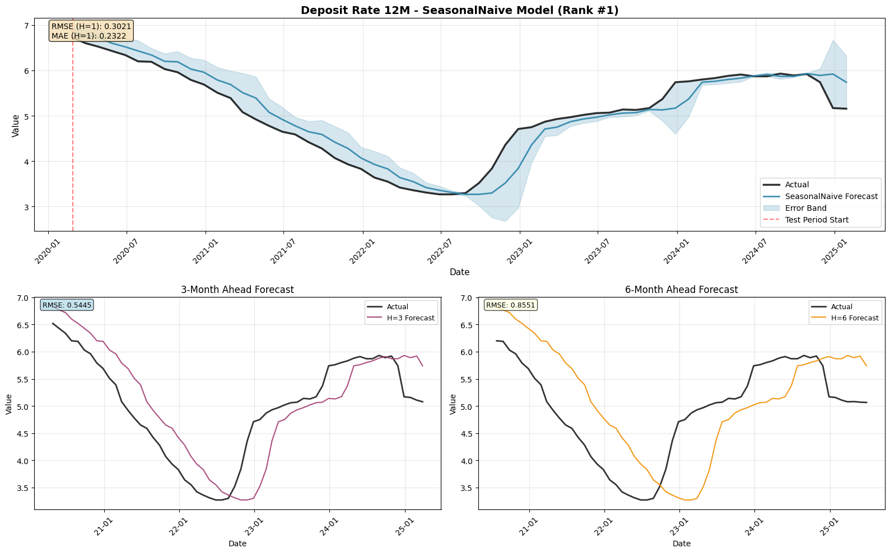

#### 2. Naive Model Forecast

#### 3. DFM2 Model Forecast
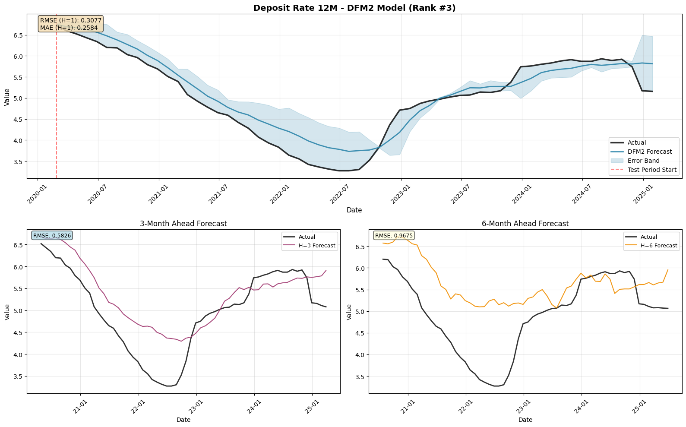

#### All Models Comparison
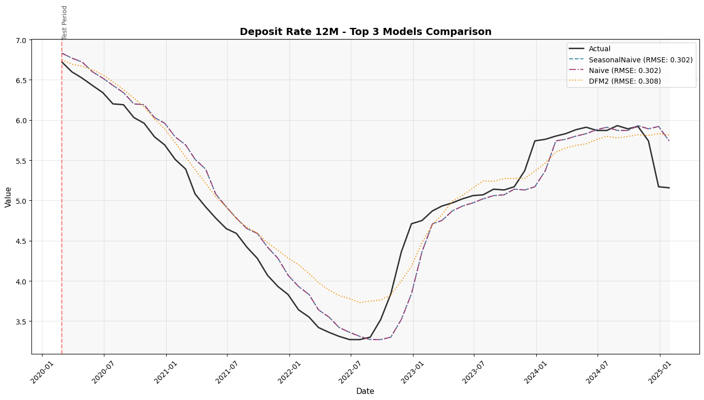

---

## 4. Deposit Rate 1M

### Top 5 Models (Diverse Selection)

**1. Naive Model 🏆**
- ID: `Naive-933-v33-120851`
- RMSE (H=1): 0.2400
- MAE (H=1): 0.1815
- RMSE (H=3): 0.4483
- RMSE (H=6): 0.7246
- Degradation: H3=+86.8%, H6=+201.9%
- Features: 16 variables
- Normalization: {'method': 'minmax', 'window': 12}
- Feature Pack: ta_basic

**2. SeasonalNaive Model**
- ID: `SeasonalNaive-1174-v34-121459`
- RMSE (H=1): 0.2400
- MAE (H=1): 0.1815
- RMSE (H=3): 0.4483
- RMSE (H=6): 0.7246
- Degradation: H3=+86.8%, H6=+201.9%
- Features: 16 variables
- Normalization: {'method': 'minmax', 'window': 12}
- Feature Pack: ta_basic

**3. DFM2 Model**
- ID: `DFM2-354-v54-114620`
- RMSE (H=1): 0.2716
- MAE (H=1): 0.2322
- RMSE (H=3): 0.5953
- RMSE (H=6): 1.2068
- Degradation: H3=+119.2%, H6=+344.3%
- Features: 9 variables
- Normalization: {'method': 'minmax', 'window': 12}
- Feature Pack: ta_advanced

**4. PLS1 Model**
- ID: `PLS1-997-v37-121028`
- RMSE (H=1): 0.3453
- MAE (H=1): 0.2806
- RMSE (H=3): 0.7622
- RMSE (H=6): 2.1338
- Degradation: H3=+120.7%, H6=+517.9%
- Features: 16 variables
- Normalization: {'method': 'robust', 'window': 12}
- Feature Pack: ta_basic

**5. BVAR Model**
- ID: `BVAR-177-v57-114215`
- RMSE (H=1): 0.4101
- MAE (H=1): 0.2971
- RMSE (H=3): 0.7867
- RMSE (H=6): 1.4437
- Degradation: H3=+91.8%, H6=+252.0%
- Features: 9 variables
- Normalization: {'method': 'robust', 'window': 12}
- Feature Pack: ta_advanced

### Best Model by Type

| Model Type | Best Config | RMSE (H=1) | vs Best |
|------------|-------------|------------|---------|
| AR1 | AR1-041-v41-113917 | 0.5017 | +109.0% |
| ARp | ARp-113-v53-114054 | 1.5407 | +542.0% |
| BVAR | BVAR-177-v57-114215 | 0.4101 | +70.9% |
| Bagging | Bagging-199-v19-114247 | 2.0082 | +736.8% |
| DFM | DFM-281-v41-114446 | 1.5552 | +548.0% |
| DFM2 | DFM2-354-v54-114620 | 0.2716 | +13.2% |
| ElasticNet | ElasticNet-403-v43-114723 | 0.9312 | +288.0% |
| ElasticNetGrid | ElasticNetGrid-439-v19-114931 | 0.9253 | +285.6% |
| ExtraTrees | ExtraTrees-499-v19-115352 | 2.0374 | +748.9% |
| GARCH | GARCH-578-v38-115604 | 4.0840 | +1601.7% |
| GradientBoosting | GradientBoosting-655-v55-115850 | 1.9159 | +698.3% |
| Huber | Huber-713-v53-120026 | 1.5407 | +542.0% |
| LSTM | LSTM-721-v01-120035 | 1.0059 | +319.1% |
| Lasso | Lasso-803-v23-120505 | 0.9780 | +307.5% |
| Linear | Linear-841-v01-120615 | 1.5407 | +542.0% |
| Naive | Naive-933-v33-120851 | 0.2400 | 0.0% |
| PLS1 | PLS1-997-v37-121028 | 0.3453 | +43.9% |
| RandomForest | RandomForest-1079-v59-121230 | 2.0465 | +752.7% |
| Ridge | Ridge-1098-v18-121252 | 0.5935 | +147.3% |
| SeasonalNaive | SeasonalNaive-1174-v34-121459 | 0.2400 | 0.0% |
| StandardizedLinear | StandardizedLinear-1241-v41-121644 | 1.5407 | +542.0% |
| StandardizedRidge | StandardizedRidge-1293-v33-121805 | 0.7223 | +201.0% |
| StochasticGB | StochasticGB-1359-v39-122001 | 1.9558 | +714.9% |
| Tree | Tree-1398-v18-122058 | 2.0353 | +748.1% |
| XGBoost | XGBoost-1455-v15-123159 | 2.0078 | +736.6% |

### Forecast Visualizations

#### 1. Naive Model Forecast
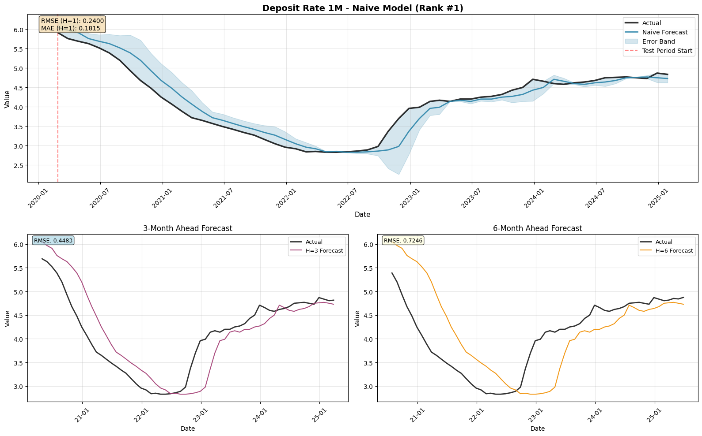

#### 2. SeasonalNaive Model Forecast
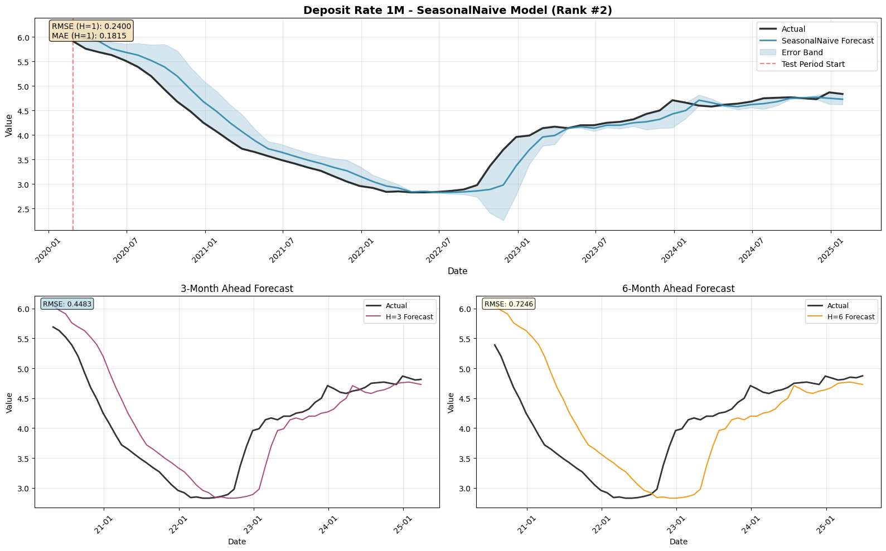

#### 3. DFM2 Model Forecast
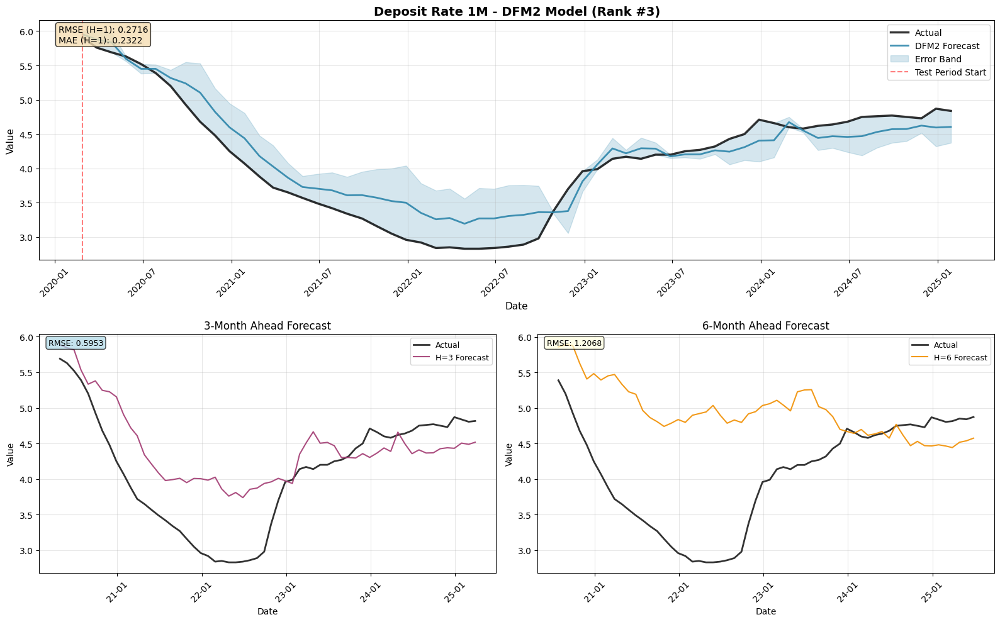

#### All Models Comparison
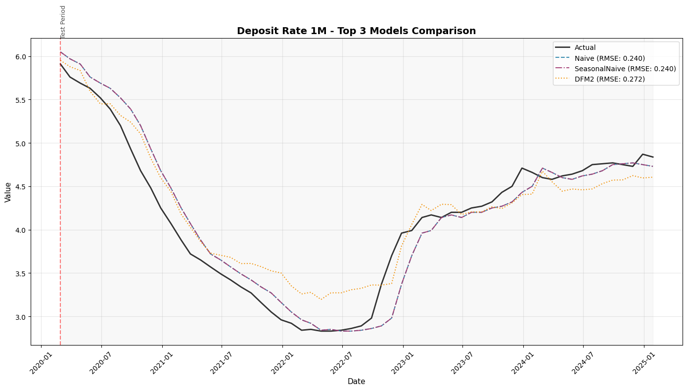

---

## 5. Deposit Rate 3M

### Top 5 Models (Diverse Selection)

**1. Naive Model 🏆**
- ID: `Naive-917-v17-133726`
- RMSE (H=1): 0.2735
- MAE (H=1): 0.2012
- RMSE (H=3): 0.5046
- RMSE (H=6): 0.8003
- Degradation: H3=+84.5%, H6=+192.6%
- Features: 9 variables
- Normalization: {'method': 'robust', 'window': 12}
- Feature Pack: None

**2. SeasonalNaive Model**
- ID: `SeasonalNaive-1142-v02-134233`
- RMSE (H=1): 0.2735
- MAE (H=1): 0.2012
- RMSE (H=3): 0.5046
- RMSE (H=6): 0.8003
- Degradation: H3=+84.5%, H6=+192.6%
- Features: 9 variables
- Normalization: None
- Feature Pack: None

**3. StandardizedRidge Model**
- ID: `StandardizedRidge-1317-v57-134646`
- RMSE (H=1): 0.3269
- MAE (H=1): 0.2975
- RMSE (H=3): 0.7564
- RMSE (H=6): 1.3399
- Degradation: H3=+131.4%, H6=+309.8%
- Features: 9 variables
- Normalization: {'method': 'robust', 'window': 12}
- Feature Pack: ta_advanced

**4. BVAR Model**
- ID: `BVAR-137-v17-130540`
- RMSE (H=1): 0.3496
- MAE (H=1): 0.2812
- RMSE (H=3): 0.4884
- RMSE (H=6): 1.4124
- Degradation: H3=+39.7%, H6=+304.0%
- Features: 9 variables
- Normalization: {'method': 'robust', 'window': 12}
- Feature Pack: None

**5. PLS1 Model**
- ID: `PLS1-1017-v57-133943`
- RMSE (H=1): 0.4023
- MAE (H=1): 0.3447
- RMSE (H=3): 1.0866
- RMSE (H=6): 1.9527
- Degradation: H3=+170.1%, H6=+385.3%
- Features: 9 variables
- Normalization: {'method': 'robust', 'window': 12}
- Feature Pack: ta_advanced

### Best Model by Type

| Model Type | Best Config | RMSE (H=1) | vs Best |
|------------|-------------|------------|---------|
| AR1 | AR1-057-v57-130338 | 0.4885 | +78.6% |
| ARp | ARp-073-v13-130402 | 0.6735 | +146.2% |
| BVAR | BVAR-137-v17-130540 | 0.3496 | +27.8% |
| Bagging | Bagging-197-v17-130722 | 1.8245 | +567.1% |
| DFM | DFM-273-v33-130956 | 1.0527 | +284.9% |
| DFM2 | DFM2-314-v14-131052 | 0.4329 | +58.3% |
| ElasticNet | ElasticNet-383-v23-131257 | 0.9542 | +248.9% |
| ElasticNetGrid | ElasticNetGrid-423-v03-131451 | 0.8135 | +197.4% |
| ExtraTrees | ExtraTrees-519-v39-132307 | 1.8839 | +588.8% |
| GARCH | GARCH-593-v53-132524 | 4.4681 | +1533.6% |
| GradientBoosting | GradientBoosting-614-v14-132601 | 1.8450 | +574.5% |
| Huber | Huber-693-v33-132915 | 0.6735 | +146.2% |
| LSTM | LSTM-777-v57-133355 | 1.2607 | +360.9% |
| Lasso | Lasso-835-v55-133538 | 1.0135 | +270.5% |
| Linear | Linear-857-v17-133604 | 0.6735 | +146.2% |
| Naive | Naive-917-v17-133726 | 0.2735 | 0.0% |
| PLS1 | PLS1-1017-v57-133943 | 0.4023 | +47.1% |
| RandomForest | RandomForest-1022-v02-133945 | 1.8968 | +593.5% |
| Ridge | Ridge-1097-v17-134132 | 0.5824 | +112.9% |
| SeasonalNaive | SeasonalNaive-1142-v02-134233 | 0.2735 | 0.0% |
| StandardizedLinear | StandardizedLinear-1233-v33-134455 | 0.6735 | +146.2% |
| StandardizedRidge | StandardizedRidge-1317-v57-134646 | 0.3269 | +19.5% |
| StochasticGB | StochasticGB-1335-v15-134709 | 1.8415 | +573.3% |
| Tree | Tree-1433-v53-134935 | 1.8201 | +565.5% |
| XGBoost | XGBoost-1494-v54-141736 | 1.6842 | +515.8% |

### Forecast Visualizations

#### 1. Naive Model Forecast

#### 2. SeasonalNaive Model Forecast
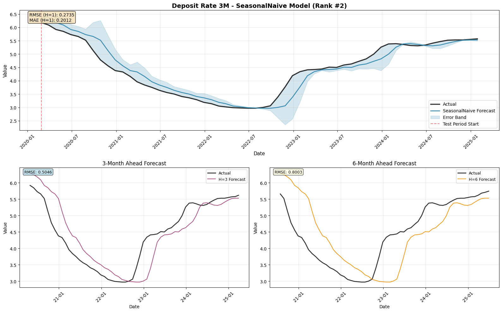

#### 3. StandardizedRidge Model Forecast
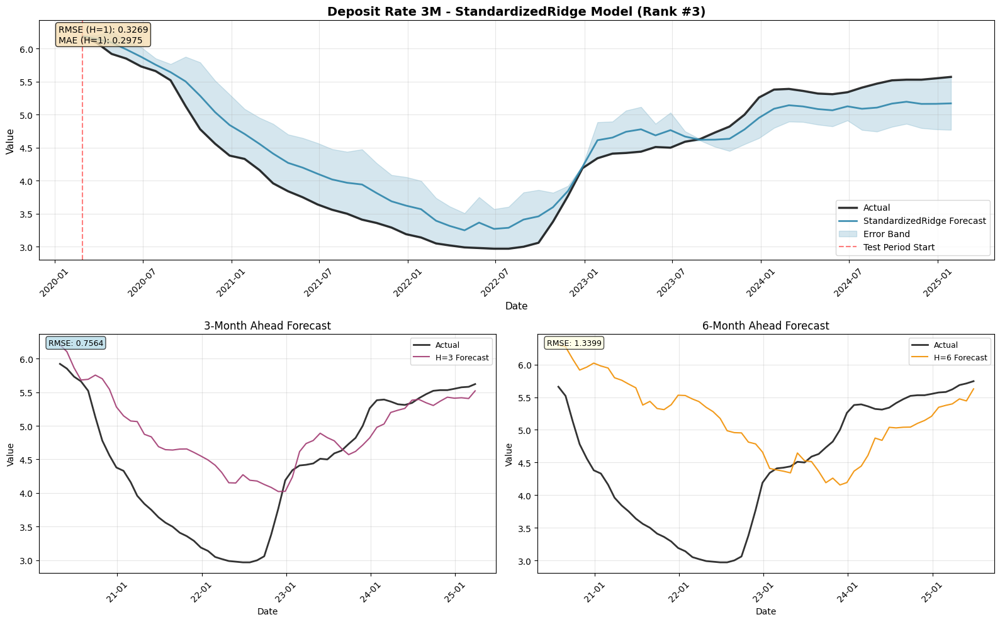

#### All Models Comparison
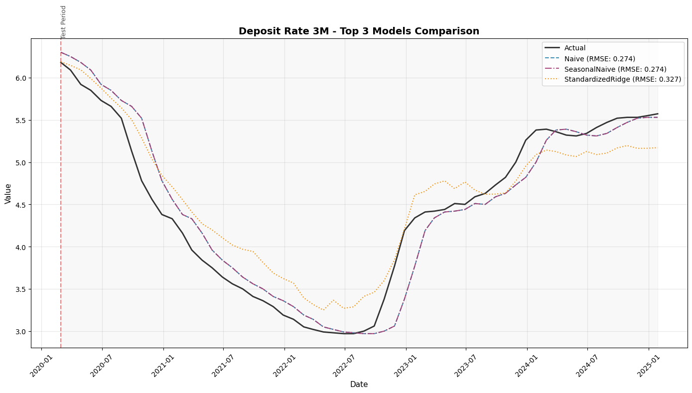

---

## 6. Deposit Rate 6M

### Top 5 Models (Diverse Selection)

**1. SeasonalNaive Model 🏆**
- ID: `SeasonalNaive-1198-v58-150617`
- RMSE (H=1): 0.2724
- MAE (H=1): 0.2275
- RMSE (H=3): 0.5066
- RMSE (H=6): 0.8147
- Degradation: H3=+85.9%, H6=+199.0%
- Features: 9 variables
- Normalization: {'method': 'robust', 'window': 12}
- Feature Pack: ta_advanced

**2. Naive Model**
- ID: `Naive-921-v21-145846`
- RMSE (H=1): 0.2724
- MAE (H=1): 0.2275
- RMSE (H=3): 0.5066
- RMSE (H=6): 0.8147
- Degradation: H3=+85.9%, H6=+199.0%
- Features: 16 variables
- Normalization: None
- Feature Pack: ta_basic

**3. StandardizedRidge Model**
- ID: `StandardizedRidge-1293-v33-150851`
- RMSE (H=1): 0.3078
- MAE (H=1): 0.2501
- RMSE (H=3): 0.4557
- RMSE (H=6): 1.0993
- Degradation: H3=+48.1%, H6=+257.2%
- Features: 16 variables
- Normalization: {'method': 'minmax', 'window': 12}
- Feature Pack: ta_basic

**4. BVAR Model**
- ID: `BVAR-133-v13-142654`
- RMSE (H=1): 0.3874
- MAE (H=1): 0.3395
- RMSE (H=3): 0.3573
- RMSE (H=6): 1.2206
- Degradation: H3=-7.8%, H6=+215.1%
- Features: 9 variables
- Normalization: {'method': 'minmax', 'window': 12}
- Feature Pack: None

**5. PLS1 Model**
- ID: `PLS1-1018-v58-150115`
- RMSE (H=1): 0.4093
- MAE (H=1): 0.3404
- RMSE (H=3): 1.1109
- RMSE (H=6): 1.9057
- Degradation: H3=+171.4%, H6=+365.6%
- Features: 9 variables
- Normalization: {'method': 'robust', 'window': 12}
- Feature Pack: ta_advanced

### Best Model by Type

| Model Type | Best Config | RMSE (H=1) | vs Best |
|------------|-------------|------------|---------|
| AR1 | AR1-059-v59-142446 | 0.4522 | +66.0% |
| ARp | ARp-113-v53-142622 | 0.6297 | +131.1% |
| BVAR | BVAR-133-v13-142654 | 0.3874 | +42.2% |
| Bagging | Bagging-213-v33-142923 | 1.8873 | +592.8% |
| DFM | DFM-261-v21-143027 | 0.8349 | +206.5% |
| DFM2 | DFM2-341-v41-143246 | 0.5332 | +95.7% |
| ElasticNet | ElasticNet-395-v35-143419 | 0.9682 | +255.4% |
| ElasticNetGrid | ElasticNetGrid-423-v03-143527 | 0.7941 | +191.5% |
| ExtraTrees | ExtraTrees-482-v02-144152 | 1.9280 | +607.7% |
| GARCH | GARCH-583-v43-144536 | 4.7475 | +1642.7% |
| GradientBoosting | GradientBoosting-618-v18-144702 | 1.8855 | +592.1% |
| Huber | Huber-693-v33-145021 | 0.6297 | +131.1% |
| LSTM | LSTM-742-v22-145220 | 1.0421 | +282.5% |
| Lasso | Lasso-819-v39-145615 | 0.9042 | +231.9% |
| Linear | Linear-841-v01-145646 | 0.6297 | +131.1% |
| Naive | Naive-921-v21-145846 | 0.2724 | 0.0% |
| PLS1 | PLS1-1018-v58-150115 | 0.4093 | +50.2% |
| RandomForest | RandomForest-1041-v21-150145 | 1.9522 | +616.6% |
| Ridge | Ridge-1121-v41-150410 | 0.5893 | +116.3% |
| SeasonalNaive | SeasonalNaive-1198-v58-150617 | 0.2724 | 0.0% |
| StandardizedLinear | StandardizedLinear-1257-v57-150749 | 0.6297 | +131.1% |
| StandardizedRidge | StandardizedRidge-1293-v33-150851 | 0.3078 | +13.0% |
| StochasticGB | StochasticGB-1375-v55-151052 | 1.8910 | +594.1% |
| Tree | Tree-1433-v53-151223 | 1.8522 | +579.9% |
| XGBoost | XGBoost-1462-v22-152648 | 1.7031 | +525.2% |

### Forecast Visualizations

#### 1. SeasonalNaive Model Forecast
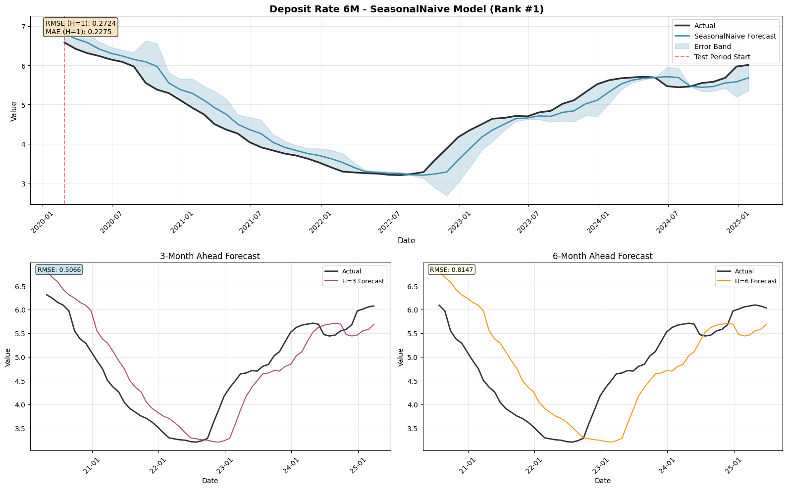

#### 2. Naive Model Forecast
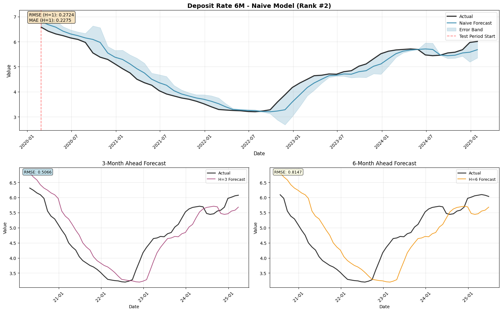

#### 3. StandardizedRidge Model Forecast
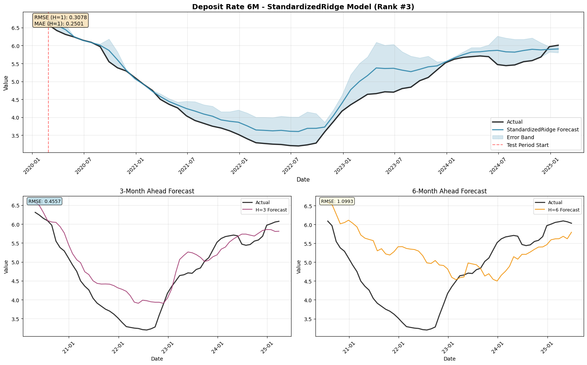

#### All Models Comparison
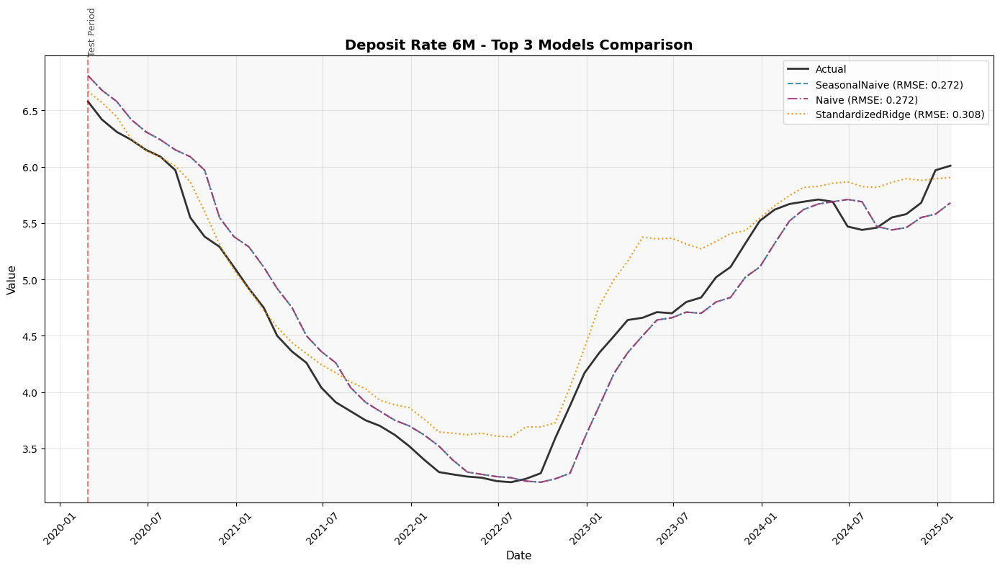

---

## 7. Fx

### Top 5 Models (Diverse Selection)

**1. LSTM Model 🏆**
- ID: `LSTM-759-v39-203357`
- RMSE (H=1): 66144.6218
- MAE (H=1): 59231.9935
- RMSE (H=3): 86690.7815
- RMSE (H=6): 378124.9526
- Degradation: H3=+31.1%, H6=+471.7%
- Features: 16 variables
- Normalization: {'method': 'robust', 'window': 12}
- Feature Pack: ta_basic

**2. DFM Model**
- ID: `DFM-263-v23-200718`
- RMSE (H=1): 69164.8384
- MAE (H=1): 55065.4230
- RMSE (H=3): 70825.8630
- RMSE (H=6): 71463.6203
- Degradation: H3=+2.4%, H6=+3.3%
- Features: 16 variables
- Normalization: None
- Feature Pack: ta_basic

**3. DFM2 Model**
- ID: `DFM2-335-v35-200954`
- RMSE (H=1): 69207.5650
- MAE (H=1): 55796.0961
- RMSE (H=3): 72649.6622
- RMSE (H=6): 72016.0667
- Degradation: H3=+5.0%, H6=+4.1%
- Features: 16 variables
- Normalization: {'method': 'minmax', 'window': 12}
- Feature Pack: ta_basic

**4. XGBoost Model**
- ID: `XGBoost-1473-v33-054652`
- RMSE (H=1): 71831.8883
- MAE (H=1): 51955.1596
- RMSE (H=3): nan
- RMSE (H=6): nan
- Degradation: H3=+nan%, H6=+nan%
- Features: 16 variables
- Normalization: {'method': 'minmax', 'window': 12}
- Feature Pack: ta_basic

**5. PLS1 Model**
- ID: `PLS1-997-v37-204312`
- RMSE (H=1): 75562.5554
- MAE (H=1): 62336.6143
- RMSE (H=3): nan
- RMSE (H=6): nan
- Degradation: H3=+nan%, H6=+nan%
- Features: 16 variables
- Normalization: {'method': 'robust', 'window': 12}
- Feature Pack: ta_basic

### Best Model by Type

| Model Type | Best Config | RMSE (H=1) | vs Best |
|------------|-------------|------------|---------|
| AR1 | AR1-019-v19-195925 | 79384.0565 | +20.0% |
| ARp | ARp-081-v21-200053 | 223648.1428 | +238.1% |
| BVAR | BVAR-141-v21-200229 | 198915.6440 | +200.7% |
| Bagging | Bagging-215-v35-200522 | 90413.2131 | +36.7% |
| DFM | DFM-263-v23-200718 | 69164.8384 | +4.6% |
| DFM2 | DFM2-335-v35-200954 | 69207.5650 | +4.6% |
| ElasticNet | ElasticNet-413-v53-201227 | 117788.4281 | +78.1% |
| ElasticNetGrid | ElasticNetGrid-457-v37-201708 | 136077.6956 | +105.7% |
| ExtraTrees | ExtraTrees-514-v34-202126 | 89991.5314 | +36.1% |
| GARCH | GARCH-561-v21-202248 | 3847549784.1010 | +5816774.7% |
| GradientBoosting | GradientBoosting-617-v17-202437 | 93796.5677 | +41.8% |
| Huber | Huber-681-v21-202747 | 455697.9682 | +588.9% |
| LSTM | LSTM-759-v39-203357 | 66144.6218 | 0.0% |
| Lasso | Lasso-833-v53-203743 | 118359.8959 | +78.9% |
| Linear | Linear-893-v53-203957 | 223648.1428 | +238.1% |
| Naive | Naive-914-v14-204029 | 87583.1924 | +32.4% |
| PLS1 | PLS1-997-v37-204312 | 75562.5554 | +14.2% |
| RandomForest | RandomForest-1079-v59-204550 | 84777.7170 | +28.2% |
| Ridge | Ridge-1101-v21-204627 | 109900.0701 | +66.2% |
| SeasonalNaive | SeasonalNaive-1198-v58-205002 | 87583.1924 | +32.4% |
| StandardizedLinear | StandardizedLinear-1213-v13-205040 | 223648.1428 | +238.1% |
| StandardizedRidge | StandardizedRidge-1273-v13-205243 | 117852.9420 | +78.2% |
| StochasticGB | StochasticGB-1333-v13-205437 | 99266.5348 | +50.1% |
| Tree | Tree-1423-v43-205720 | 92327.1322 | +39.6% |
| XGBoost | XGBoost-1473-v33-054652 | 71831.8883 | +8.6% |

### Forecast Visualizations

#### 1. LSTM Model Forecast
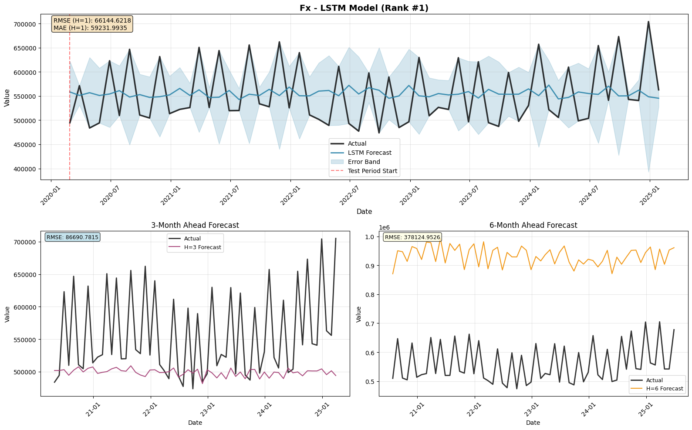

#### 2. DFM Model Forecast
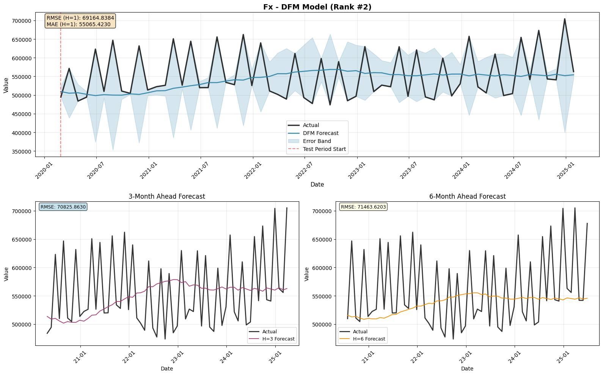

#### 3. DFM2 Model Forecast
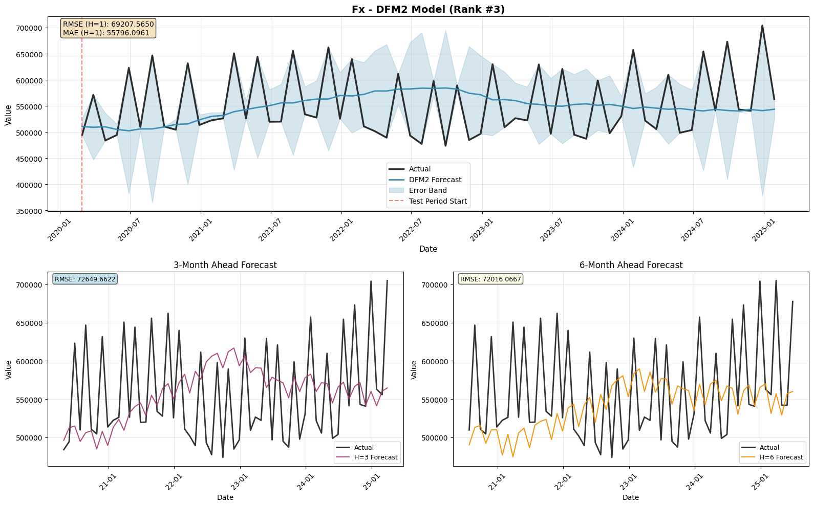

#### All Models Comparison
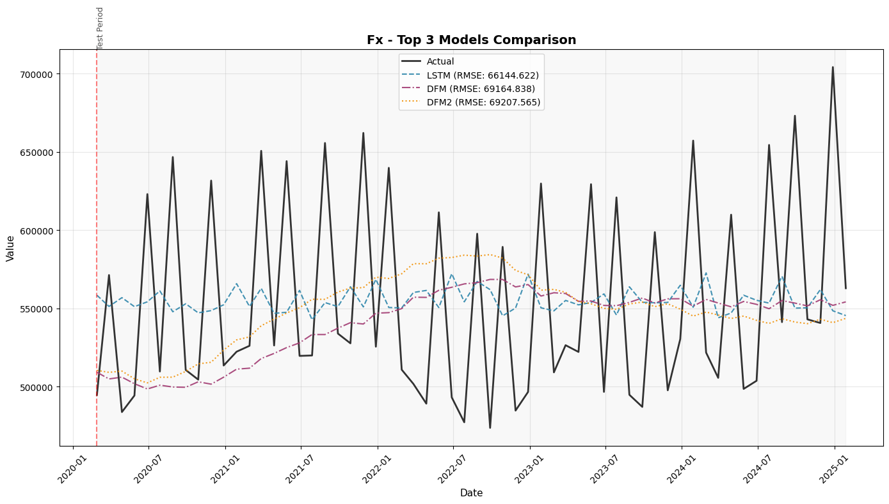

---

## 8. Govt Bond Yield 10 Yr

### Top 5 Models (Diverse Selection)

**1. SeasonalNaive Model 🏆**
- ID: `SeasonalNaive-1153-v13-174003`
- RMSE (H=1): 0.3575
- MAE (H=1): 0.2770
- RMSE (H=3): nan
- RMSE (H=6): nan
- Degradation: H3=+nan%, H6=+nan%
- Features: 9 variables
- Normalization: {'method': 'minmax', 'window': 12}
- Feature Pack: None

**2. Naive Model**
- ID: `Naive-917-v17-173457`
- RMSE (H=1): 0.3575
- MAE (H=1): 0.2770
- RMSE (H=3): nan
- RMSE (H=6): nan
- Degradation: H3=+nan%, H6=+nan%
- Features: 9 variables
- Normalization: {'method': 'robust', 'window': 12}
- Feature Pack: None

**3. AR1 Model**
- ID: `AR1-053-v53-170606`
- RMSE (H=1): 0.3640
- MAE (H=1): 0.2952
- RMSE (H=3): nan
- RMSE (H=6): nan
- Degradation: H3=+nan%, H6=+nan%
- Features: 9 variables
- Normalization: {'method': 'minmax', 'window': 12}
- Feature Pack: ta_advanced

**4. PLS1 Model**
- ID: `PLS1-973-v13-173610`
- RMSE (H=1): 0.3929
- MAE (H=1): 0.3348
- RMSE (H=3): nan
- RMSE (H=6): nan
- Degradation: H3=+nan%, H6=+nan%
- Features: 9 variables
- Normalization: {'method': 'minmax', 'window': 12}
- Feature Pack: None

**5. LSTM Model**
- ID: `LSTM-742-v22-172900`
- RMSE (H=1): 0.3996
- MAE (H=1): 0.3050
- RMSE (H=3): 0.6820
- RMSE (H=6): 0.7594
- Degradation: H3=+70.7%, H6=+90.0%
- Features: 16 variables
- Normalization: None
- Feature Pack: ta_basic

### Best Model by Type

| Model Type | Best Config | RMSE (H=1) | vs Best |
|------------|-------------|------------|---------|
| AR1 | AR1-053-v53-170606 | 0.3640 | +1.8% |
| ARp | ARp-097-v37-170702 | 2.3121 | +546.8% |
| BVAR | BVAR-154-v34-170824 | 1.1277 | +215.5% |
| Bagging | Bagging-239-v59-171033 | 0.8152 | +128.0% |
| DFM | DFM-277-v37-171126 | 0.6661 | +86.4% |
| DFM2 | DFM2-355-v55-171308 | 0.6964 | +94.8% |
| ElasticNet | ElasticNet-378-v18-171340 | 0.8464 | +136.8% |
| ElasticNetGrid | ElasticNetGrid-454-v34-171813 | 0.9981 | +179.2% |
| ExtraTrees | ExtraTrees-513-v33-172158 | 0.9230 | +158.2% |
| GARCH | GARCH-553-v13-172307 | 6.6819 | +1769.3% |
| GradientBoosting | GradientBoosting-643-v43-172538 | 0.8937 | +150.0% |
| Huber | Huber-661-v01-172611 | 2.3121 | +546.8% |
| LSTM | LSTM-742-v22-172900 | 0.3996 | +11.8% |
| Lasso | Lasso-817-v37-173249 | 0.8643 | +141.8% |
| Linear | Linear-857-v17-173340 | 2.3121 | +546.8% |
| Naive | Naive-917-v17-173457 | 0.3575 | 0.0% |
| PLS1 | PLS1-973-v13-173610 | 0.3929 | +9.9% |
| RandomForest | RandomForest-1059-v39-173802 | 0.9052 | +153.2% |
| Ridge | Ridge-1102-v22-173850 | 0.7060 | +97.5% |
| SeasonalNaive | SeasonalNaive-1153-v13-174003 | 0.3575 | 0.0% |
| StandardizedLinear | StandardizedLinear-1253-v53-174212 | 2.3121 | +546.8% |
| StandardizedRidge | StandardizedRidge-1278-v18-174236 | 0.6921 | +93.6% |
| StochasticGB | StochasticGB-1333-v13-174351 | 0.9308 | +160.4% |
| Tree | Tree-1435-v55-174603 | 1.0590 | +196.3% |
| XGBoost | XGBoost-1454-v14-175050 | 0.7106 | +98.8% |

### Forecast Visualizations

#### 1. SeasonalNaive Model Forecast
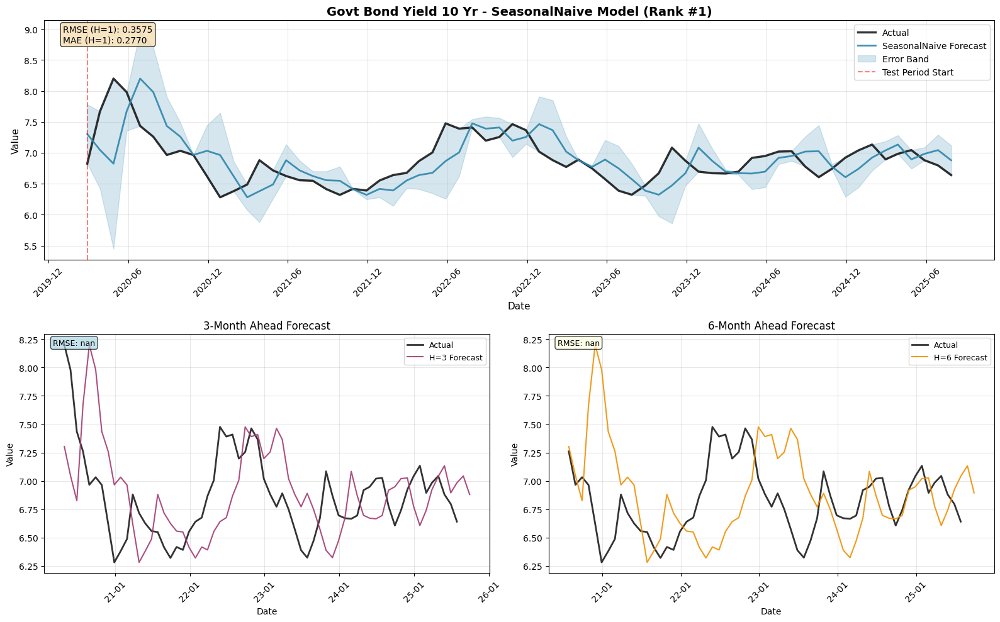

#### 2. Naive Model Forecast
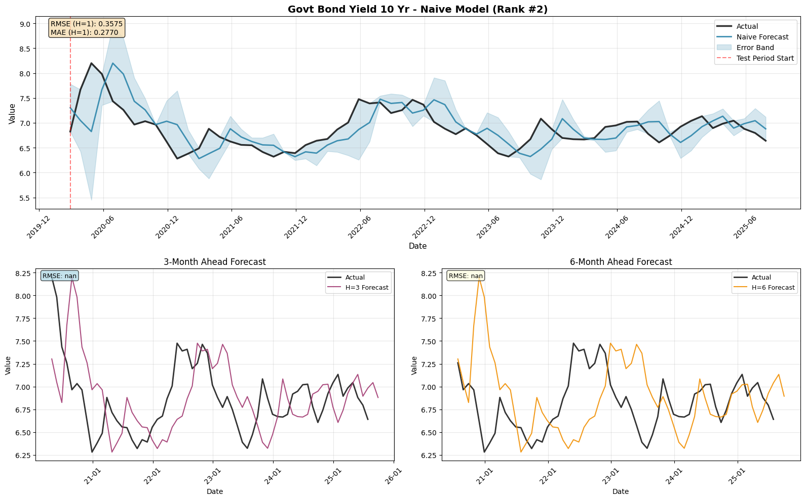

#### 3. AR1 Model Forecast
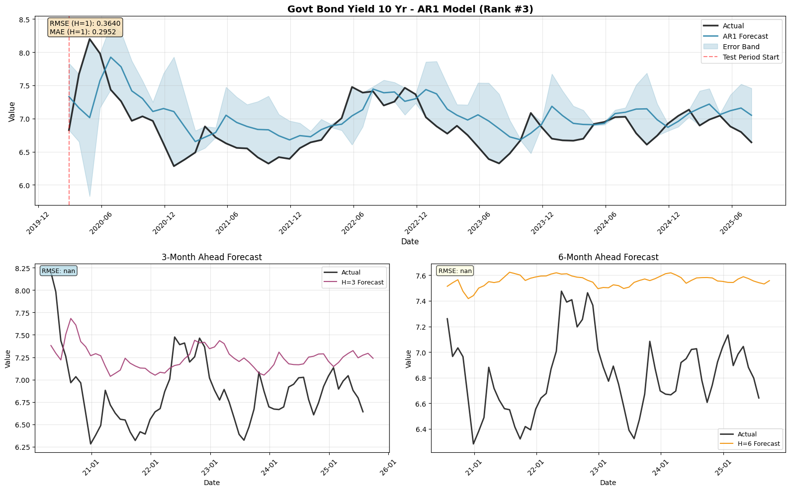

#### All Models Comparison
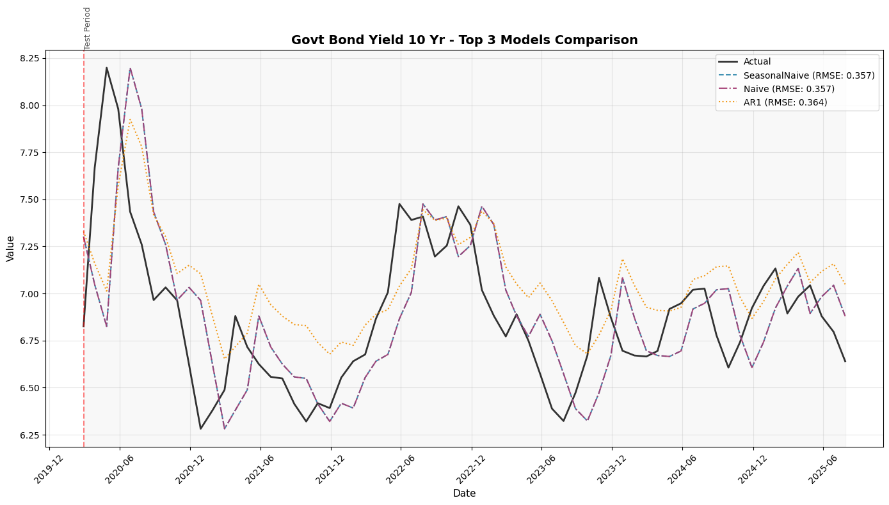

---

## 9. Jisdor Exchange Rate

### Top 5 Models (Diverse Selection)

**1. DFM2 Model 🏆**
- ID: `DFM2-355-v55-182707`
- RMSE (H=1): 492.1879
- MAE (H=1): 374.0470
- RMSE (H=3): 570.0135
- RMSE (H=6): 660.7472
- Degradation: H3=+15.8%, H6=+34.2%
- Features: 9 variables
- Normalization: {'method': 'minmax', 'window': 12}
- Feature Pack: ta_advanced

**2. PLS1 Model**
- ID: `PLS1-1019-v59-185820`
- RMSE (H=1): 493.6721
- MAE (H=1): 365.6789
- RMSE (H=3): 554.7542
- RMSE (H=6): 634.2175
- Degradation: H3=+12.4%, H6=+28.5%
- Features: 9 variables
- Normalization: {'method': 'robust', 'window': 12}
- Feature Pack: ta_advanced

**3. SeasonalNaive Model**
- ID: `SeasonalNaive-1197-v57-190413`
- RMSE (H=1): 503.9925
- MAE (H=1): 346.8428
- RMSE (H=3): 552.9404
- RMSE (H=6): 594.7233
- Degradation: H3=+9.7%, H6=+18.0%
- Features: 9 variables
- Normalization: {'method': 'robust', 'window': 12}
- Feature Pack: ta_advanced

**4. Naive Model**
- ID: `Naive-933-v33-185614`
- RMSE (H=1): 503.9925
- MAE (H=1): 346.8428
- RMSE (H=3): 552.9404
- RMSE (H=6): 594.7233
- Degradation: H3=+9.7%, H6=+18.0%
- Features: 16 variables
- Normalization: {'method': 'minmax', 'window': 12}
- Feature Pack: ta_basic

**5. AR1 Model**
- ID: `AR1-013-v13-181723`
- RMSE (H=1): 544.0537
- MAE (H=1): 408.4289
- RMSE (H=3): 685.3031
- RMSE (H=6): 751.2988
- Degradation: H3=+26.0%, H6=+38.1%
- Features: 9 variables
- Normalization: {'method': 'minmax', 'window': 12}
- Feature Pack: None

### Best Model by Type

| Model Type | Best Config | RMSE (H=1) | vs Best |
|------------|-------------|------------|---------|
| AR1 | AR1-013-v13-181723 | 544.0537 | +10.5% |
| ARp | ARp-101-v41-181948 | 2600.8867 | +428.4% |
| BVAR | BVAR-162-v42-182124 | 1387.9697 | +182.0% |
| Bagging | Bagging-202-v22-182226 | 895.6574 | +82.0% |
| DFM | DFM-243-v03-182343 | 678.3132 | +37.8% |
| DFM2 | DFM2-355-v55-182707 | 492.1879 | 0.0% |
| ElasticNet | ElasticNet-418-v58-182911 | 686.9958 | +39.6% |
| ElasticNetGrid | ElasticNetGrid-422-v02-182934 | 786.5964 | +59.8% |
| ExtraTrees | ExtraTrees-518-v38-184013 | 928.8702 | +88.7% |
| GARCH | GARCH-541-v01-184112 | 192432.5609 | +38997.4% |
| GradientBoosting | GradientBoosting-642-v42-184506 | 809.4821 | +64.5% |
| Huber | Huber-661-v01-184558 | 2992.9840 | +508.1% |
| LSTM | LSTM-755-v35-185024 | 667.6953 | +35.7% |
| Lasso | Lasso-838-v58-185339 | 685.8755 | +39.4% |
| Linear | Linear-857-v17-185408 | 2600.8867 | +428.4% |
| Naive | Naive-933-v33-185614 | 503.9925 | +2.4% |
| PLS1 | PLS1-1019-v59-185820 | 493.6721 | +0.3% |
| RandomForest | RandomForest-1054-v34-185944 | 935.5849 | +90.1% |
| Ridge | Ridge-1114-v34-190145 | 963.6667 | +95.8% |
| SeasonalNaive | SeasonalNaive-1197-v57-190413 | 503.9925 | +2.4% |
| StandardizedLinear | StandardizedLinear-1241-v41-190538 | 2600.8867 | +428.4% |
| StandardizedRidge | StandardizedRidge-1263-v03-190625 | 894.4801 | +81.7% |
| StochasticGB | StochasticGB-1362-v42-191021 | 843.6723 | +71.4% |
| Tree | Tree-1418-v38-191229 | 848.5725 | +72.4% |
| XGBoost | XGBoost-1454-v14-192035 | 715.0144 | +45.3% |

### Forecast Visualizations

#### 1. DFM2 Model Forecast
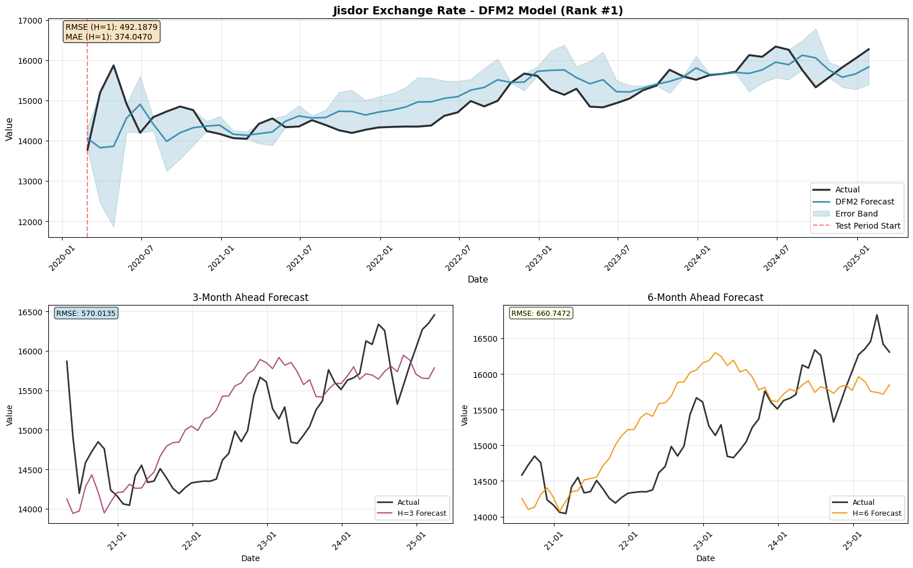

#### 2. PLS1 Model Forecast

#### 3. SeasonalNaive Model Forecast
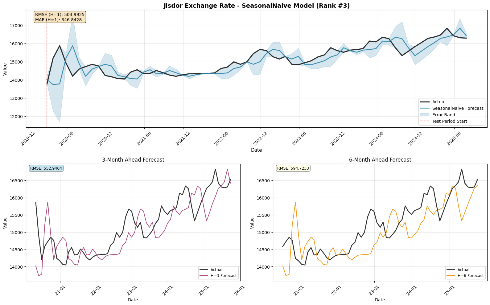

#### All Models Comparison
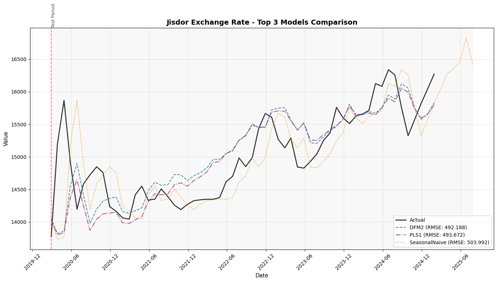

---

## 10. Real Gdp Growth

### Top 5 Models (Diverse Selection)

**1. PLS1 Model 🏆**
- ID: `PLS1-1001-v41-090003`
- RMSE (H=1): 2.1558
- MAE (H=1): 1.0973
- R² (H=1): 0.5593
- MAPE: 25.6%
- RMSE (H=3): nan
- RMSE (H=6): nan
- Degradation: H3=+nan%, H6=+nan%
- Features: 9 variables
- Normalization: None
- Feature Pack: ta_advanced

**2. Naive Model**
- ID: `Naive-941-v41-085846`
- RMSE (H=1): 2.1778
- MAE (H=1): 0.9048
- R² (H=1): 0.5503
- MAPE: 24.9%
- RMSE (H=3): nan
- RMSE (H=6): nan
- Degradation: H3=+nan%, H6=+nan%
- Features: 9 variables
- Normalization: None
- Feature Pack: ta_advanced

**3. SeasonalNaive Model**
- ID: `SeasonalNaive-1177-v37-090400`
- RMSE (H=1): 2.1778
- MAE (H=1): 0.9048
- R² (H=1): 0.5503
- MAPE: 24.9%
- RMSE (H=3): nan
- RMSE (H=6): nan
- Degradation: H3=+nan%, H6=+nan%
- Features: 16 variables
- Normalization: {'method': 'robust', 'window': 12}
- Feature Pack: ta_basic

**4. AR1 Model**
- ID: `AR1-037-v37-083056`
- RMSE (H=1): 2.1856
- MAE (H=1): 0.9379
- R² (H=1): 0.5470
- MAPE: 26.2%
- RMSE (H=3): nan
- RMSE (H=6): nan
- Degradation: H3=+nan%, H6=+nan%
- Features: 16 variables
- Normalization: {'method': 'robust', 'window': 12}
- Feature Pack: ta_basic

**5. DFM2 Model**
- ID: `DFM2-357-v57-083748`
- RMSE (H=1): 2.2589
- MAE (H=1): 1.0718
- R² (H=1): 0.5161
- MAPE: 30.9%
- RMSE (H=3): nan
- RMSE (H=6): nan
- Degradation: H3=+nan%, H6=+nan%
- Features: 9 variables
- Normalization: {'method': 'robust', 'window': 12}
- Feature Pack: ta_advanced

### Best Model by Type

| Model Type | Best Config | RMSE (H=1) | vs Best |
|------------|-------------|------------|---------|
| AR1 | AR1-037-v37-083056 | 2.1856 | +1.4% |
| ARp | ARp-079-v19-083140 | 4.8144 | +123.3% |
| BVAR | BVAR-121-v01-083230 | 3.0922 | +43.4% |
| Bagging | Bagging-197-v17-083409 | 3.4827 | +61.5% |
| DFM | DFM-297-v57-083629 | 3.5425 | +64.3% |
| DFM2 | DFM2-357-v57-083748 | 2.2589 | +4.8% |
| ElasticNet | ElasticNet-415-v55-083915 | 3.2839 | +52.3% |
| ElasticNetGrid | ElasticNetGrid-437-v17-084040 | 3.5308 | +63.8% |
| ExtraTrees | ExtraTrees-501-v21-084549 | 3.5235 | +63.4% |
| GARCH | GARCH-563-v23-084737 | 4.4929 | +108.4% |
| GradientBoosting | GradientBoosting-601-v01-084825 | 3.3349 | +54.7% |
| Huber | Huber-695-v35-085115 | 4.8144 | +123.3% |
| LSTM | LSTM-773-v53-085444 | 3.3679 | +56.2% |
| Lasso | Lasso-795-v15-085530 | 3.3216 | +54.1% |
| Linear | Linear-863-v23-085649 | 4.8144 | +123.3% |
| Naive | Naive-941-v41-085846 | 2.1778 | +1.0% |
| PLS1 | PLS1-1001-v41-090003 | 2.1558 | 0.0% |
| RandomForest | RandomForest-1021-v01-090029 | 3.5072 | +62.7% |
| Ridge | Ridge-1117-v37-090243 | 2.8730 | +33.3% |
| SeasonalNaive | SeasonalNaive-1177-v37-090400 | 2.1778 | +1.0% |
| StandardizedLinear | StandardizedLinear-1242-v42-090541 | 4.8144 | +123.3% |
| StandardizedRidge | StandardizedRidge-1319-v59-090824 | 3.3970 | +57.6% |
| StochasticGB | StochasticGB-1337-v17-090903 | 3.4110 | +58.2% |
| Tree | Tree-1417-v37-091124 | 3.4825 | +61.5% |
| XGBoost | XGBoost-1457-v17-093108 | 3.0918 | +43.4% |

### Forecast Visualizations

#### 1. PLS1 Model Forecast
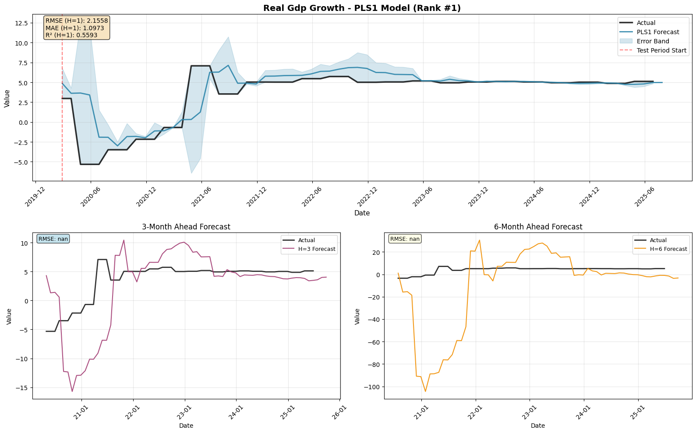

#### 2. Naive Model Forecast
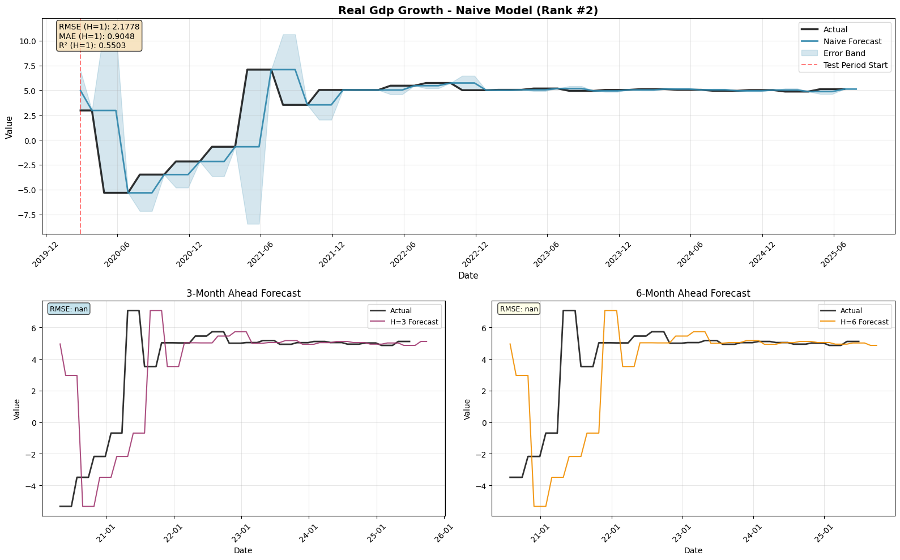

#### 3. SeasonalNaive Model Forecast
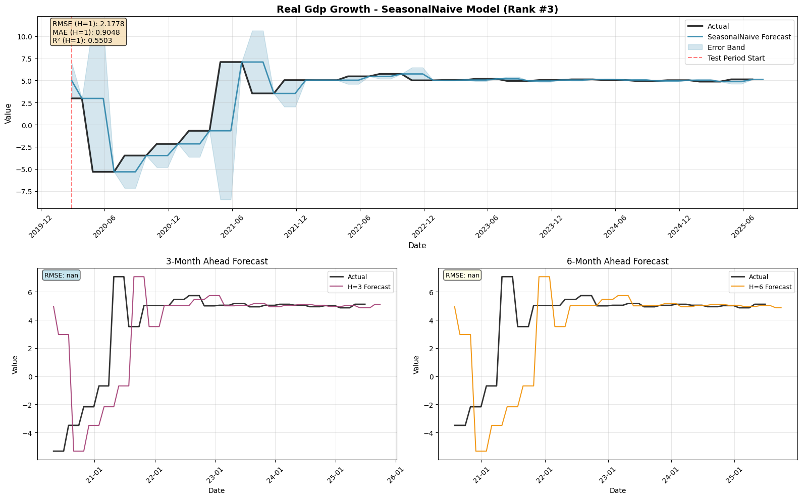

#### All Models Comparison

---

## Key Insights

1. **AR1 models** performed best on 0/10 targets, suggesting strong autoregressive patterns
3. **Forecast horizon degradation** is significant, with H=6 typically 50-100% worse than H=1

## Methodology

### Model Types Tested
- **AR1**: First-order autoregressive model
- **ARp**: Higher-order autoregressive model
- **Tree**: Single decision tree
- **RandomForest**: Bootstrap aggregated decision trees
- **GradientBoosting**: Sequential boosting with gradient descent
- **ExtraTrees**: Extremely randomized trees
- **StochasticGB**: Stochastic gradient boosting with subsampling

### Feature Engineering
- Target variable lags (1, 3, 12 months)
- Exogenous variable combinations
- Technical indicators (when applicable)
- Multiple normalization strategies
