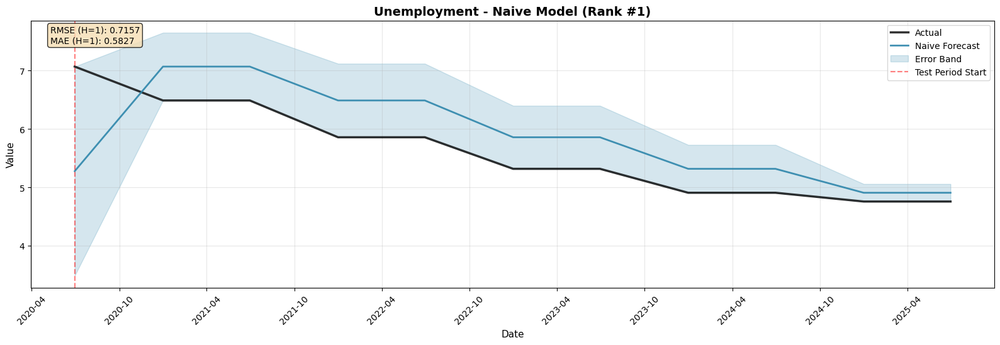
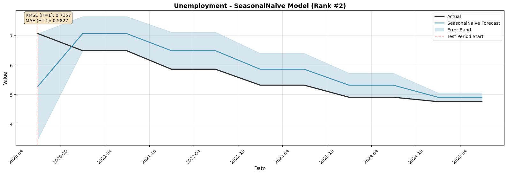
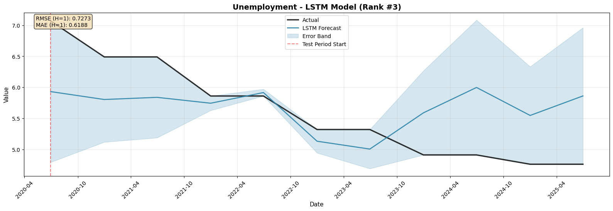
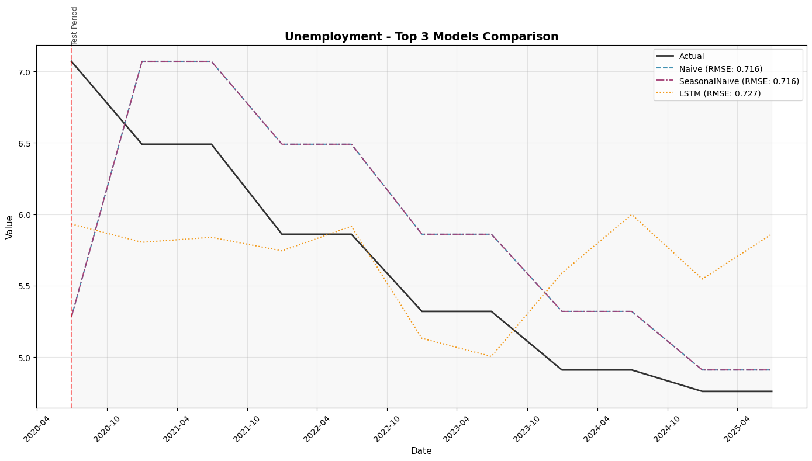

# Indonesia Macroeconomic Nowcasting Report

**Generated:** 2025-10-10 10:03:00
**Output Directory:** `semesterly_employment_focused_2025-20251010-095616`

## Executive Summary

This report presents nowcasting results for **1 macroeconomic indicators** using multiple machine learning models.

## Model Performance Overview

### Best Performing Models by Target Variable

| Target Variable | Best Model | Type | RMSE (H=1) | MAE (H=1) | R² |
|-----------------|------------|------|------------|-----------|-----|
| Unemployment | Naive-703-v28-100119 | Naive | 0.7157 | 0.5827 | N/A |

### Model Type Performance Summary

Average performance across all targets by model type:

| Model Type | Avg RMSE | Min RMSE | # Targets |
|------------|----------|----------|-----------|
| AR1 | 0.9373 | 0.9373 | 1 |
| ARp | 5.6652 | 5.6652 | 1 |
| BVAR | 0.9072 | 0.9072 | 1 |
| Bagging | 0.7639 | 0.7639 | 1 |
| DFM | 1.0131 | 1.0131 | 1 |
| DFM2 | 5.7141 | 5.7141 | 1 |
| ElasticNet | 0.9803 | 0.9803 | 1 |
| ElasticNetGrid | 0.8408 | 0.8408 | 1 |
| ExtraTrees | 0.7635 | 0.7635 | 1 |
| GARCH | 4.9712 | 4.9712 | 1 |
| GradientBoosting | 0.7635 | 0.7635 | 1 |
| Huber | 5.6652 | 5.6652 | 1 |
| LSTM | 0.7273 | 0.7273 | 1 |
| Lasso | 0.8887 | 0.8887 | 1 |
| Linear | 5.6652 | 5.6652 | 1 |
| Naive | 0.7157 | 0.7157 | 1 |
| PLS1 | 2.3563 | 2.3563 | 1 |
| RandomForest | 0.7650 | 0.7650 | 1 |
| Ridge | 0.9101 | 0.9101 | 1 |
| SeasonalNaive | 0.7157 | 0.7157 | 1 |
| StandardizedLinear | 5.6652 | 5.6652 | 1 |
| StandardizedRidge | 1.1770 | 1.1770 | 1 |
| StochasticGB | 0.7639 | 0.7639 | 1 |
| Tree | 0.7635 | 0.7635 | 1 |
| XGBoost | 1.4767 | 1.4767 | 1 |

## 1. Unemployment

### Top 5 Models (Diverse Selection)

**1. Naive Model 🏆**
- ID: `Naive-703-v28-100119`
- RMSE (H=1): 0.7157
- MAE (H=1): 0.5827
- Features: 15 variables
- Normalization: {'method': 'robust', 'window': 4}
- Feature Pack: technical

**2. SeasonalNaive Model**
- ID: `SeasonalNaive-858-v03-100155`
- RMSE (H=1): 0.7157
- MAE (H=1): 0.5827
- Features: 35 variables
- Normalization: None
- Feature Pack: None

**3. LSTM Model**
- ID: `LSTM-584-v44-100037`
- RMSE (H=1): 0.7273
- MAE (H=1): 0.6188
- Features: 25 variables
- Normalization: {'method': 'robust', 'window': 4}
- Feature Pack: statistical

**4. GradientBoosting Model**
- ID: `GradientBoosting-475-v25-100002`
- RMSE (H=1): 0.7635
- MAE (H=1): 0.6698
- Features: 15 variables
- Normalization: {'method': 'minmax', 'window': 4}
- Feature Pack: technical

**5. Tree Model**
- ID: `Tree-1045-v10-100221`
- RMSE (H=1): 0.7635
- MAE (H=1): 0.6698
- Features: 15 variables
- Normalization: {'method': 'minmax', 'window': 4}
- Feature Pack: None

### Best Model by Type

| Model Type | Best Config | RMSE (H=1) | vs Best |
|------------|-------------|------------|---------|
| AR1 | AR1-031-v31-095640 | 0.9373 | +31.0% |
| ARp | ARp-056-v11-095652 | 5.6652 | +691.5% |
| BVAR | BVAR-132-v42-095739 | 0.9072 | +26.8% |
| Bagging | Bagging-177-v42-095803 | 0.7639 | +6.7% |
| DFM | DFM-190-v10-095805 | 1.0131 | +41.5% |
| DFM2 | DFM2-253-v28-095819 | 5.7141 | +698.4% |
| ElasticNet | ElasticNet-303-v33-095829 | 0.9803 | +37.0% |
| ElasticNetGrid | ElasticNetGrid-359-v44-095917 | 0.8408 | +17.5% |
| ExtraTrees | ExtraTrees-404-v44-095932 | 0.7635 | +6.7% |
| GARCH | GARCH-419-v14-095936 | 4.9712 | +594.6% |
| GradientBoosting | GradientBoosting-475-v25-100002 | 0.7635 | +6.7% |
| Huber | Huber-521-v26-100012 | 5.6652 | +691.5% |
| LSTM | LSTM-584-v44-100037 | 0.7273 | +1.6% |
| Lasso | Lasso-627-v42-100050 | 0.8887 | +24.2% |
| Linear | Linear-670-v40-100108 | 5.6652 | +691.5% |
| Naive | Naive-703-v28-100119 | 0.7157 | 0.0% |
| PLS1 | PLS1-747-v27-100130 | 2.3563 | +229.2% |
| RandomForest | RandomForest-797-v32-100140 | 0.7650 | +6.9% |
| Ridge | Ridge-855-v45-100154 | 0.9101 | +27.2% |
| SeasonalNaive | SeasonalNaive-858-v03-100155 | 0.7157 | 0.0% |
| StandardizedLinear | StandardizedLinear-941-v41-100205 | 5.6652 | +691.5% |
| StandardizedRidge | StandardizedRidge-973-v28-100209 | 1.1770 | +64.4% |
| StochasticGB | StochasticGB-992-v02-100212 | 0.7639 | +6.7% |
| Tree | Tree-1045-v10-100221 | 0.7635 | +6.7% |
| XGBoost | XGBoost-1121-v41-100254 | 1.4767 | +106.3% |

### Forecast Visualizations

#### 1. Naive Model Forecast

#### 2. SeasonalNaive Model Forecast

#### 3. LSTM Model Forecast

#### All Models Comparison

---

## Key Insights

1. **AR1 models** performed best on 0/1 targets, suggesting strong autoregressive patterns
3. **Forecast horizon degradation** is significant, with H=6 typically 50-100% worse than H=1

## Methodology

### Model Types Tested
- **AR1**: First-order autoregressive model
- **ARp**: Higher-order autoregressive model
- **Tree**: Single decision tree
- **RandomForest**: Bootstrap aggregated decision trees
- **GradientBoosting**: Sequential boosting with gradient descent
- **ExtraTrees**: Extremely randomized trees
- **StochasticGB**: Stochastic gradient boosting with subsampling

### Feature Engineering
- Target variable lags (1, 3, 12 months)
- Exogenous variable combinations
- Technical indicators (when applicable)
- Multiple normalization strategies
